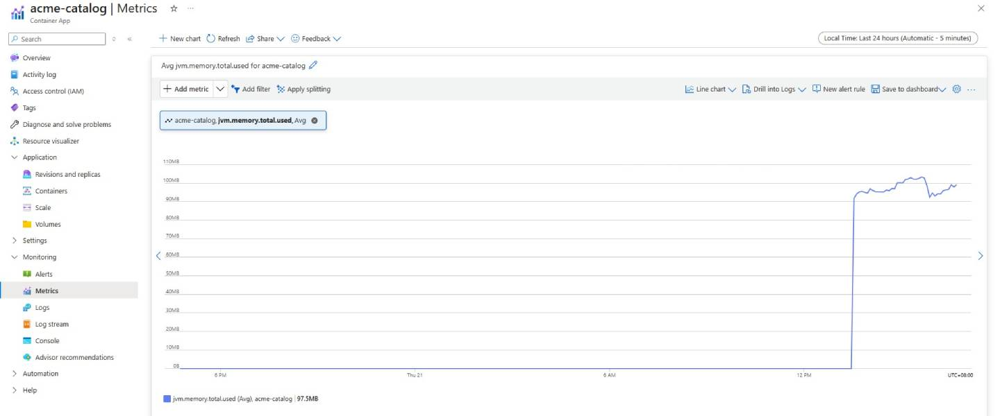
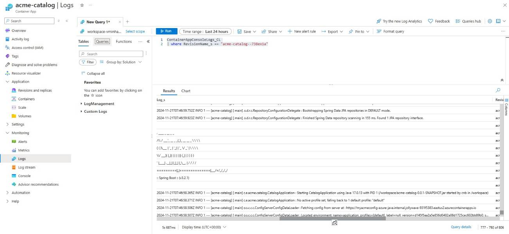

# Get Log and Metrics
## Introduction
This document provides instructions on how to view logs and metrics for your Azure Container Apps. By following these steps, you will be able to monitor your containerized applications effectively. For more details, see [Observability in Azure Container Apps](https://learn.microsoft.com/azure/container-apps/observability).

## Prerequisites
- Deploy at least one application on the Azure Container Apps from previous guidance.

## Steps

### 1. View Metrics
You can go to your container app on Portal to see metrics. For example, monitor the metrics of acme-catalog app:

See [Java metrics for Java apps in Azure Container Apps](https://learn.microsoft.com/azure/container-apps/java-metrics) for more information.

### 2. View live Logs
Use the following command to view continuous live stream logs for your Azure Container App:
```bash
az containerapp logs show \
    --name <container app name> \
    --resource-group ${RESOURCE_GROUP} \
    --follow
```
More details can be found in the [official documentation](https://learn.microsoft.com/azure/container-apps/logging).

### 3. View Historical Logs
You can view historical logs for your Azure Container App on the Portal by command:
```bash
ContainerAppConsoleLogs_CL
| where RevisionName_s == <revision name>
```
