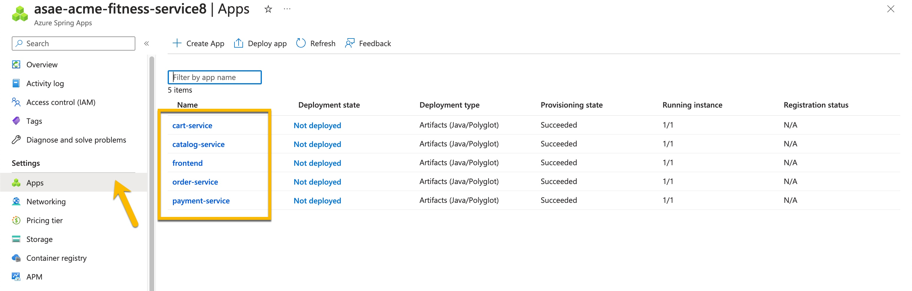
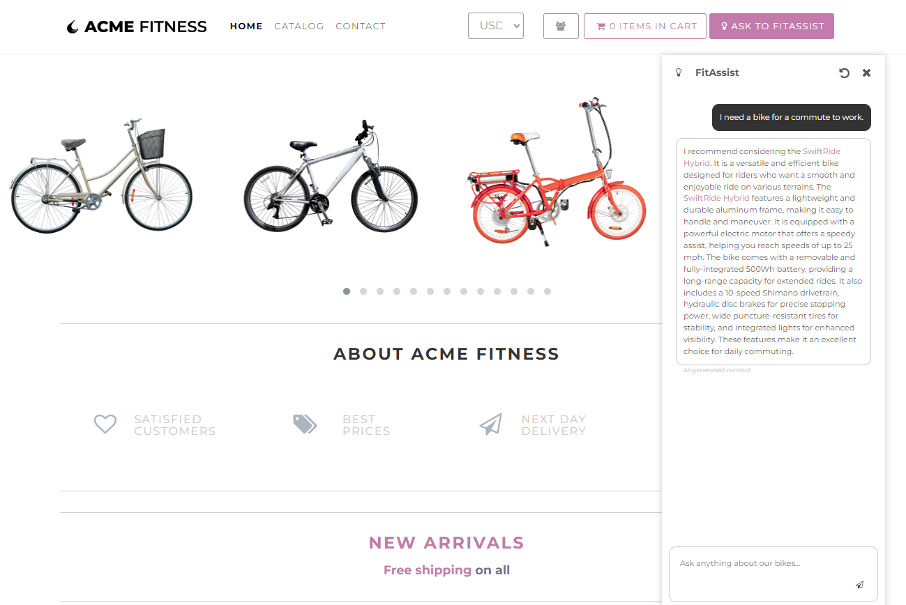

# Spring Boot Apps を Azure Spring Apps Enterprise にデプロイする

Azure Spring Apps Enterprise を使用すると、Azure 上で Spring Boot アプリケーションと多言語アプリケーションを簡単に実行できます。


このクイック スタートでは、Java、Python、C# で記述された既存のアプリケーションを Azure にデプロイする方法について説明します。完了すると、Azure CLI もしくは Azure ポータルを使用して引き続きアプリケーションを管理できます。

* [Azure Spring Apps へのアプリケーションのデプロイ](#spring-boot-apps-を-azure-spring-apps-enterprise-にデプロイする)
  * [本ワークショップで得られる内容](#本ワークショップで得られる内容)
  * [事前準備](#事前準備)
  * [Azure CLI extension のインストール](#azure-cli-extension-のインストール)
  * [レポジトリを Clone](#レポジトリを-clone)
  * [作業 0 - インストール環境の準備](#作業-0---インストール環境の準備)  
  * [作業 1 - アプリケーションのビルドとデプロイ](#作業-1---アプリケーションのビルドとデプロイ)
  * [作業 2 - シングル サインオンの構成](#作業-2---シングル-サインオンの構成)
  * [作業 3 - Azure Database for PostgreSQL および Azure Cache for Redis の統合](#作業-3---azure-database-for-postgresql-および-azure-cache-for-redis-の統合)
  * [作業 4 - アプリケーション内の機密情報の安全な読み込み](#作業-4---アプリケーション内の機密情報の安全な読み込み)
  * [作業 5 - エンドツーエンドのアプリケーション監視](#作業-5---エンドツーエンドのアプリケーション監視)
  * [作業 6 - リクエスト数に対するレート制限の設定](#作業-6---リクエスト数に対するレート制限の設定)
  * [作業 7 - アイデアから生産までの自動化](#作業-7---アイデアから生産までの自動化)
  * [作業 8 - フィットネス・ストアに AI を適用](#作業-8---フィットネス・ストアに-ai-を適用)

## 本ワークショップで得られる内容

目標:

* Azure Spring Apps のサービス・インスタンスをプロビジョニング
* アプリケーション構成(Config)サービス・リポジトリーの構成
* 多言語アプリケーションを Azure にデプロイし、Tanzu ビルド サービスを使用してビルド
* Spring Cloud Gateway を使用しアプリケーションへのルーティングを構成
* アプリケーションの動作確認
* API ポータルを使用したアプリケーション API の確認
* アプリケーションのシングル サインオン (SSO) を構成
* アプリケーションの監視
* GitHub アクションを使用したプロビジョニングとデプロイの自動化

次の図は、このガイドで使用する ACME フィットネスストアのアーキテクチャを示しています。


このアプリケーションは、いくつかのサービスから構成されています。

このアプリケーションは、いくつかのサービスで構成されています。

* 4 つの Java Spring Boot アプリケーション:
  * カタログサービス：利用可能な製品を取得
  * 支払いサービス：ユーザーの注文に対する支払い処理と承認
  * ID サービス：認証されたユーザーを参照
  * 支援サービス：フィットネス・ストアに AI を適用

* 1 つの Python アプリケーション:
  * カートサービス：購入用に選択されたユーザーのアイテムを管理

* 1 つの ASP.NET Core アプリケーション:
  * 注文サービス：ユーザーのカートに入っている商品の購入処理

* 1 つの NodeJS 静的 HTML アプリケーション
  * フロントエンド：フロントエンド・ショッピング・アプリケーション

## 事前準備

Azure 上に Java アプリケーションをデプロイするため、Azure サブスクリプションが必要です。 Azure のアカウントをお持ちでない場合、[MSDN サブスクライバーの特典](https://azure.microsoft.com/pricing/member-offers/credit-for-visual-studio-subscribers/)を有効にするか、もしくは[無料の Azure アカウント](https://azure.microsoft.com/pricing/purchase-options/azure-account)を作成してください。

さらに、次のものが必要になります。

| [Azure CLI version 2.50.0 以降](https://learn.microsoft.com/cli/azure/install-azure-cli?view=azure-cli-latest)
| [Git](https://git-scm.com/)
| [`jq` コマンド](https://stedolan.github.io/jq/download/)
|

ご注意 -  Windows では [`jq` コマンド](https://stedolan.github.io/jq/download/) は `jq-win64.exe` を `jq.exe` に名前を変更し `PATH` に追加してください。

ご注意 - bash シェルの利用。Azure CLI コマンドはすべての環境で同じように動作すべきですが、シェルの解釈はさまざまです。ここで実行するコマンドは bash でのみ動作確認済みです。 Windows でこれらの操作を行うためには、Windows ディストリビューションに付属する Git Bash をご利用ください。 Windows 環境では、Git Bash をご利用いただき、WSL は使用しないでください。

### または Azure Cloud Shell を使用

もしくは、Azure Cloud Shell も利用可能です。Azure Portal では、ブラウザから実行できる対話型の Azure Cloud Shell を提供しています。Cloud Shell で bash を使用し Azure サービスを操作します。Cloud Shell にプリ・インストールされたコマンドを使用して、 ローカル環境へのインストールは不要で、この README のドキュメントを作成します。Azure を起動するには クラウド・シェル: [https://shell.azure.com](https://shell.azure.com) に移動するか、 [Cloud Shell の起動] ボタンをクリックして、ブラウザで Cloud Shell を開きます。

この記事のコードを Azure Cloud Shell で実行するには、次のようにします。

1. クラウド・シェルを起動

2. コード・ブロックの [コピー] ボタンを選択し、コードをコピー

3. Windows および Linux では Ctrl + Shift + V を選択し、macOS では Cmd+Shift + V を選択し、コードをクラウド シェル セッションに貼り付ける

4. Enter キーを押してコードを実行

## Azure CLI extension のインストール

下記のコマンドを実行し、Azure CLI に Azure Spring Apps 拡張機能をインストールします

```shell
az extension add --name spring
```

ご注意: - 最新のエンタープライズ Tier の機能を有効にし VMware Tanzu コンポーネントを構成するためには、`spring` という名の CLI 拡張バージョン '1.14.0' 以降が必須です。次のコマンドを使用して、以前のバージョンを削除し、最新の Enterprise Tier 拡張機能をインストールしてください。

```shell
az extension update --name spring
```

ご注意 - 場合によっては、上記の更新コマンドが失敗することもあります。その際は、spring の拡張機能を再インストールしてください。次のコマンドを使用し、以前のバージョンを削除し、最新のものをインストールできます。

```shell
az extension remove --name spring-cloud
az extension remove --name spring
az extension add --name spring
```

上記のコマンドを実装した後、`spring` のバージョンが `1.14.0` 以上になっているかを確認してください。更新されていない場合は、[Azure CLI の再インストール](https://learn.microsoft.com/ja-jp/cli/azure/install-azure-cli)を試してください。

## レポジトリを Clone

### 新しいフォルダーを作成し、サンプル アプリのリポジトリを複製

```shell
mkdir source-code
cd source-code
git clone https://github.com/Azure-Samples/acme-fitness-store
cd acme-fitness-store/azure-spring-apps-enterprise

```

## 作業 0 - インストール環境の準備

### Azure に Login 

Azure CLI にログインし、アクティブなサブスクリプションを選択します。

```shell
az login
```
```shell
az account list -o table
```
表示された表の一覧から、使用するサブスクリプション ID をメモしてください。

### デプロイの環境の準備

./scripts フォルダーで操作してください。

```shell
cd scripts
```

次に

```shell
pwd
```
下記のような結果が表示されます。

```
./source-code/acme-fitness-store/azure-spring-apps-enterprise/scripts
```
提供されているテンプレートを元に、環境変数を設定した bash スクリプトを作成します。

```shell
cp ./setup-env-variables-template.sh ./setup-env-variables.sh -i
```

任意のエディターを使用し、ファイルの内容を編集し(例として Visual Studio Code のエディターを使用します)、次の値を追加します。

```shell
code `setup-env-variables.sh` 
```
次の情報を入力します。

```shell
export SUBSCRIPTION=subscription-id                 # replace it with your subscription-id from above
export RESOURCE_GROUP=resource-group-name           # existing resource group or one that will be created in next steps
export SPRING_APPS_SERVICE=azure-spring-apps-name   # name of the service that will be created in the next steps
export LOG_ANALYTICS_WORKSPACE=log-analytics-name   # existing workspace or one that will be created in next steps
export REGION=region-name                           # choose a region with Enterprise tier support
```

REGION の値は、Azure Spring Apps が利用可能なリージョン (eastus など) を設定する必要があります。Azure Spring アプリで利用可能なすべてのリージョンについては、[こちら](https://azure.microsoft.com/explore/global-infrastructure/products-by-region/)を参照してください。

次に、source コマンドで環境を設定します。

```shell
source ./setup-env-variables.sh
```

次に、サブスクリプションを設定します
```shell
az account set --subscription ${SUBSCRIPTION}
```

> 注: この演習では、テンプレートからスクリプトを作成し、値を入力した後、そのスクリプトを「ソース」にすることが複数回あります。ワークショップを完了する前に違う作業を行う場合、またはセッションが切断/期限切れになった場合は、環境変数を再設定できるように、再度「az login」をした後に、これらのスクリプトを再実行(つまり「re-source」)する必要があります。実行可能な(1つの)「累積」スクリプトがあり、以下の他のセットアップスクリプト(4)を呼び出します。

```
./setup-env-variables.sh
./setup-sso-variables-ad.sh
./setup-sso-variables.sh
./setup-db-env-variables.sh 
./setup-ai-env-variables.sh 
```

> この累積スクリプトは、次の場所にあります
```
./scripts/setup-env-variables-ALL.sh
```

### Azure Spring Apps サービス・インスタンスを作成

Azure Spring Apps サービスに割り当てる名前を検討します。名前は 4 から 32 文字の長さで、小文字、数字、ハイフンのみ使用できます。サービス名の最初の文字は文字で、最後の文字は文字または数字の必要があります。

Azure Spring Apps サービスを格納するリソース グループを作成します。

> 注: 既存のリソース グループを使用している場合は、この手順をスキップできます

```shell
az group create --name ${RESOURCE_GROUP} \
    --location ${REGION}
```

エンタープライズ層の法律条項とプライバシーに関する声明に同意します。

> 注: 下記の手順は、利用するサブスクリプションで Azure Spring Apps のエンタープライズ層のインスタンスを、過去に作成したことがない場合に必要です。

```shell
az provider register --namespace Microsoft.SaaS
az term accept --publisher vmware-inc --product azure-spring-cloud-vmware-tanzu-2 --plan asa-ent-hr-mtr
```

Azure Spring Apps Enterprise のインスタンスを作成します。

```shell
az spring create --name ${SPRING_APPS_SERVICE} \
    --resource-group ${RESOURCE_GROUP} \
    --location ${REGION} \
    --sku Enterprise \
    --enable-application-configuration-service \
    --enable-service-registry \
    --enable-gateway \
    --enable-api-portal \
    --enable-alv \
    --enable-app-acc \
    --build-pool-size S2 
```

> 注: `create` コマンドが失敗した場合は、[ここで](#azure-cli-extension-のインストール)説明する Azure Spring Apps 拡張機能を更新してみてください

> 注: サービス インスタンスのデプロイには約 10 分から 15 分かかります。

下記のコマンドで、デフォルトのリソース グループ名とクラスター名を設定します。

```shell
az configure --defaults \
    group=${RESOURCE_GROUP} \
    location=${REGION} \
    spring=${SPRING_APPS_SERVICE}
```

### Azure Spring Apps の Log Analytics を構成

Azure Spring Apps サービスで使用する Log Analytics Workspace を作成します。

> 注: 既存のワークスペースを使用する場合、下記の手順はスキップできます

```shell
az monitor log-analytics workspace create \
  --workspace-name ${LOG_ANALYTICS_WORKSPACE} \
  --location ${REGION} \
  --resource-group ${RESOURCE_GROUP}   
```

作成した Azure Spring Apps サービスと Log Analytics ワークスペースのリソース ID を取得します

```shell
export LOG_ANALYTICS_RESOURCE_ID=$(az monitor log-analytics workspace show \
    --resource-group ${RESOURCE_GROUP} \
    --workspace-name ${LOG_ANALYTICS_WORKSPACE} \
    --query id \
    -o tsv)

export SPRING_APPS_RESOURCE_ID=$(az spring show \
    --name ${SPRING_APPS_SERVICE} \
    --resource-group ${RESOURCE_GROUP} \
    --query id \
    -o tsv)
```

Azure Spring Apps サービスの診断設定を構成します。

```shell
az monitor diagnostic-settings create --name "send-logs-and-metrics-to-log-analytics" \
    --resource ${SPRING_APPS_RESOURCE_ID} \
    --workspace ${LOG_ANALYTICS_RESOURCE_ID} \
    --logs '[
         {
           "category": "ApplicationConsole",
           "enabled": true,
           "retentionPolicy": {
             "enabled": false,
             "days": 0
           }
         },
         {
            "category": "SystemLogs",
            "enabled": true,
            "retentionPolicy": {
              "enabled": false,
              "days": 0
            }
          },
         {
            "category": "IngressLogs",
            "enabled": true,
            "retentionPolicy": {
              "enabled": false,
              "days": 0
             }
           }
       ]' \
       --metrics '[
         {
           "category": "AllMetrics",
           "enabled": true,
           "retentionPolicy": {
             "enabled": false,
             "days": 0
           }
         }
       ]'
```

> 注: Git Bash ユーザーの場合、リソース ID が `/` で始まるため、誤ってファイル パスとして解釈され、コマンドの実行に失敗する可能性があります。 
> 
> 上記コマンドの実行に失敗した場合、下記の MSYS_NO_PATHCONV を設定してください
> 
> `export MSYS_NO_PATHCONV=1`

### Application Congiguration サービスの構成

Azure CLI を使用して、Application Congiguration サービスの構成リポジトリを作成します

```shell
az spring application-configuration-service git repo add --name acme-fitness-store-config \
    --label main \
    --patterns "catalog/default,catalog/key-vault,identity/default,identity/key-vault,payment/default" \
    --uri "https://github.com/Azure-Samples/acme-fitness-store-config"
```

### Tanzuビルドサービスの設定

./scripts フォルダで操作していることを確認してください

```shell
pwd
```
下記のように表示されます。

```
./source-code/acme-fitness-store/azure-spring-apps-enterprise/scripts
```

Azure CLI を使用して、Tanzu Build サービスでカスタム・ビルダーを作成します。

```shell
az spring build-service builder create -n ${CUSTOM_BUILDER} \
    --builder-file ../resources/json/tbs/builder.json \
    --no-wait
```

## 作業 1 - アプリケーションのビルドとデプロイ

前提条件：

* [作業 0 - インストール環境の準備](#作業-0---インストール環境の準備) の完了

### Azure Spring Apps でアプリケーションを作成

各サービスごとにアプリケーションを作成します。

```shell
az spring app create --name ${CART_SERVICE_APP} --instance-count 1 --memory 1Gi &
az spring app create --name ${ORDER_SERVICE_APP} --instance-count 1 --memory 1Gi &
az spring app create --name ${PAYMENT_SERVICE_APP} --instance-count 1 --memory 1Gi &
az spring app create --name ${CATALOG_SERVICE_APP} --instance-count 1 --memory 1Gi &
```

次に、フロントエンド用のアプリを作成します。

```shell
az spring app create --name ${FRONTEND_APP} --instance-count 1 --memory 1Gi

```

この時点で、制御が本体に戻されるまで待ってから続行してください。

Azure ポータルを確認し、すべてのサービス(4サービスおよびフロントエンドアプリ)が作成されていることを確認してください。下記のように表示されます。




### Application Configuration サービスにバインド

いくつかのアプリケーションは、Application Configuration サービスからの設定が必要なため、バインディングを行います

```shell
az spring application-configuration-service bind --app ${PAYMENT_SERVICE_APP}
az spring application-configuration-service bind --app ${CATALOG_SERVICE_APP}
```

### Service Registry にバインド

いくつかのアプリケーションは、サービスレジストリを使用したサービス検出が必要なため、 バインディングを行います

```shell
az spring service-registry bind --app ${PAYMENT_SERVICE_APP}
az spring service-registry bind --app ${CATALOG_SERVICE_APP}
```

### Spring Cloud Gateway の設定

Spring Cloud Gateway にエンドポイントを割り当て、API 情報を使用して設定を行います

```shell
az spring gateway update --assign-endpoint true
export GATEWAY_URL=$(az spring gateway show | jq -r '.properties.url')
    
az spring gateway update \
    --api-description "Acme Fitness Store API" \
    --api-title "Acme Fitness Store" \
    --api-version "v1.0" \
    --server-url "https://${GATEWAY_URL}" \
    --allowed-origins "*" \
    --no-wait
```

#### アプリケーションのルーティング規則を作成

JSON に記載したルーティング規則を使用し、Spring Cloud Gateway にルーティング規則を作成します

```shell
az spring gateway route-config create \
    --name ${CART_SERVICE_APP} \
    --app-name ${CART_SERVICE_APP} \
    --routes-file ../resources/json/routes/cart-service.json
    
az spring gateway route-config create \
    --name ${ORDER_SERVICE_APP} \
    --app-name ${ORDER_SERVICE_APP} \
    --routes-file ../resources/json/routes/order-service.json

az spring gateway route-config create \
    --name ${CATALOG_SERVICE_APP} \
    --app-name ${CATALOG_SERVICE_APP} \
    --routes-file ../resources/json/routes/catalog-service.json

az spring gateway route-config create \
    --name ${FRONTEND_APP} \
    --app-name ${FRONTEND_APP} \
    --routes-file ../resources/json/routes/frontend.json
```

### 多言語アプリケーションのビルドとデプロイ

各アプリケーションをビルドしてデプロイし、必要なパラメーターを設定します

```shell
# Deploy Payment Service
az spring app deploy --name ${PAYMENT_SERVICE_APP} \
    --config-file-pattern payment/default \
    --source-path ../../apps/acme-payment \
    --build-env BP_JVM_VERSION=17

# Deploy Catalog Service
az spring app deploy --name ${CATALOG_SERVICE_APP} \
    --config-file-pattern catalog/default \
    --source-path ../../apps/acme-catalog \
    --build-env BP_JVM_VERSION=17

# Deploy Order Service
az spring app deploy --name ${ORDER_SERVICE_APP} \
    --builder ${CUSTOM_BUILDER} \
    --source-path ../../apps/acme-order 

# Deploy Cart Service 
az spring app deploy --name ${CART_SERVICE_APP} \
    --builder ${CUSTOM_BUILDER} \
    --env "CART_PORT=8080" \
    --source-path ../../apps/acme-cart 

# Deploy Frontend App
az spring app deploy --name ${FRONTEND_APP} \
    --builder ${CUSTOM_BUILDER} \
    --source-path ../../apps/acme-shopping 
```

> 注:すべてのアプリケーションのデプロイには5〜10分かかります

### Spring Cloud Gateway を経由したアプリケーションへのアクセス

Spring Cloud Gateway の URL を取得し、ブラウザーで開きます。

```shell
open "https://${GATEWAY_URL}"
```

Azure クラウド・シェルもしくは Windows を使用している場合は、次のコマンドの実行結果の URL をブラウザで表示します。

```shell
echo "https://${GATEWAY_URL}"
```

ACME フィットネス・ストア・アプリケーションが表示されます。


アプリケーションを操作できるようになりましたが、まだすべてが機能しているわけではないことにご注意ください。`作業 2 - シングル サインオンの構成` 以降を構成して、残りの機能を有効にします。

### API ポータルを使用した API の探索

API ポータルにエンドポイントを割り当て、ブラウザーで開きます。

```shell
az spring api-portal update --assign-endpoint true
export PORTAL_URL=$(az spring api-portal show --query properties.url -o tsv)

open "https://${PORTAL_URL}"
```

Azure クラウド・シェルもしくは Windows を使用している場合は、ブラウザーで次のコマンドの出力結果の URL を開きます。

```shell
echo "https://${PORTAL_URL}"
```

## 作業 2 - シングル サインオンの構成

この作業では、Microsoft Entra ID (旧 Azure Active Directory) または既存の ID プロバイダを使用して Spring Cloud Gateway のシングルサインオンを設定します。

前提条件：

* [作業 1 - アプリケーションのビルドとデプロイ](#作業-1---アプリケーションのビルドとデプロイ) の完了
* シングル サインオン ID プロバイダーに Azure Active Directory アプリケーションの登録または資格情報を管理するためのアクセス許可

> 注意:
> このユニットはオプション(省略可能)です。アプリケーションは、この作業を完了しなくても機能します。ログイン、カートへのアイテムの追加、注文の完了など、特定の機能だけが利用できません。 
> その場合 SSO を構成せずに、[作業 3 - Azure Database for PostgreSQL および Azure Cache for Redis の統合](#作業-3---azure-database-for-postgresql-および-azure-cache-for-redis-の統合)に進み、ほかの作業を継続します。

### アプリケーションを Microsoft Entra ID (Azure AD) に登録

下記で、Entra ID を使用してシングル・サインオン・プロバイダーを作成する手順について説明します。 既存のプロバイダーを使用する場合、[既存の ID プロバイダーの使用](#既存の-sso-id-プロバイダーの使用) に進んでください

アプリケーションを登録するために、一意の表示名を選択してください

```shell
export AD_DISPLAY_NAME=change-me    # unique application display name
```

#### Entra ID へのアプリケーション登録を作成し、出力を JSON に保存

```shell
az ad app create --display-name ${AD_DISPLAY_NAME} > ../resources/json/ad.json
```

#### アプリケーション ID を取得し、クライアント・シークレットを取得

```shell
export APPLICATION_ID=$(cat ../resources/json/ad.json | jq -r '.appId')

az ad app credential reset --id ${APPLICATION_ID} --append > ../resources/json/sso.json
```

#### サービス・プリンシパルをアプリケーションの登録に割り当て

```shell
az ad sp create --id ${APPLICATION_ID}
```

アプリケーションの登録に関する詳細な手順については、[こちら](https://learn.microsoft.com/en-us/azure/active-directory/develop/quickstart-register-app)を参照してください。

### SSO デプロイのための環境の準備

提供されているスクリプトを使用して、環境変数を設定し確認します。

このファイルのソース:

```shell
source ./setup-sso-variables-ad.sh
```

#### 環境変数の値をエコーで確認

```shell
echo ${CLIENT_ID}
echo ${CLIENT_SECRET}
echo ${ISSUER_URI}
echo ${JWK_SET_URI}
echo ${GATEWAY_URL}
echo ${PORTAL_URL}
```

#### ISSUER_URI　と JWK_SET_URI の確認

The `ISSUER_URI` should take the form `https://login.microsoftonline.com/${TENANT_ID}/v2.0`
The `JWK_SET_URI` should take the form `https://login.microsoftonline.com/${TENANT_ID}/discovery/v2.0/keys`

#### Web リダイレクト URI（必須） を Entra ID アプリケーションの登録に追加

```shell
az ad app update --id ${APPLICATION_ID} \
    --web-redirect-uris "https://${GATEWAY_URL}/login/oauth2/code/sso" "https://${PORTAL_URL}/oauth2-redirect.html" "https://${PORTAL_URL}/login/oauth2/code/sso"
```

リダイレクト URI の詳細については、[こちら](https://learn.microsoft.com/en-us/azure/active-directory/develop/quickstart-register-app#add-a-redirect-uri)を参照してください。

### 既存の SSO ID プロバイダーの使用

> 注: Entra ID アプリケーションの登録を作成した場合は、[SSO を使用した Spring Cloud Gateway の構成](#sso-を使用した-spring-cloud-gateway-の設定) に進みます。

既存の SSO ID プロバイダーを使用したい場合、既存のテンプレートをコピーします

繰り返しになりますが、./scriptsフォルダーから操作していることを確認してください。

```shell
pwd
```
下記の結果が表示されます

```shell
...../source-code/acme-fitness-store/azure-spring-apps-enterprise/scripts
```

次に、カスタムな値を設定するため setup-sso-variables-template.sh のコピーを作成します

```shell
cp ./setup-sso-variables-template.sh ./setup-sso-variables.sh -i
```

次に、次の値をエコーで確認します。
```shell
echo ${CLIENT_ID}
echo ${CLIENT_SECRET}
echo ${ISSUER_URI}
echo ${JWK_SET_URI}
```

コピーを編集します
```
code `setup-sso-variables.sh` 
```

必要な値を追加します
```shell
export CLIENT_ID="change-me"        # Your SSO Provider Client ID
export CLIENT_SECRET="change-me"    # Your SSO Provider Client Secret
export ISSUER_URI="change-me"       # Your SSO Provider Issuer URI
export JWK_SET_URI="change-me"      # Your SSO Provider Json Web Token URI
```

> `issuer-uri` の設定は、公式の Spring Boot ドキュメントで説明されている規則に従う必要があります。
> プロバイダーは、発行者識別子としてアサートする issuer-uri の URI を使用して構成する必要があります。たとえば、指定された発行者 URI が "https://example.com" の場合、OpenID プロバイダー構成要求は "https://example.com/.well-known/openid-configuration" に対して行われます。
> 結果は、OpenID プロバイダー構成応答であることが期待されます。 OpenID Connect ディスカバリー・プロトコルをサポートする許可サーバーのみを使用できることに注意してください

> `JWK_SET_URI` は通常、次の形式を取ります `${ISSUER_URI}/$VERSION/keys`

#### コピーしたファイルに「実行可能」権限を付与

```shell
chmod +x setup-sso-variables.sh
```

#### 環境を設定

```shell
source setup-sso-variables.sh
```

#### SSO プロバイダーの承認済みリダイレクト URI の一覧に下記を追加

```shell
echo "https://${GATEWAY_URL}/login/oauth2/code/sso"
echo "https://${PORTAL_URL}/oauth2-redirect.html" 
echo "https://${PORTAL_URL}/login/oauth2/code/sso"
```

### SSO を使用した Spring Cloud Gateway の設定

#### SSO を有効にして Spring Cloud Gateway を構成

```shell
az spring gateway update \
    --client-id ${CLIENT_ID} \
    --client-secret ${CLIENT_SECRET} \
    --scope ${SCOPE} \
    --issuer-uri ${ISSUER_URI} \
    --no-wait
```

### ID サービス アプリケーションのデプロイ

#### ID サービス アプリケーションのセットアップ、設定、およびデプロイ

```shell
az spring app create --name ${IDENTITY_SERVICE_APP} --instance-count 1 --memory 1Gi
```

#### ID サービスを Application Configuration Service にバインド

```shell
az spring application-configuration-service bind --app ${IDENTITY_SERVICE_APP}
```

#### ID サービスを Service Registry　にバインド

```shell
az spring service-registry bind --app ${IDENTITY_SERVICE_APP}
```

#### ID サービス用の アプリケーションのルーティング規則を作成

```shell
az spring gateway route-config create \
    --name ${IDENTITY_SERVICE_APP} \
    --app-name ${IDENTITY_SERVICE_APP} \
    --routes-file ../resources/json/routes/identity-service.json
```

#### ID サービスをデプロイ

```shell
az spring app deploy --name ${IDENTITY_SERVICE_APP} \
    --env "JWK_URI=${JWK_SET_URI}" \
    --config-file-pattern identity/default \
    --source-path ../../apps/acme-identity \
    --build-env BP_JVM_VERSION=17
```

> 注:アプリケーションのデプロイには約3〜5分かかります。

### 既存のアプリケーションの更新

Spring Cloud Gateway からの認可情報を使用できるように既存のアプリケーションを更新します

```shell
# Cart Service の更新
az spring app update --name ${CART_SERVICE_APP} \
    --env "AUTH_URL=https://${GATEWAY_URL}" "CART_PORT=8080" 
    
# Order Service の更新
az spring app update --name ${ORDER_SERVICE_APP} \
    --env "AcmeServiceSettings__AuthUrl=https://${GATEWAY_URL}" 
```

### Spring Cloud Gateway からアプリケーションにログイン

Spring Cloud Gateway の URL を取得し、ブラウザーで開きます

```shell
open "https://${GATEWAY_URL}"
```

Azure クラウド・シェルもしくは Windows を使用している場合は、次のコマンドの出力結果をブラウザーで開きます

```shell
echo "https://${GATEWAY_URL}"
```

> You should see the ACME Fitness Store Application, and be able to log in using your
SSO Credentials. Once logged in, the remaining functionality of the application will
be available. This includes adding items to the cart and placing an order.
> ACME フィットネス・ストア・アプリケーションが表示され、 SSO 資格情報を利用してログインで切るようになります。ログインすると、アプリケーションの残りの機能が利用できるようになります。これには、カートへのアイテムの追加と注文が含まれます。

### API ポータルで SSO を構成

API ポータルで SSO を有効に設定します

```shell
export PORTAL_URL=$(az spring api-portal show --query properties.url -o tsv)

az spring api-portal update \
    --client-id ${CLIENT_ID} \
    --client-secret ${CLIENT_SECRET}\
    --scope "openid,profile,email" \
    --issuer-uri ${ISSUER_URI}
```

### API ポータルを使用した API の探索

ブラウザでAPIポータルを開くと、ログイン URL にリダイレクトされます。

```shell
open "https://${PORTAL_URL}"
```

Azure クラウド・シェルもしくは Windows を使用している場合は、下記コマンドの実行結果の URL をブラウザで開きます。

```shell
echo "https://${PORTAL_URL}"
```

> 保護された API にアクセスするには、承認をクリックし、SSO プロバイダーの指示に従ってください 。API ポータルを使用した API 承認の詳細については、[こちら](https://docs.vmware.com/en/API-portal-for-VMware-Tanzu/1.0/api-portal-1-0.pdf)を参照してください。

## 作業 3 - Azure Database for PostgreSQL および Azure Cache for Redis の統合

デフォルトで、いくつかのサービスはメモリ内のデータ・ストレージを使用します。このユニットでは、アプリケーションの外部に永続ストアを作成し、アプリケーションをそれらのストアに接続します。

前提条件：

* [作業 1 - アプリケーションのビルドとデプロイ](#作業-1---アプリケーションのビルドとデプロイ)の完了

### 環境を準備

`./scripts` フォルダーで作業を行っていることを確認してください

```shell
cd scripts
```

次に下記のコマンドで確認します

```shell
pwd
```
下記のような結果が表示されます

```
./source-code/acme-fitness-store/azure-spring-apps-enterprise/scripts
```

#### 提供さてたいるテンプレートをコピーし、環境変数を設定する bash スクリプトを作成

```shell
cp ./setup-db-env-variables-template.sh ./setup-db-env-variables.sh -i
```

```shell
code `./setup-db-env-variables.sh` 
```

#### 次に、次の情報を入力

```shell
export AZURE_CACHE_NAME=change-me                   # Unique name for Azure Cache for Redis Instance
export POSTGRES_SERVER=change-me                    # Unique name for Azure Database for PostgreSQL Flexible Server
export POSTGRES_SERVER_USER=change-name             # Postgres server username to be created in next steps
export POSTGRES_SERVER_PASSWORD=change-name         # Postgres server password to be created in next steps
```

> 注: DNS の競合を避けるために、AZURE_CACHE_NAME と POSTGRES_SERVER は一意の名前である必要があります

#### スクリプトに実行権限を付与

```shell
chmod +x ./setup-db-env-variables.sh
```

#### 次に、環境を設定

```shell
source ./setup-db-env-variables.sh
```

### Azure Cache for Redis を作成

> 注: redisキャッシュのデプロイには約15〜20分かかります

#### Azure CLI を使用して Azure Cache for Redis のインスタンスを作成

```shell
az redis create \
  --name ${AZURE_CACHE_NAME} \
  --location ${REGION} \
  --resource-group ${RESOURCE_GROUP} \
  --sku Basic \
  --vm-size c0
```

### Azure Postgres データベース サーバーを作成

> 注: PostgreSQL フレキシブル サーバーのデプロイには 5 分から 10 分かかります

### Azure CLI を使用して、Azure データベース PostgreSQL Flexible Server を作成

```shell
az postgres flexible-server create --name ${POSTGRES_SERVER} \
    --resource-group ${RESOURCE_GROUP} \
    --location ${REGION} \
    --admin-user ${POSTGRES_SERVER_USER} \
    --admin-password ${POSTGRES_SERVER_PASSWORD} \
    --public-access 0.0.0.0 \
    --tier Burstable \
    --sku-name Standard_B1ms \
    --version 14 \
    --storage-size 32 \
    --yes
```
### 他の Azure サービスからの接続を許可

#### ファイアウォールルールを設定

```shell
az postgres flexible-server firewall-rule create --rule-name allAzureIPs \
     --name ${POSTGRES_SERVER} \
     --resource-group ${RESOURCE_GROUP} \
     --start-ip-address 0.0.0.0 --end-ip-address 0.0.0.0
```

### uuid-ossp 拡張機能を有効

```shell
az postgres flexible-server parameter set \
    --resource-group ${RESOURCE_GROUP} \
    --server-name ${POSTGRES_SERVER} \
    --name azure.extensions --value uuid-ossp
```

### 注文サービス用のデータベースを作成

```shell
az postgres flexible-server db create \
  --database-name ${ORDER_SERVICE_DB} \
  --server-name ${POSTGRES_SERVER}
```

### カタログ・サービス用のデータベースを作成

```shell
az postgres flexible-server db create \
  --database-name ${CATALOG_SERVICE_DB} \
  --server-name ${POSTGRES_SERVER}
```

> 注:続行する前に、すべてのサービスの準備が整うのを待ちます

### サービス・コネクタの作成

The Order Service and Catalog Service use Azure Database for Postgres create Service Connectors for those applications:
注文サービスとカタログ サービスは、Azure Database Postgres のサービス・コネクタを作成して使用します

#### 注文サービスを Postgres にバインド

```shell
az spring connection create postgres-flexible \
    --resource-group ${RESOURCE_GROUP} \
    --service ${SPRING_APPS_SERVICE} \
    --connection ${ORDER_SERVICE_DB_CONNECTION} \
    --app ${ORDER_SERVICE_APP} \
    --deployment default \
    --tg ${RESOURCE_GROUP} \
    --server ${POSTGRES_SERVER} \
    --database ${ORDER_SERVICE_DB} \
    --secret name=${POSTGRES_SERVER_USER} secret=${POSTGRES_SERVER_PASSWORD} \
    --client-type dotnet
```

カタログ サービスは Entra ID 認証を使用して Postgres に接続するため、パスワードを含める必要はありません

#### カタログサービスをPostgresにバインド

```shell
az spring connection create postgres-flexible \
    --resource-group ${RESOURCE_GROUP} \
    --service ${SPRING_APPS_SERVICE} \
    --connection ${CATALOG_SERVICE_DB_CONNECTION} \
    --app ${CATALOG_SERVICE_APP} \
    --deployment default \
    --tg ${RESOURCE_GROUP} \
    --server ${POSTGRES_SERVER} \
    --database ${CATALOG_SERVICE_DB} \
    --client-type springboot \
    --system-identity
```

> 注: 上記コマンドをiOSで実行する場合は、postgresql と 'serviceconnector-passwordless' の拡張機能が必要です。これらがインストールされていない場合は、このコマンドの実行中にインストールします。

> 上記のコマンドを実行した後、Azure Spring App アプリケーションによってシステム割り当てマネージド ID が有効になり、Postgres データベース ユーザーを作成し、マネージド ID を割り当て、アクセス許可がユーザーに付与されます。

#### カート サービスから Azure Cache for Redis にサービス・コネクタで接続

```shell
az spring connection create redis \
    --resource-group ${RESOURCE_GROUP} \
    --service ${SPRING_APPS_SERVICE} \
    --connection ${CART_SERVICE_CACHE_CONNECTION} \
    --app ${CART_SERVICE_APP} \
    --deployment default \
    --tg ${RESOURCE_GROUP} \
    --server ${AZURE_CACHE_NAME} \
    --database 0 \
    --client-type python 
```

> 注: 現在、Azure Spring Apps CLI 拡張機能では、クライアントの種類として Java、Spring Boot、または .NET のみが許可されています。 今回カート・サービスは、接続文字列が Python と Java で同じため、クライアント接続の種類として Java を使用します。 
> この作業は今後、CLI で追加のオプションが使用可能になると変更されます。

### アプリケーションの更新

次に、影響を受けるアプリケーションを更新し、新しく作成したデータベースと Redis キャッシュを使用します
#### カタログ・サービスを再起動してサービス・コネクタの有効化

```shell
az spring app restart --name ${CATALOG_SERVICE_APP}
```
#### PostgreSQL 接続文字列を取得し、カタログ サービスを更新

```shell
export POSTGRES_CONNECTION_STR=$(az spring connection show \
    --resource-group ${RESOURCE_GROUP} \
    --service ${SPRING_APPS_SERVICE} \
    --deployment default \
    --connection ${ORDER_SERVICE_DB_CONNECTION} \
    --app ${ORDER_SERVICE_APP} \
    --query configurations[0].value \
    -o tsv)"Trust Server Certificate=true;"
```

```shell
az spring app update \
    --name order-service \
    --env "DatabaseProvider=Postgres" "ConnectionStrings__OrderContext=${POSTGRES_CONNECTION_STR}" "AcmeServiceSettings__AuthUrl=https://${GATEWAY_URL}"
```

#### Redis 接続文字列を取得し、カート・サービスを更新

```shell
export REDIS_CONN_STR=$(az spring connection show \
    --resource-group ${RESOURCE_GROUP} \
    --service ${SPRING_APPS_SERVICE} \
    --deployment default \
    --connection ${CART_SERVICE_CACHE_CONNECTION} \
    --app ${CART_SERVICE_APP} \
    --query configurations[0].value \
    -o tsv)
```

```shell
az spring app update \
    --name cart-service \
    --env "CART_PORT=8080" "REDIS_CONNECTIONSTRING=${REDIS_CONN_STR}" "AUTH_URL=https://${GATEWAY_URL}"
```

### 永続化データの表示

カートにいくつかの項目を追加して、カート・データが Redis に保持されるようになったことを確認します。次に、カート・サービスを再起動します。

```shell
az spring app restart --name ${CART_SERVICE_APP}
```

> 注：カート サービスを再起動すると、カート内のアイテムが保持されることにご注意ください。

#### 注文後、注文データが PostgreSQL データベースに永続化されることを確認

次の URL から発注した注文を表示します

```text
https://${GATEWAY_URL}/order/${USER_ID}
```

> 注: USER_IDは、エンコードされたユーザー名の URL です。

#### 次に、注文サービス・アプリケーションを再起動

```shell
az spring app restart --name ${ORDER_SERVICE_APP}
```

再起動後、発注した注文の URL に再度アクセスし、それらが保持されていることを確認します

## 作業 4 - アプリケーション内の機密情報の安全な読み込み

この作業では、Azure Key Vault を使用して、Azure サービスに接続するための機密情報を安全に格納および読み込みます

前提条件：

* [作業 1 - アプリケーションのビルドとデプロイ](#作業-1---アプリケーションのビルドとデプロイ) の完了
* [作業 3 - Azure Database for PostgreSQL および Azure Cache for Redis の統合](#作業-3---azure-database-for-postgresql-および-azure-cache-for-redis-の統合) の完了

### Azure キー コンテナーを作成して機密情報を格納

Key Vault 用に一意の名前を設定するため環境変数を設定します。

```shell
export KEY_VAULT=change-me      # customize this
```

#### Azure Key Vault を作成し、Key Vault URI を取得

```shell
az keyvault create --name ${KEY_VAULT} -g ${RESOURCE_GROUP}
export KEYVAULT_URI=$(az keyvault show --name ${KEY_VAULT} \
    --query properties.vaultUri \
    -o tsv)
```

#### Key Vault にデータベース接続情報を格納

```shell
export POSTGRES_SERVER_FULL_NAME="${POSTGRES_SERVER}.postgres.database.azure.com"
```

```shell
az keyvault secret set --vault-name ${KEY_VAULT} \
    --name "POSTGRES-SERVER-NAME" --value ${POSTGRES_SERVER_FULL_NAME}

az keyvault secret set --vault-name ${KEY_VAULT} \
    --name "ConnectionStrings--OrderContext" --value "${POSTGRES_CONNECTION_STR}"

az keyvault secret set --vault-name ${KEY_VAULT} \
    --name "CATALOG-DATABASE-NAME" --value ${CATALOG_SERVICE_DB}
 
az keyvault secret set --vault-name ${KEY_VAULT} \
    --name "POSTGRES-LOGIN-NAME" --value ${POSTGRES_SERVER_USER}
    
az keyvault secret set --vault-name ${KEY_VAULT} \
    --name "POSTGRES-LOGIN-PASSWORD" --value ${POSTGRES_SERVER_PASSWORD}
```

#### Redis 接続情報を取得し　Key Vault に格納

```shell
export REDIS_HOST=$(az redis show -n ${AZURE_CACHE_NAME} --query hostName -o tsv)
export REDIS_PORT=$(az redis show -n ${AZURE_CACHE_NAME} --query sslPort -o tsv)
export REDIS_PRIMARY_KEY=$(az redis list-keys -n ${AZURE_CACHE_NAME} --query primaryKey -o tsv)
```

```shell
az keyvault secret set --vault-name ${KEY_VAULT} \
  --name "CART-REDIS-CONNECTION-STRING" --value "${REDIS_CONN_STR}"
```

#### SSO サービスの情報を Key Vault に格納

```shell
az keyvault secret set --vault-name ${KEY_VAULT} \
    --name "SSO-PROVIDER-JWK-URI" --value ${JWK_SET_URI}
```

> 注: シングル サインオンを構成していない場合は、SSO-PROVIDER-JWK-URI シークレットの作成をスキップできます

#### アプリケーションでシステム割り当てマネージド ID を有効にし、マネージド ID を環境変数にエクスポート

```shell
az spring app identity assign --name ${CART_SERVICE_APP} --system-assigned
export CART_SERVICE_APP_IDENTITY=$(az spring app show --name ${CART_SERVICE_APP} --query identity.principalId -o tsv)

az spring app identity assign --name ${ORDER_SERVICE_APP} --system-assigned
export ORDER_SERVICE_APP_IDENTITY=$(az spring app show --name ${ORDER_SERVICE_APP} --query identity.principalId -o tsv)

az spring app identity assign --name ${CATALOG_SERVICE_APP} --system-assigned
export CATALOG_SERVICE_APP_IDENTITY=$(az spring app show --name ${CATALOG_SERVICE_APP} --query identity.principalId -o tsv)

az spring app identity assign --name ${IDENTITY_SERVICE_APP} --system-assigned
export IDENTITY_SERVICE_APP_IDENTITY=$(az spring app show --name ${IDENTITY_SERVICE_APP} --query identity.principalId -o tsv)
```

#### Key Vault に許可を与え、マネージド ID が機密情報を読み込み可能に設定

```shell
az keyvault set-policy --name ${KEY_VAULT} \
    --object-id ${CART_SERVICE_APP_IDENTITY} --secret-permissions get list
    
az keyvault set-policy --name ${KEY_VAULT} \
    --object-id ${ORDER_SERVICE_APP_IDENTITY} --secret-permissions get list

az keyvault set-policy --name ${KEY_VAULT} \
    --object-id ${CATALOG_SERVICE_APP_IDENTITY} --secret-permissions get list

az keyvault set-policy --name ${KEY_VAULT} \
    --object-id ${IDENTITY_SERVICE_APP_IDENTITY} --secret-permissions get list
```

> 注: 作業 2 を完了していない場合、ID サービスは存在しません。シングル サインオンを構成していない場合は、このサービスの ID またはポリシーの構成をスキップします。

### アプリケーションを有効化し Azure Key Vault からシークレットを読み込む

#### サービス・コネクタを削除し、アプリケーションを有効化し Azure Key Vault からシークレットをロード

```shell
az spring connection delete \
    --resource-group ${RESOURCE_GROUP} \
    --service ${SPRING_APPS_SERVICE} \
    --connection ${ORDER_SERVICE_DB_CONNECTION} \
    --app ${ORDER_SERVICE_APP} \
    --deployment default \
    --yes
```

```shell
az spring connection delete \
    --resource-group ${RESOURCE_GROUP} \
    --service ${SPRING_APPS_SERVICE} \
    --connection ${CATALOG_SERVICE_DB_CONNECTION} \
    --app ${CATALOG_SERVICE_APP} \
    --deployment default \
    --yes
```

```shell
az spring connection delete \
    --resource-group ${RESOURCE_GROUP} \
    --service ${SPRING_APPS_SERVICE} \
    --connection ${CART_SERVICE_CACHE_CONNECTION} \
    --app ${CART_SERVICE_APP} \
    --deployment default \
    --yes
```

```shell    
az spring app update --name ${ORDER_SERVICE_APP} \
    --env "ConnectionStrings__KeyVaultUri=${KEYVAULT_URI}" "AcmeServiceSettings__AuthUrl=https://${GATEWAY_URL}" "DatabaseProvider=Postgres"
```

```shell
az spring app update --name ${CATALOG_SERVICE_APP} \
    --config-file-pattern catalog/default,catalog/key-vault \
    --env "SPRING_CLOUD_AZURE_KEYVAULT_SECRET_PROPERTY_SOURCES_0_ENDPOINT=${KEYVAULT_URI}" "SPRING_CLOUD_AZURE_KEYVAULT_SECRET_PROPERTY_SOURCES_0_NAME=${KEY_VAULT}" "SPRING_PROFILES_ACTIVE=default,key-vault"
```

```shell  
az spring app update --name ${IDENTITY_SERVICE_APP} \
    --config-file-pattern identity/default,identity/key-vault \
    --env "SPRING_CLOUD_AZURE_KEYVAULT_SECRET_PROPERTY_SOURCES_0_ENDPOINT=${KEYVAULT_URI}" "SPRING_CLOUD_AZURE_KEYVAULT_SECRET_PROPERTY_SOURCES_0_NAME=${KEY_VAULT}" "SPRING_PROFILES_ACTIVE=default,key-vault"
```

```shell    
az spring app update --name ${CART_SERVICE_APP} \
    --env "CART_PORT=8080" "KEYVAULT_URI=${KEYVAULT_URI}" "AUTH_URL=https://${GATEWAY_URL}"
```

## 作業 5 - エンドツーエンドのアプリケーション監視

この作業では、ライブ・アプリケーション・メトリクスとクエリログを調べ、アプリケーションの正常性を把握します

前提条件：

* [ユニット 1 - アプリケーションのデプロイとビルドの完了](#作業-1---アプリケーションのビルドとデプロイ)
* [ユニット 3 - Azure Database for PostgreSQL および Azure Cache for Redis の統合の完了](#作業-3---azure-database-for-postgresql-および-azure-cache-for-redis-の統合)
* [ユニット 4 の完了 - アプリケーション シークレットの安全な読み込み](#作業-4---アプリケーション内の機密情報の安全な読み込み)

### インストルメンテーション・キーを Key Vault に追加

Application Insights のインストルメンテーション・キーは、Java 以外のアプリケーションに提供する必要があります。

> 注: 今後、Java 以外のアプリケーションのビルドパックでサポートする予定です 
> Application Insightsのバインドとこの手順は不要です。

Application Insights　のインストルメンテーション・キーを取得し、Key Vault に追加する

```shell
export INSTRUMENTATION_KEY=$(az monitor app-insights component show --app ${APPLICATION_INSIGHTS} --query connectionString -o tsv)

az keyvault secret set --vault-name ${KEY_VAULT} \
    --name "ApplicationInsights--ConnectionString" --value ${INSTRUMENTATION_KEY}
```

### サンプリングレートの更新

Application Insights バインドのサンプリング・レートを増加します。

```shell
az spring build-service builder buildpack-binding set \
    --builder-name default \
    --name default \
    --type ApplicationInsights \
    --properties sampling-rate=100 connection_string=${INSTRUMENTATION_KEY}
```

### アプリケーションのリロード

アプリケーションを再起動し設定をリロードします。Java アプリケーションでは、これにより新しいサンプリング・レートが有効になります。Java 以外のアプリケーションの場合、これにより、Key Vault からインストルメンテーション キーにアクセスできるようになります。

```shell
az spring app restart -n ${CART_SERVICE_APP}
az spring app restart -n ${ORDER_SERVICE_APP}
az spring app restart -n ${IDENTITY_SERVICE_APP}
az spring app restart -n ${CATALOG_SERVICE_APP}
az spring app restart -n ${PAYMENT_SERVICE_APP}
```

### アプリケーションのログ・ストリームを取得

下記のコマンドを使用して、カタログ・サービスから最新の 100 行のアプリ・コンソール・ログを取得します

```shell
az spring app logs \
    -n ${CATALOG_SERVICE_APP} \
    --lines 100
```

`-f`　のパラメーターを追加することで、リアルタイムでアプリのログ・ストリーミングを取得できます。ストリーミングで、カタログ・サービスのログを表示してください


```shell
az spring app logs \
    -n ${CATALOG_SERVICE_APP} \
    -f
```

`az spring app logs -h` を使用して、より多くのパラメーターとログ・ストリーム機能を調べることができます。

### トラフィックの生成

ACME フィットネス・ショップ・アプリケーションに対して、トラフィックを生成します。アプリケーション内の画面を遷移したり、カタログを表示したり、注文したりします。

トラフィックを継続的に生成するには、トラフィック・ジェネレータを使用します。

```shell
cd traffic-generator
GATEWAY_URL=https://${GATEWAY_URL} ./gradlew gatlingRun-com.vmware.acme.simulation.GuestSimulation
cd -
```

トラフィック・ジェネレーターの実行中に次のセクションに進んでください。

### Application Insights　でアプリ監視を開始し依存関係を調査

Azure Spring Apps で作成した Application Insights を開き、Spring Boot アプリケーションの監視を開始します。Application Insights は、Azure Spring Apps サービス・インスタンスと同じリソース・グループにあります。

#### `Application Map` の画面に移動


#### `Peformance` の画面に移動


#### `Performance/Dependenices` の画面に移動

依存関係、特に SQL 呼び出しのパフォーマンスを確認できます


#### `Performance/Roles` 画面に移動

個々のインスタンスまたはロールのパフォーマンス・メトリクスを確認できます


SQL 呼び出しをクリックすると、エンドツーエンドのトランザクションがコンテキストで表示されます。


#### `Failures` と `Exceptions` の画面に移動 

例外の一覧を確認できます


####　`Metrics` の画面に移動

Spring Boot アプリ、Spring Cloud のモジュールと依存関係で提供されるメトリックを確認できます。 
以下のチャートは、 `http_server_requests` と `Heap Memory Used` を示しています。


Spring Boot　は、JVM、CPU、Tomcat、Logback　など、多くのコアメトリックを登録します。 Spring Boot の auto-configuration により、Spring MVC で処理するリクエストのインストルメンテーションが可能になります。

 `ProductController` と `PaymentController`　のREST コントローラは、クラスレベルで指定するマイクロメータの `@Timed` アノテーションでインストルメント化されています。

* `acme-catalog` アプリケーションでは、次のカスタムメトリックが有効になっています
  * @Timed: `store.products`
* `acem-payment` アプリケーションでは、次のカスタムメトリックが有効になっています
  * @Timed: `store.payment`

#### `Metrics` 画面でカスタムメトリクスを確認


#### `Live Metrics` 画面に移動

ライブ メトリックは、1 秒より短い待機時間で画面に表示されます


### Azure Log Analytics で ACME フィットネス・ストアのログとメトリックの監視を開始

作成した Log Analytics を開きます - Azure Spring Apps サービス・インスタンスを作成したリソース グループと同じ場所に Log Analytics があります

Log Analytics ページで、`Logs` 画面を選択し、以下に示す Azure Spring Apps のサンプル・クエリを実行します。

#### Kusto クエリを実行し、アプリケーション ログを表示

```sql
    AppPlatformLogsforSpring 
    | where TimeGenerated > ago(24h) 
    | limit 500
    | sort by TimeGenerated
    | project TimeGenerated, AppName, Log
```


#### Kusto クエリを実行し、 `catalog-service` アプリケーション・ログを表示

```sql
    AppPlatformLogsforSpring 
    | where AppName has "catalog-service"
    | limit 500
    | sort by TimeGenerated
    | project TimeGenerated, AppName, Log
```


#### Kusto クエリを実行し、各アプリでスローされたエラーと例外を確認

```sql
    AppPlatformLogsforSpring 
    | where Log contains "error" or Log contains "exception"
    | extend FullAppName = strcat(ServiceName, "/", AppName)
    | summarize count_per_app = count() by FullAppName, ServiceName, AppName, _ResourceId
    | sort by count_per_app desc 
    | render piechart
```


#### Kusto クエリを実行し、Azure Spring Apps のインバウンの呼び出しをすべてを表示

```sql
    AppPlatformIngressLogs
    | project TimeGenerated, RemoteAddr, Host, Request, Status, BodyBytesSent, RequestTime, ReqId, RequestHeaders
    | sort by TimeGenerated
```

#### Kusto クエリを実行し、Azure Spring Apps で管理する Spring Cloud Gateway のすべてのログを表示

```sql
    AppPlatformSystemLogs
    | where LogType contains "SpringCloudGateway"
    | project TimeGenerated,Log
```


#### Kusto クエリを実行し、Azure Spring Apps で管理する Spring Cloud Service Registry のすべてのログを表示

```sql
    AppPlatformSystemLogs
    | where LogType contains "ServiceRegistry"
    | project TimeGenerated, Log
```


## 作業 6 - リクエスト数に対するレート制限の設定

この作業では、Spring Cloud Gateway 検索条件を使用して、API にレート制限を適用します

前提条件：

* [作業 1 - アプリケーションのビルドとデプロイ](#作業-1---アプリケーションのビルドとデプロイ)の完了

### Spring Cloud Gateway RateLimit Filter

Spring Cloud Gateway は、オープンソース・バージョンのルート フィルターと、いくつかの追加のルート・フィルターを含んでいます。これらの追加フィルターの 1 つは、[RateLimit: ユーザー・リクエストの制限フィルター](https://docs.vmware.com/en/VMware-Spring-Cloud-Gateway-for-Kubernetes/1.1/scg-k8s/GUID-route-filters.html#ratelimit-limiting-user-requests-filter)です。RateLimit フィルターは、単位時間でルートごとに許可するリクエスト数を制限します。

ルートを定義するとき、ルートのフィルターの一覧に RateLimit フィルターを含めることで、RateLimit フィルターを追加できます。フィルターには次の 4 つのオプションがあります。

* ウィンドウ内で受付可能なリクエスト数
* ウィンドウ期間:デフォルトではミリ秒（s, m, h のサフィックスを使用して、秒、分、または時間で指定)
* (省略可能) ユーザー・パーティション・キー: ユーザー毎にレート制限を適用することも可能。リクエスト中に含まれるユーザ識別子に基づいて、ユーザー毎に独自のスループットを許可可能。キーが JWT リクエスト内にあるか、または HTTP ヘッダーにあるかを設定します
* (省略可能) IPアドレスによるレート制限が可能。ユーザー毎のレート制限との組み合わせは不可能

#### 例： 全ユーザーに対して /products へ 5 秒ごとに 2 リクエストに制限

```json
{
    "predicates": [
      "Path=/products",
      "Method=GET"
    ],
    "filters": [
      "StripPrefix=0",
      "RateLimit=2,5s"
    ]
}
```

制限を超えると、応答は `429 Too Many Requests` のステータスで失敗します

### Spring Cloud Gateway Route の更新

次のコマンドを使用して、`/products` のルートに対して  `RateLimit` フィルターを適用します

```bash
az spring gateway route-config update \
    --name ${CATALOG_SERVICE_APP} \
    --app-name ${CATALOG_SERVICE_APP} \
    --routes-file azure/routes/catalog-service_rate-limit.json
```

### リクエスト・レート制限の確認

次のコマンドを使用して、Spring Cloud Gateway で `/products` ルートの URL を取得します

```bash
GATEWAY_URL=$(az spring gateway show | jq -r '.properties.url')
echo "https://${GATEWAY_URL}/products"
```

Make several requests to the URL for `/products` within a five second period to see requests fail with a status `429 Too Many Requests`.

5 秒以内に `/products` の URL に対して複数のリクエストを送信すると、リクエストが `429 Too Many Requests` ステータスで失敗することを確認します

### アプリケーション・ライブビューを使用したアプリケーションの監視

[VMware Tanzu 用アプリケーション・ライブビュー](https://docs.vmware.com/en/VMware-Tanzu-Application-Platform/1.2/tap/GUID-app-live-view-about-app-live-view.html)は、アプリ開発者やオペレーターが実行中のアプリの内部を確認するのに役立つ軽量な監視、トラブルシューティングツールです

アプリケーションライブビューは、Spring Bootアプリケーションのみをサポートします

#### アプリケーションライブビューへのアクセス

```shell
az spring dev-tool update \
    --resource-group ${RESOURCE_GROUP} \
    --service ${SPRING_APPS_SERVICE} \
    --assign-endpoint

export SPRING_DEV_TOOL=$(az spring dev-tool show \
    --resource-group ${RESOURCE_GROUP} \
    --service ${SPRING_APPS_SERVICE} | jq -r '.properties.url')

open "https://${SPRING_DEV_TOOL}/app-live-view"
```

Azure クラウド・シェルもしくは Windows を使用している場合は、下記のコマンドの実行結果をブラウザーで開きます

```shell
echo "https://${SPRING_DEV_TOOL}/app-live-view"
```

#### アプリケーション・ライブビューを使用してアプリを監視

実行中のアプリケーションをクリックし、目的のインスタンスを選択してリアルタイム・メトリクスを表示します

#### ヘルス・ページ

To navigate to the Health page, select the Health option from the Information Category drop-down.
ヘルス・ページに移動するには、Information Category ドロップダウンから Health オプションを選択します


#### メモリー・ページ

メモリ・ページに移動するには、Information Category ドロップダウンからメモリ・オプションを選択します


#### スレッド・ページ
スレッド・ページに移動するには、Information Category ドロップダウンからスレッド・オプションを選択します


## 作業 7 - アイデアから生産までの自動化

### 前提条件

GitHub Actions からこのサンプル アプリのデプロイを開始するには、以下を行ってください。

1. [こちら](#アプリケーションを-microsoft-entra-id-azure-ad-に登録)で説明されている Entra ID アプリの登録を完了するか、もしくは、[こちらの](#既存の-sso-id-プロバイダーの使用)説明に従って SSO 資格情報を準備します
2. このリポジトリをフォークし、フォークしたレポジトリで GitHub Actions をオンにします


こちらで説明されている Entra ID アプリの登録を完了するか、こちらの説明に従って SSO 資格情報を準備します
このリポジトリをフォークし、フォークでGitHubアクションをオンにします

### ストレージ アカウントの作成

次に、GitHub Actions の一部として terraform の状態を維持するためにストレージ アカウントを作成します

#### ストレージ・アカウントを作成するための環境を準備

./scripts フォルダーで操作していることを確認してください

```shell
cd scripts
```

次に下記のコマンドで確認してください

```shell
pwd
```
下記のような結果が表示されます

```
./source-code/acme-fitness-store/azure-spring-apps-enterprise/scripts
```

#### 提供されているテンプレートをコピーし、環境変数を設定した bash スクリプトの作成

```shell
cp ./setup-storage-env-variables-template.sh ./setup-storage-env-variables.sh -i
```

#### 任意のエディターを使用し、ファイルを編集(例として VS Code エディターを使用します)、次の値を追加

```shell
code `setup-storage-env-variables.sh` 
```
下記の情報を入力します

```shell
export STORAGE_RESOURCE_GROUP='change-me'      # different resource group from previous steps
export STORAGE_ACCOUNT_NAME='change-me'        # choose a name for your storage account
```

次に、環境変数を設定します

```shell
source ./setup-storage-env-variables.sh
```

#### ストレージ・アカウントを保持するリソース グループを作成

```shell
az group create \
  --name ${STORAGE_RESOURCE_GROUP} \
  --location ${REGION}
```

#### ストレージ アカウントを作成

```shell
az storage account create \
  --name ${STORAGE_ACCOUNT_NAME} \
  --resource-group ${STORAGE_RESOURCE_GROUP} \
  --location ${REGION} \
  --sku Standard_RAGRS \
  --kind StorageV2
```

#### ストレージ・アカウント内にストレージ・コンテナーを作成

```shell
az storage container create \
    --name terraform-state-container \
    --account-name ${STORAGE_ACCOUNT_NAME} \
    --auth-mode login
```

#### Azure Spring Apps インスタンスを管理するのに十分なスコープ/ロールを持つサービス・プリンシパルを作成

認識可能なサービス・プリンシパル名を作成します

```shell
az ad sp create-for-rbac --name "change-me" \
   --role contributor \
   --scopes /subscriptions/${SUBSCRIPTION} \
   --sdk-auth
```

#### コマンドの実行結果例:

```json
{
    "clientId": "<GUID>",
    "clientSecret": "<GUID>",
    "subscriptionId": "<GUID>",
    "tenantId": "<GUID>",
    "activeDirectoryEndpointUrl": "https://login.microsoftonline.com",
    "resourceManagerEndpointUrl": "https://management.azure.com/",
    "sqlManagementEndpointUrl": "https://management.core.windows.net:8443/",
    "galleryEndpointUrl": "https://gallery.azure.com/",
    "managementEndpointUrl": "https://management.core.windows.net/"
}
```

> この出力結果は、以降の手順で必要になります。これを、後から参照できる安全な場所に保存してください。

### GitHub Actions にシークレットを追加

> GitHub Actions にシークレットを追加する詳細な手順については、[こちら](https://learn.microsoft.com/azure/spring-apps/how-to-github-actions?pivots=programming-language-java#set-up-github-repository-and-authenticate-1)を参照してください。

次のシークレット (8x) を GitHub Actions に追加します

#### サービス・プリンシパル・シークレットを作成（上記の出力結果を使用）

```text
AZURE_CREDENTIALS
```

#### Terraform　プロジェクト名を作成

```text
TF_PROJECT_NAME
```

#### リソースが存在する Azure リージョンを作成

これは、環境変数としても使用できます

```text
AZURE_LOCATION
```

#### `JWK_SET_URI` を使用し OIDC_JWK_SET_URI シークレットを作成

[作業 2](#作業-2---シングル-サインオンの構成) で定義した内容を利用します。
環境変数からも使用できます
```text
OIDC_JWK_SET_URI
```

#### `CLIENT_ID` を使用して OIDC_CLIENT_ID シークレットを作成

[作業 2](#作業-2---シングル-サインオンの構成) で定義され、環境変数でも使用できます

```text
OIDC_CLIENT_ID
```

#### `CLIENT_SECRET` を使用して OIDC_CLIENT_SECRET シークレットを作成
[作業 2](#作業-2---シングル-サインオンの構成) で定義され、環境変数としても使用できます
```text
OIDC_CLIENT_SECRET
```

#### `ISSUER_URI`　を使用し OIDC_ISSUER_URI シークレットを作成
[作業 2](#作業-2---シングル-サインオンの構成) で定義され、環境変数としても使用できます
```text
OIDC_ISSUER_URI
```

#### TF_BACKEND_CONFIG シークレットを作成
Using the key & value from the blocks below, replace the values STORAGE_ACCOUNT_NAME and STORAGE_RESOURCE_GROUP with the current values from your environment variables.

下記の、キーと値を使用して、現在の環境変数の値から STORAGE_ACCOUNT_NAME と STORAGE_RESOURCE_GROUP の値を置き換えます

秘密鍵:
```text
TF_BACKEND_CONFIG
```

シークレット値:
```text
resource_group_name  = "${STORAGE_RESOURCE_GROUP}"
storage_account_name = "${STORAGE_ACCOUNT_NAME}"
container_name       = "terraform-state-container"
key                  = "dev.terraform.tfstate"
```

#### GitHub Actions シークレット設定完了
完了すると、(8つの秘密鍵)の内容が表示されます


### GitHub Actions　の実行

Now you can run GitHub Actions in your repository. The `provision` workflow will provision all resources created in the first four units. An example run is seen below:

以上で、GitHub Actions を実行できます。`provision` のワークフローは、最初の 4 つのユニットで作成されたすべてのリソースがプロビジョニングされます。実行例を以下に示します。


> 注: プロビジョニング・ワークフロー全体の処理時間は約 60 分かかります

各アプリケーションには、そのアプリケーションに変更が加えられたときにアプリケーションを再デプロイする  `Deploy` ワークフローがあります。カタログ・サービスの出力例を下記に示します


`cleanup` ワークフローを手動で実行し、`provision` ワークフローで作成された、すべてのリソースを削除できます。出力は下記のように表示されます。


## 作業 8 - フィットネス・ストアに AI を適用

### 前提条件
- JDK 17
- Python 3
- Maven
- Azure CLI
- Azure OpenAI へのアクセス権が付与された Azure サブスクリプション ([こちら](https://customervoice.microsoft.com/Pages/ResponsePage.aspx?id=v4j5cvGGr0GRqy180BHbR7en2Ais5pxKtso_Pz4b1_xUOFA5Qk1UWDRBMjg0WFhPMkIzTzhKQ1dWNyQlQCN0PWcu)から Azure OpenAI へのアクセスをリクエストしてください))

### 環境変数の準備

1. クローンしたリポジトリのルートフォルダに移動してください

1. AI 用の環境変数テンプレート・ファイルをコピーしてください

   ```bash
   cp azure-spring-apps-enterprise/scripts/setup-ai-env-variables-template.sh azure-spring-apps-enterprise/scripts/setup-ai-env-variables.sh -i
   ```

1. `azure-spring-apps-enterprise/scripts/setup-ai-env-variables.sh` ファイルに対して、Azure OpenAI インスタンスを構成するための各設定を行なってください

 - Name, e.g. `my-ai`
 - Endpoint, e.g. `https://my-ai.openai.azure.com`
 - Chat deployment ID, e.g. `gpt-35-turbo-16k``
 - Embedding deployment ID, e.g. `text-embedding-ada-002``
 - OpenAI API Key, to be updated once you create AI instance (in next step)
 
### Azure OpenAI の準備

1. 下記のコマンドを実行し、リソース・グループに Azure OpenAI リソースを作成します

   ```bash
   source ./azure-spring-apps-enterprise/scripts/setup-env-variables.sh
   export OPENAI_RESOURCE_NAME=<choose-a-resource-name>
   az cognitiveservices account create \
      -n ${OPENAI_RESOURCE_NAME} \
      -g ${RESOURCE_GROUP} \
      -l eastus \
      --kind OpenAI \
      --sku s0 \
      --custom-domain ${OPENAI_RESOURCE_NAME}   
   ```
   
   You can check the resource has been created in Azure Portal under `Azure AI Services`, e.g.
   Azure ポータルでリソースが作成されたことを確認します。`Azure AI Services` の下に下記のように表示されます。

   

1. Azure OpenAI サービスに `text-embedding-ada-002` と `gpt-35-turbo-16k` のモデルをデプロイします。

   ```bash
   az cognitiveservices account deployment create \
      -g ${RESOURCE_GROUP} \
      -n ${OPENAI_RESOURCE_NAME} \
      --deployment-name text-embedding-ada-002 \
      --model-name text-embedding-ada-002 \
      --model-version "2"  \
      --model-format OpenAI \
      --scale-type "Standard" 

    az cognitiveservices account deployment create \
      -g ${RESOURCE_GROUP} \
      -n ${OPENAI_RESOURCE_NAME} \
      --deployment-name gpt-35-turbo-16k \
      --model-name gpt-35-turbo-16k \
      --model-version "0613"  \
      --model-format OpenAI \
      --scale-type "Standard"
   ```

   この手順は、 `Azure AI Studio` でも実行できます。Open AI サービスの `Deployments` から `Azure AI Studio` に移動し `Manage Deployments` ボタンをクリックすると、移動できます。

   

   もしくは、直接リンク [https://oai.azure.com/](https://oai.azure.com/) をクリックすることでアクセスできます

   

   

   

1. `azure-spring-apps-enterprise/scripts/setup-ai-env-variables.sh` の値を編集します。

    * エンドポイントと API キー - Azure Portal の OpenAI インスタンスで `Keys and Endpoint` の箇所をオンにします
    
         
    * `AI_APP` は `assist-service`　のようなデフォルトの値を使用します。

> 注: エンドポイントを取得するには、Azure CLI で `cognitiveservices` に対してクエリを実行します。

   ```bash
   az cognitiveservices account show \
     --name ${OPENAI_RESOURCE_NAME} \
     --resource-group ${RESOURCE_GROUP} \
     --output json | jq -r '.properties.endpoint' 
   ```

### (省略可能) ベクターストアでデータを処理

`assist-service` のサービスを構築する前に、ベクター・ストアでデータを前処理する必要があります。ベクター・ストアは、ACME フィットネス・ストアで取り扱う各製品の詳細な説明をベクターで表現した内容を含むデータ・ストアです。リポジトリには既にビルド済みのファイル `vector_store.json` があるため、この手順をスキップできます。ベクターストアを自分で構築する場合は、次のコマンドを実行します。

```bash
source ./azure-spring-apps-enterprise/scripts/setup-ai-env-variables.sh
cd apps/acme-assist
./preprocess.sh data/bikes.json,data/accessories.json src/main/resources/vector_store.json
```

### Assist アプリをビルドし Azure Spring Apps にデプロイ

1. AI 用の環境変数を構成します

   ```bash
   source ./azure-spring-apps-enterprise/scripts/setup-ai-env-variables.sh
   ```

1. `assist-service` という新しい AI サービスを作成します

    ```bash    
    az spring app create --name ${AI_APP} --instance-count 1 --memory 1Gi
    ```

1.  `assist-service` 用に Spring Cloud Gateway のルーティングを設定します

    ```bash
    az spring gateway route-config create \
        --name ${AI_APP} \
        --app-name ${AI_APP} \
        --routes-file azure-spring-apps-enterprise/resources/json/routes/assist-service.json
    ```
    
1. アプリケーションをデプロイします

    ```bash
    az spring app deploy --name ${AI_APP} \
        --source-path apps/acme-assist \
        --build-env BP_JVM_VERSION=17 \
        --env \
        SPRING_AI_AZURE_OPENAI_ENDPOINT=${SPRING_AI_AZURE_OPENAI_ENDPOINT} \
        SPRING_AI_AZURE_OPENAI_API_KEY=${SPRING_AI_AZURE_OPENAI_API_KEY} \
    ```

1. アプリケーションを再テストします。`ASK TO FITASSIST` に移動してアシスタントと会話を行います。

   ```
   I need a bike for a commute to work.
   ```

   

1. Assist アプリケーションで生成された出力を確認します

   


## 次の作業

このクイック・スタートでは、Azure CLI を使用して多言語アプリケーションを Azure Spring Apps にデプロイしました。 また、エンタープライズ版を利用し VMware Tanzu コンポーネントを設定しました。
Azure Spring Apps もしくは VMware Tanzu コンポーネントの詳細は下記から入手できます。

* [Azure Spring Apps](https://azure.microsoft.com/products/spring-apps/)
* [Azure Spring Apps docs](https://learn.microsoft.com/azure/spring-apps/enterprise/)
* [Deploy Spring Apps from scratch](https://github.com/microsoft/azure-spring-cloud-training)
* [Deploy existing Spring Apps](https://github.com/Azure-Samples/azure-spring-cloud)
* [Azure for Java Cloud Developers](https://learn.microsoft.com/en-us/azure/java/)
* [Spring Cloud Azure](https://spring.io/projects/spring-cloud-azure)
* [Spring Cloud](https://spring.io/projects/spring-cloud)
* [Spring Cloud Gateway](https://docs.vmware.com/en/VMware-Spring-Cloud-Gateway-for-Kubernetes/index.html)
* [API Portal](https://docs.vmware.com/en/API-portal-for-VMware-Tanzu/index.html)
