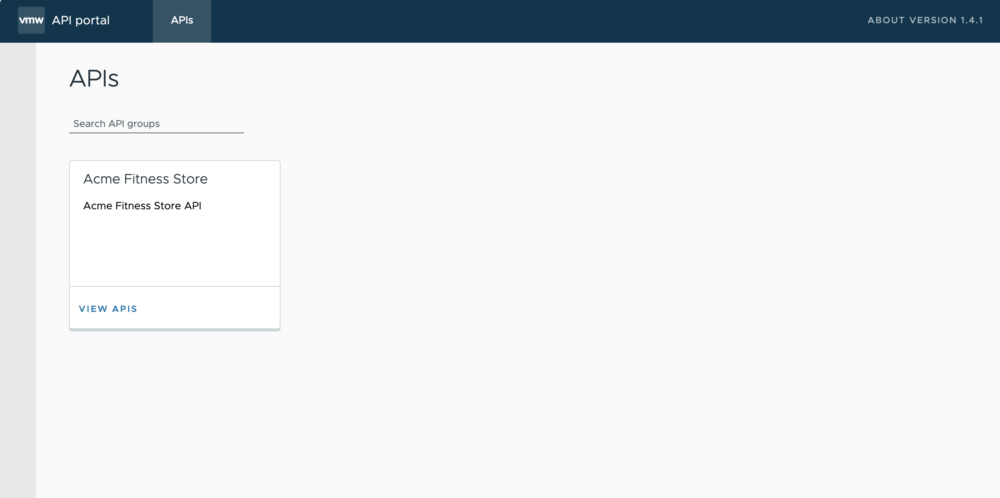
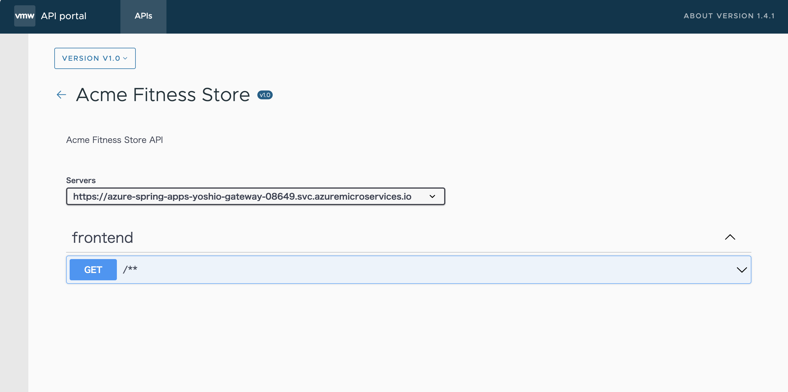

前の作業では、簡単な Hello World サービスを Azure Spring Apps Enterprise のインスタンスにデプロイしました。ここでは、ACME Fitness のフロント・エンド・アプリをデプロイし、Spring Cloud Gateway と連携し、フロント・エンド・サービスにアクセスできるようにします。

以下の図は、本作業が完了した際に表示される結果を示しています


以下は、アプリケーション・サービスを正常にデプロイするための手順です

- [1. Application Insights のサンプリングレートを設定](#1-application-insights-のサンプリングレートを設定)
  - [1.1. サンプリングレートの更新](#11-サンプリングレートの更新)
- [2. フロント・エンド・アプリケーションを Azure Spring Apps に作成しデプロイ](#2-フロント・エンド・アプリケーションを-azure-spring-apps-に作成しデプロイ)
- [3. Spring Cloud Gateway の設定](#3-spring-cloud-gateway-の設定)
  - [3.1. アプリケーションのルーティング・ルールを作成](#31-アプリケーションのルーティング・ルールを作成)
- [4. Spring Cloud Gateway 経由でアプリケーションにアクセス](#4-spring-cloud-gateway-経由でアプリケーションにアクセス)
- [5. API ポータルで API を確認](#5-api-ポータルで-api-を確認)

## 1. Application Insights のサンプリングレートを設定

下記は、フロント・エンド・アプリのデプロイに直接関連しない予備的な作業手順です。しかしアプリをデプロイする前に、事前に Application Insights で必要な設定を確認しておきます。Application Insights に関する詳細はセクション 14 で取り扱います。

提供するテンプレートをコピーし、Key Vault 環境設定に関する変数を持つ bash スクリプトを作成します：

```shell
cd azure-spring-apps-enterprise/
cp ./scripts/setup-keyvault-env-variables-template.sh ./scripts/setup-keyvault-env-variables.sh
```

`./scripts/setup-keyvault-env-variables.sh` を開き、以下の情報を更新します：

```shell
export KEY_VAULT=acme-fitness-kv-CHANGE-ME     # Azure Key Vault の一意の名前。
# CHANGE_ME の箇所を、3 の ARM テンプレートで作成された文字列に置き換えます。
```

次に、環境変数の設定を有効にします：

```shell
source ./scripts/setup-keyvault-env-variables.sh
```

環境変数を設定後、Azure KeyVault の URI を取得します

```shell
export KEYVAULT_URI=$(az keyvault show --name ${KEY_VAULT} | jq -r '.properties.vaultUri')
```

> ご注意：環境に応じては GitHub codespaces 上で KeyVault を作成できない場合があります。その場合信頼されるデバイスから Azure CLI にログインし、KeyVault を作成してください。

Application Insights の Instrumentation Key を取得し、Key Vault に追加します

```shell
export INSTRUMENTATION_KEY=$(az monitor app-insights component show --app ${SPRING_APPS_SERVICE} -g ${RESOURCE_GROUP} | jq -r '.connectionString')

az keyvault secret set --vault-name ${KEY_VAULT} \
    --name "ApplicationInsights--ConnectionString" --value ${INSTRUMENTATION_KEY}
```

### 1.1. サンプリングレートの更新

下記のコマンドを実行する前に、稼働中のアプリケーションがないことを確認してください。ビルドパックビルダーの更新時に、稼働中のアプリケーションに対して競合を引き起こす可能性があります。既存でアプリケーションが存在する場合、Azure Portal から削除してください。削除は Azure Spring Apps インスタンスに移動し、Apps セクションに移動して行います。

Application Insights のバインディングのサンプリングレートを増やします。

```shell
az spring build-service builder buildpack-binding set -g ${RESOURCE_GROUP} -s ${SPRING_APPS_SERVICE} \
    --builder-name default \
    --name default \
    --type ApplicationInsights \
    --properties sampling-rate=100 connection_string=${INSTRUMENTATION_KEY}
```

## 2. フロント・エンド・アプリケーションを Azure Spring Apps に作成しデプロイ

まず最初に、サービスに対するアプリケーションを作成します：

```shell
az spring app create --name ${FRONTEND_APP} --instance-count 1 --memory 1Gi 
```

上記が完了した後、アプリをデプロイします。

```shell
cd ..
pwd 
/workspaces/acme-fitness-store

az spring app deploy --name ${FRONTEND_APP} \
    --source-path ./apps/acme-shopping 
```

## 3. Spring Cloud Gateway の設定

API で公開エンドポイントを割り当て、 Spring Cloud Gateway の設定を更新します：

```shell
az spring gateway update --assign-endpoint true
export GATEWAY_URL=$(az spring gateway show | jq -r '.properties.url')
```

assign-endpoint 引数に true の値を設定すると、ゲートウェイにパブリックからアクセス可能なエンドポイントが作成されます。

```shell
az spring gateway update \
    --api-description "Acme Fitness Store API" \
    --api-title "Acme Fitness Store" \
    --api-version "v1.0" \
    --server-url "https://${GATEWAY_URL}" \
    --allowed-origins "*" \
    --no-wait
```

### 3.1. アプリケーションのルーティング・ルールを作成

ルーティング・ルールは、エンドポイントに対する各リクエストをバックエンドのアプリケーションにバインドします。以下の作業で、フロント・エンド・アプリに対する Spring Cloud Gateway のルールを作成しています。

```shell
cd ./azure-spring-apps-enterprise/resources/json
az spring gateway route-config create \
    --name ${FRONTEND_APP} \
    --app-name ${FRONTEND_APP} \
    --routes-file ./routes/frontend.json
```

## 4. Spring Cloud Gateway 経由でアプリケーションにアクセス

Spring Cloud Gateway　の　URL　を取得し、ブラウザで開きます：

```shell
echo "https://${GATEWAY_URL}"
```

下記のように acme-fitness の Web ページが表示された場合成功です。フロント・エンド・アプリと、その Spring Cloud Gateway の対応するルートが正しく設定され、正常にデプロイされています。
ただし、ACME フィットネスのアプリケーションを操作できるようになっていますが、まだすべての機能が有効ではないことにご注意ください。次の作業に進んで、残りの機能を追加で設定します。


## 5. API ポータルで API を確認

API ポータルに対してエンド・ポイントを割り当て、ブラウザで開きます

```shell
az spring api-portal update --assign-endpoint true
export PORTAL_URL=$(az spring api-portal show | jq -r '.properties.url')

echo "https://${PORTAL_URL}"
```

ブラウザからアクセスすると下記のような画面が表示されます。



Acme Fitness Store をクリックすると、ACMEFitness Store の API 一覧が表示されます。




⬅️ 前の作業: [07 - ASA-E コンポーネントの概要](../07-asa-e-components-overview/README.md)

➡️ 次の作業: [09 - ハンズオン・ラボ 3.1 - バックエンド・アプリのデプロイ](../09-hol-3.1-deploy-backend-apps/README.md)