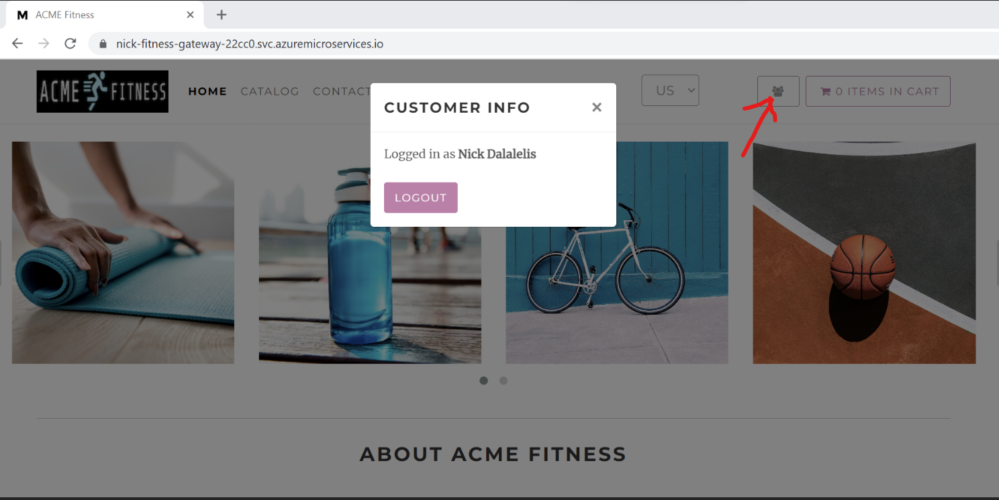

本作業では、Microsoft Entra ID (旧 Azure Active Directory) または既存の Identity Provider を使用し Spring Cloud Gateway に対してシングル・サイン・オンの設定を行います。

この作業が完了すると、アーキテクチャは下記のようになります。
 

## 1. Microsoft Entra ID 　にアプリケーションを登録

アプリケーションを登録するための一意な表示用の名前を設定します

```shell
export AD_DISPLAY_NAME=acme-ad-YOUR-UNIQUE_USERNAME    # unique application display name
```

Entra ID にアプリケーションを登録し、出力結果を JSON ファイルに保存します

```shell
az ad app create --display-name ${AD_DISPLAY_NAME} > ad.json
```

> ご注意：Azure の環境によっては、GitHub codespaces で `az ad app create`コマンドを実行すると失敗する場合があります。その場合は、信頼されたデバイス上で別途コマンドを実行してください。

アプリケーション ID を取得し、クライアント・シークレットを取得し、クレデンシャルに設定します。

```shell
export APPLICATION_ID=$(cat ad.json | jq -r '.appId')

az ad app credential reset --id ${APPLICATION_ID} --append > ./resources/json/sso.json
```

アプリケーションの登録に必要な Web リダイレクト先の URI を追加します。

```shell
az ad app update --id ${APPLICATION_ID} \
    --web-redirect-uris "https://${GATEWAY_URL}/login/oauth2/code/sso" \
     "https://${PORTAL_URL}/oauth2-redirect.html" "https://${PORTAL_URL}/login/oauth2/code/sso"
```

リダイレクト先の URI に関する詳細な情報は[こちら](https://docs.microsoft.com/ja-jp/azure/active-directory/develop/quickstart-register-app#add-a-redirect-uri)をご参照ください。

アプリケーションに対してサービスプリンシパルを割り当てます。

```shell
az ad sp create --id ${APPLICATION_ID}
```

アプリケーションの登録に関するより詳細な情報は、[こちら](https://docs.microsoft.com/ja-jp/azure/active-directory/develop/quickstart-register-app)をご参照ください。

### 1.1. SSO を有効化するための環境設定の準備

事前に提供されるスクリプトを読み込んで環境設定を行い、環境変数が正しく設定されているかご確認ください。

```shell
cd ./scripts
source ./setup-sso-variables-ad.sh
cd ..

echo ${CLIENT_ID}
echo ${CLIENT_SECRET}
echo ${TENANT_ID}
echo ${ISSUER_URI}
echo ${JWK_SET_URI}
```

`ISSUER_URI`は`https://login.microsoftonline.com/${TENANT_ID}/v2.0`の形式になります
`JWK_SET_URI`は`https://login.microsoftonline.com/${TENANT_ID}/discovery/v2.0/keys`の形式になります。

## 2. Identity Service　アプリケーションの作成とデプロイ

Azure Spring Apps に Identity Service 用のアプリケーションを作成します。

```shell
az spring app create --name ${IDENTITY_SERVICE_APP} --instance-count 1 --memory 1Gi
```

次に、Identity Service を Application Configuration Service にバインドします。

```shell
az spring application-configuration-service bind --app ${IDENTITY_SERVICE_APP}
```

次に、Identity Service を Service Registry にバインドします。

```shell
az spring service-registry bind --app ${IDENTITY_SERVICE_APP}
```

最後に、Spring Cloud Gateway に対して Identity Service アプリケーション用のルーティング・ルールを作成します。

```shell
cd /workspaces/acme-fitness-store/azure-spring-apps-enterprise/resources/json
az spring gateway route-config create \
    --name ${IDENTITY_SERVICE_APP} \
    --app-name ${IDENTITY_SERVICE_APP} \
    --routes-file ./routes/identity-service.json
```

### 2.1.  Identity Service アプリケーションのデプロイ

Java で実装された Identity Service のアプリケーションをソース・コードを元にデプロイします。

```shell
cd /workspaces/acme-fitness-store
az spring app deploy --name ${IDENTITY_SERVICE_APP} \
    --env "JWK_URI=${JWK_SET_URI}" \
    --config-file-pattern identity/default \
    --build-env BP_JVM_VERSION=17 \
    --source-path ./apps/acme-identity
```

> ご注意: アプリケーションのデプロイには約 3-5 分かかります。

## 3. Spring Cloud Gateway に SSO を設定

SSO を利用できるように　Spring Cloud Gateway を設定します。

```shell
az spring gateway update \
    --client-id ${CLIENT_ID} \
    --client-secret ${CLIENT_SECRET} \
    --scope ${SCOPE} \
    --issuer-uri ${ISSUER_URI} \
    --no-wait
```

### 3.1. 既存のアプリケーションを更新

Spring Cloud Gateway で認証情報を使用するように、既存のアプリケーションを更新します。

```shell
# カート・サービスの更新
az spring app update --name ${CART_SERVICE_APP} \
    --env "AUTH_URL=https://${GATEWAY_URL}" "CART_PORT=8080" 
    
# 注文サービスの更新
az spring app  update --name ${ORDER_SERVICE_APP} \
    --env "AcmeServiceSettings__AuthUrl=https://${GATEWAY_URL}" 
```

### 3.2. Spring Cloud Gateway を通じてアプリケーションにログイン

Spring Cloud Gateway の URL を取得し、ブラウザで開きます。

```shell
echo "https://${GATEWAY_URL}"
```

URL にアクセスすると ACME Fitness Store アプリケーションが表示され、SSO の資格情報を使用して、ログインができるようになっています。ログインが完了すると、アプリケーションの残りの機能も利用できるようになっています。例えば、カートにアイテムを追加したり、注文を行うこともできるようになっています。

## 4. API ポータルで SSO を設定

API ポータルで SSO を有効化します。

```shell
export PORTAL_URL=$(az spring api-portal show | jq -r '.properties.url')

az spring api-portal update \
    --client-id ${CLIENT_ID} \
    --client-secret ${CLIENT_SECRET}\
    --scope "openid,profile,email" \
    --issuer-uri ${ISSUER_URI}
```

### 4.1. APIポータルで API を探索

ブラウザで API ポータルに接続します。するとログイン画面にリダイレクトされます。

```shell
echo "https://${PORTAL_URL}"
```

保護された API にアクセスするには、認証をクリックし、SSOプ ロバイダーに合わせた手順で実行します。API　ポータルでの　API　認証についての詳細は、[こちら](https://docs.vmware.com/en/API-portal-for-VMware-Tanzu/1.0/api-portal-1-0.pdf)をご参照ください。

## 5. アプリのテスト

この時点で、アプリをテストし、注文を行う準備が整いました。

## 6. 永続化データの表示

実際に注文を行うことで、注文データが PostgreSQL データベースに永続化されていることを確認します。以下の URL から注文を確認します。

```text
echo https://${GATEWAY_URL}/order/${USER_ID}
```

USER_ID は URL エンコードされたユーザー名の文字列です。例えば、John Smith は John%20Smith となります。

ログインしている際に、`ログイン/ログアウト` ボタンをクリックすることで ユーザーID を確認できます。

 

⬅️ 前の作業: [11 - ハンズオン・ラボ 3.3 - Database と Cache の設定](../11-hol-3.3-configure-database-cache/README.md)

➡️ 次の作業: [13 - ハンズオン・ラボ 3.5 - Azure KeyVault の設定](../13-hol-3.5-configure-azure-keyvault/README.md)