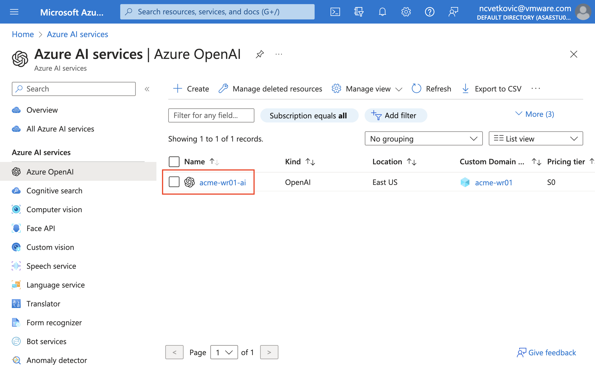
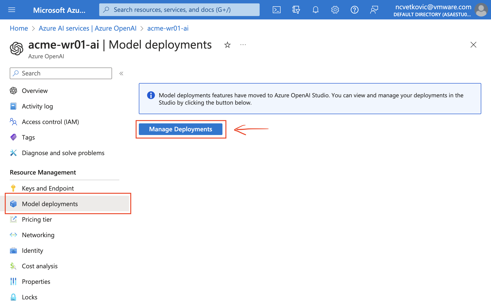
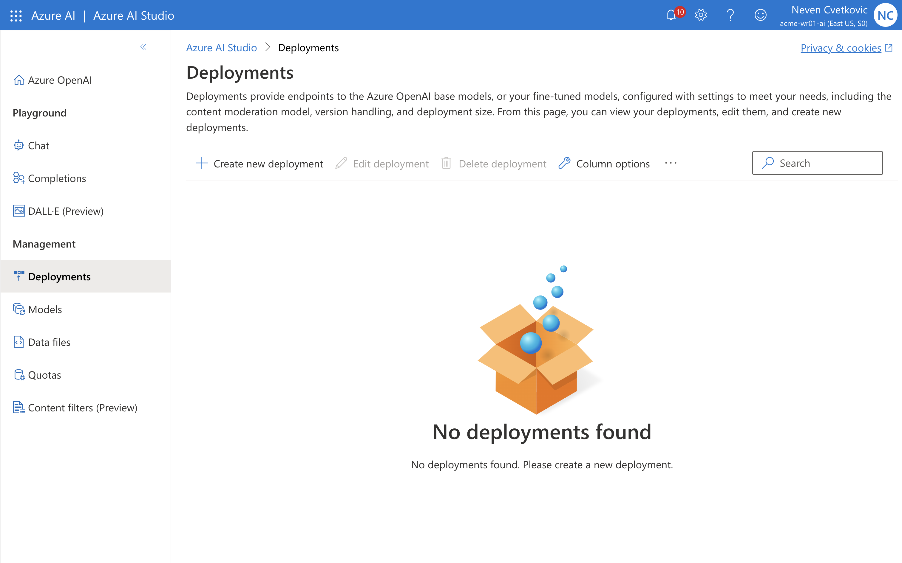
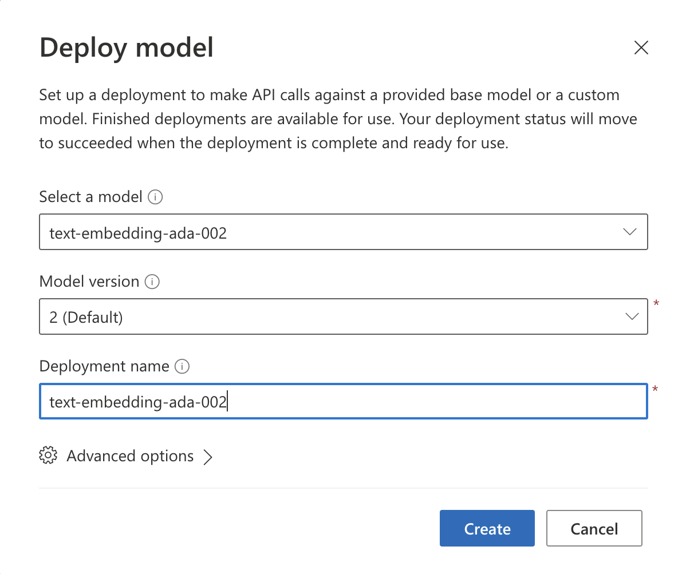
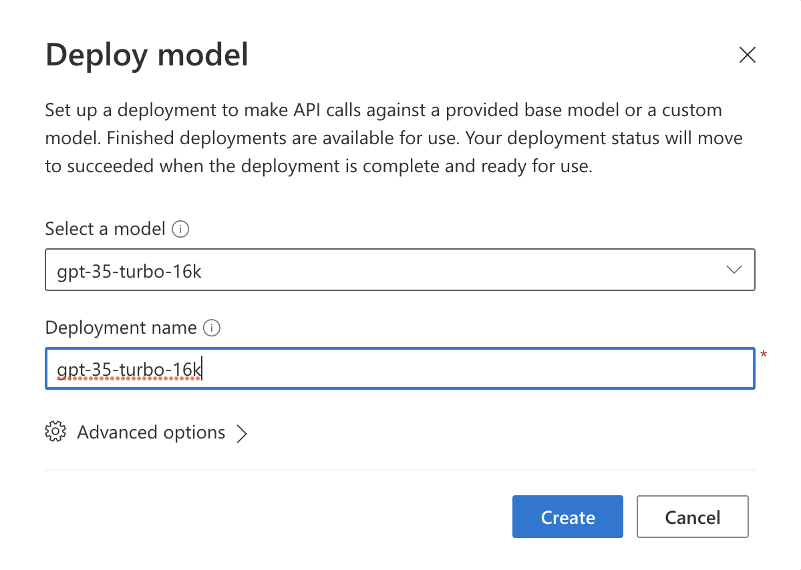
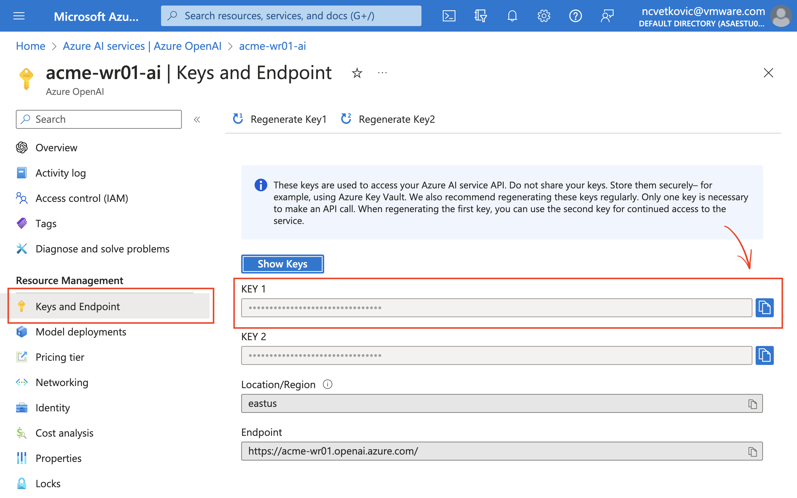

# Prepare Azure OpenAI

Please consult with your workshop instructor if this has already been pre-configured for you.
It's very important that your Azure subscription has been granted access to Azure OpenAI resources.

1. Choose a `OPENAI_RESOURCE_NAME` which should be globally unique.

1. Run the following command to create an Azure OpenAI resource in the the resource group.

   ```bash
   az upgrade -y
   export OPENAI_RESOURCE_NAME=<choose-a-resource-name>
   az cognitiveservices account create \
      -n ${OPENAI_RESOURCE_NAME} \
      -g ${RESOURCE_GROUP} \
      -l eastus2 \
      --kind OpenAI \
      --sku s0 \
      --custom-domain ${OPENAI_RESOURCE_NAME}   
   ```
   
   You can check the resource has been created in Azure Portal under `Azure AI Services`, e.g.

   

1. Create the model deployments for `text-embedding-ada-002` and `gpt-35-turbo-16k` in your Azure OpenAI service.
   
   ```bash
   az cognitiveservices account deployment create \
      -g ${RESOURCE_GROUP} \
      -n ${OPENAI_RESOURCE_NAME} \
      --deployment-name text-embedding-ada-002 \
      --model-name text-embedding-ada-002 \
      --model-version "2"  \
      --model-format OpenAI \
      --sku Standard \
      --capacity 120

   az cognitiveservices account deployment create \
      -g ${RESOURCE_GROUP} \
      -n ${OPENAI_RESOURCE_NAME} \
      --deployment-name gpt-35-turbo-16k \
      --model-name gpt-35-turbo-16k \
      --model-version "0613"  \
      --model-format OpenAI \
      --sku Standard \
      --capacity 120
   ```

   > Note: The latest API version of `gpt-35-turbo-16k` deployment model might not be compatible with Azure CLI.

   This step could also be done in `Azure AI Studio`. You can go to `Azure AI Studio` by going to `Deployments` in your Open AI service and clicking on `Manage Deployments` button.

   

   Alternatively, you can click go to the link, e.g. https://oai.azure.com/

   

   

   

1. Update the values in `azure-spring-apps-enterprise/scripts/setup-ai-env-variables.sh`, e.g.
    * for Endpoint and API KEY - check under Azure Portal OpenAI instances in `Keys and Endpoint` section
        
    * for `SPRING_AI_AZURE_OPENAI_MODEL` use previously defined model, e.g. `gpt-35-turbo-16k`
    * for `SPRING_AI_AZURE_OPENAI_EMBEDDINGMODEL` use previously defined model, e.g. `text-embedding-ada-002`
    * for `AI_APP` use default name, e.g. `assist-service`
    
    You can also get the endpoint and API keys by querying the `cognitiveservices` from Azure CLI, e.g.

   ```bash
   az cognitiveservices account show \
     --name ${OPENAI_RESOURCE_NAME} \
     --resource-group ${RESOURCE_GROUP} \
     --query 'properties.endpoint' --output tsv

   az cognitiveservices account keys list \
     --name ${OPENAI_RESOURCE_NAME} \
     --resource-group ${RESOURCE_GROUP} \
     --query 'key1' --output tsv 
   ```

1. source `azure-spring-apps-enterprise/scripts/setup-ai-env-variables.sh`
   ```bash
   source `azure-spring-apps-enterprise/scripts/setup-ai-env-variables.sh`
   ```
   
> Next: [03 - Play with Spring AI Workshop](../03-spring-ai-azure-workshop/README.md)
