# Build and deploy assist app to Azure Spring Apps Enterprise

1. Set both standard and AI environment variables, e.g. 

   ```bash
   source ./azure-spring-apps-enterprise/scripts/setup-ai-env-variables.sh
   source ./azure-spring-apps-enterprise/scripts/setup-env-variables.sh
   ```

1. Create an application placeholder for the new AI service `assist-service`, e.g.

    ```bash
    az spring app create \
      --service ${SPRING_APPS_SERVICE} \
      --resource-group ${RESOURCE_GROUP} \
      --name ${AI_APP} \
      --instance-count 1 \
      --memory 1Gi
    ```

1.  Configure Spring Cloud Gateway with the `assist-service` routes, e.g.

    ```bash
    az spring gateway route-config create \
        --service ${SPRING_APPS_SERVICE} \
        --resource-group ${RESOURCE_GROUP} \
        --name ${AI_APP} \
        --app-name ${AI_APP} \
        --routes-file azure-spring-apps-enterprise/resources/json/routes/assist-service.json
    ```
    
1. Deploy the application, e.g. 

    ```bash
    az spring app deploy --name ${AI_APP} \
        --service ${SPRING_APPS_SERVICE} \
        --resource-group ${RESOURCE_GROUP} \
        --source-path apps/acme-assist \
        --build-env BP_JVM_VERSION=17 \
        --env \
            SPRING_AI_AZURE_OPENAI_ENDPOINT=${SPRING_AI_AZURE_OPENAI_ENDPOINT} \
            SPRING_AI_AZURE_OPENAI_API_KEY=${SPRING_AI_AZURE_OPENAI_API_KEY} \
            SPRING_AI_AZURE_OPENAI_MODEL=${SPRING_AI_AZURE_OPENAI_MODEL} \
            SPRING_AI_AZURE_OPENAI_EMBEDDINGMODEL=${SPRING_AI_AZURE_OPENAI_EMBEDDINGMODEL}
    ```

1. Test the `acme-fitness` application in the browser again. Go to `ASK TO FITASSIST` and converse with the assistant, e.g.

 
   ```
   I need a bike for a commute to work.
   ```

1. Observe the output that was generated by the Assist application, e.g.

   


   ```
   I want an eBike that can keep up with City Traffic
   ```
 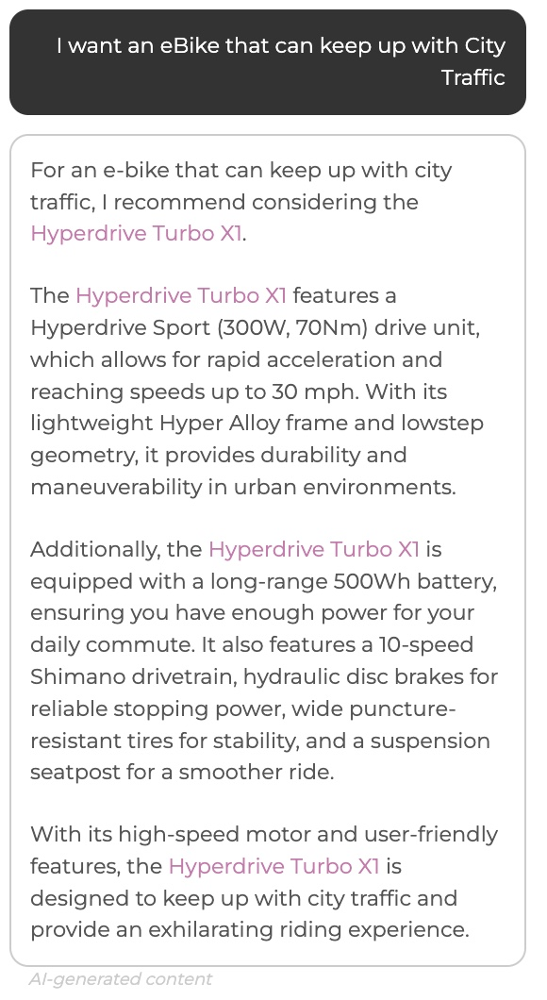

   ```
   What are the most popular eBike models for city riders?
   ```
 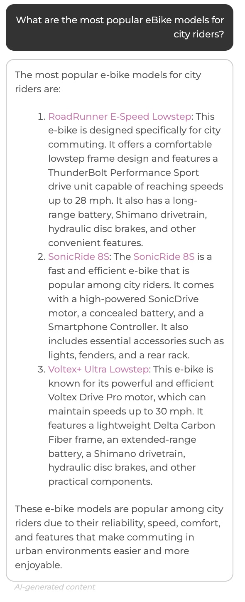

   ```
   Looking for a high performance Bike, delivers speed & comfort
   ```
 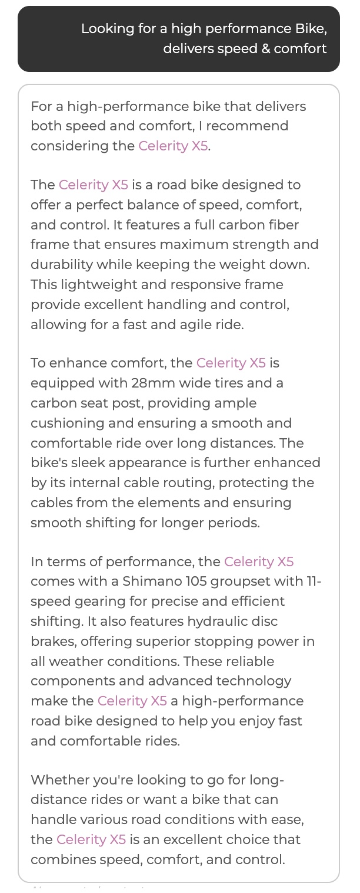

   ```
   How fast can it go?
   ```
 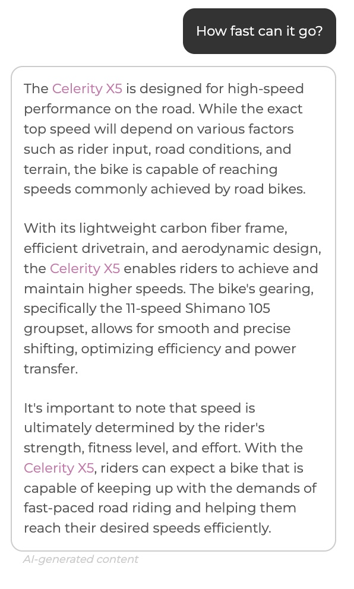

   ```
   How far on a single charge?
   ```
 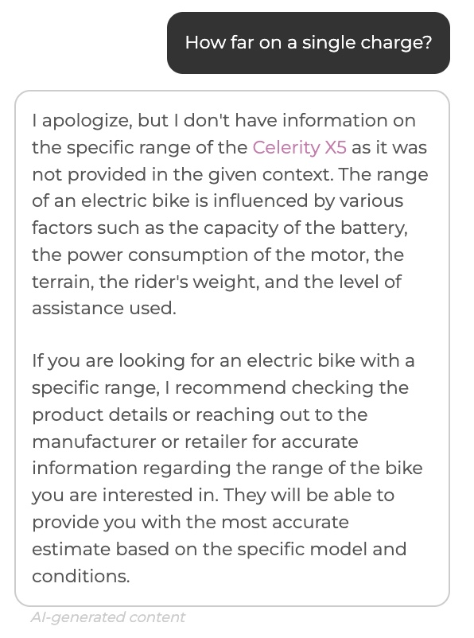

   ```
   How fast can Hyperdrive Turbo XI go?
   ```
 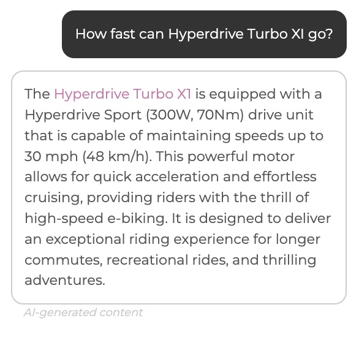

   ```
   How far on single charge can Hyperdrive Turbo XI go?
   ```
 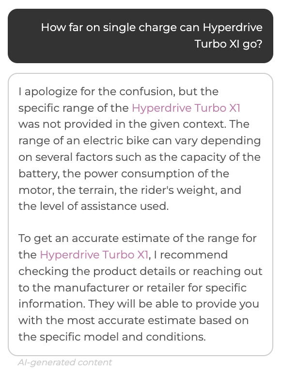

   ```
   How long does it take to charge the bike?
   ```
 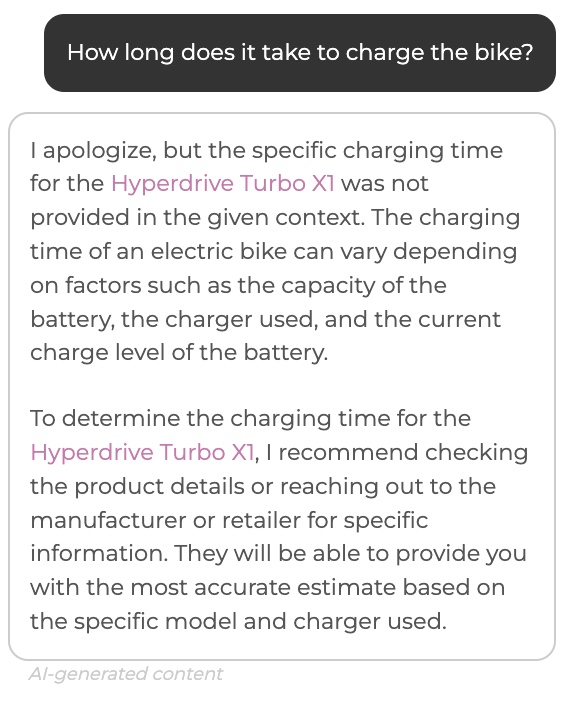

   ```
   Can I ride it in rain?
   ```
 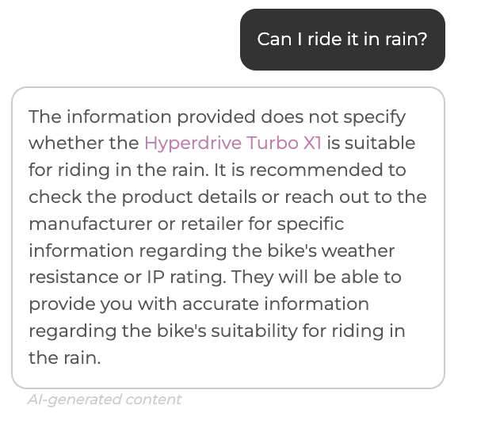

   ```
   Do I need a license to ride?
   ```
 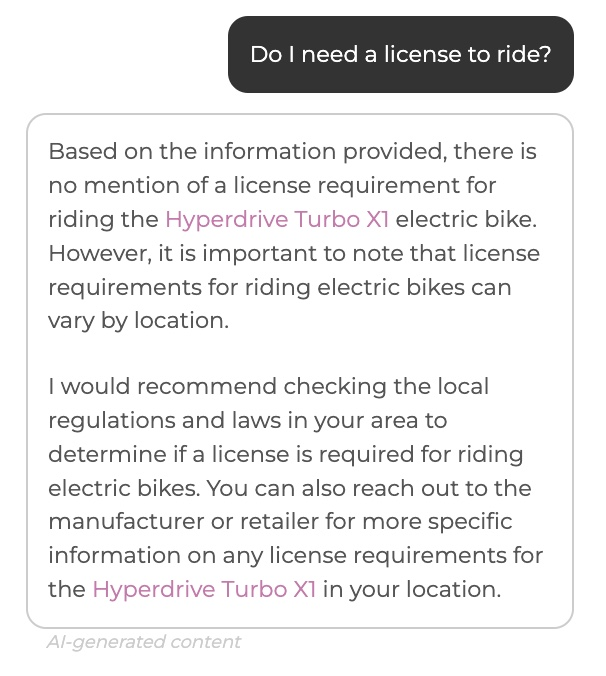

   ```
   What is a good maintenance plan?
   ```
 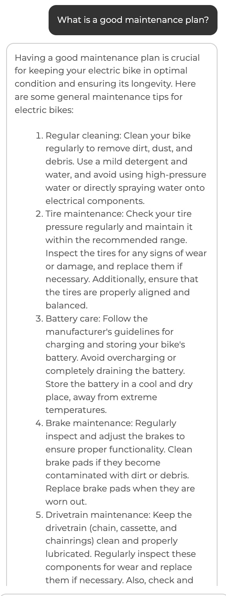

   ```
   What accessories can I consider for this bike, be brief.
   ```
 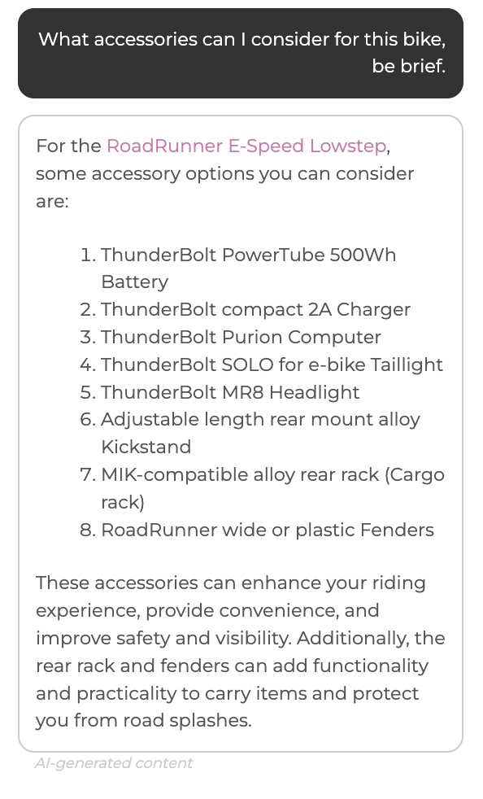

   ```
   How long will it take to get bike delivered?
   ```
 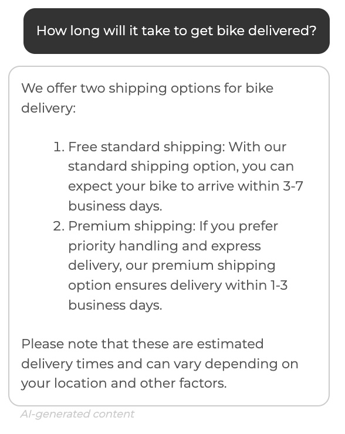


1. Congratulations! You have successfully added AI capabilities to your polyglot e-commerce application.


## Next Steps

In this quickstart, you've deployed polyglot applications to Azure Spring Apps using Azure CLI.
You also configured VMware Tanzu components in the enterprise tier. To learn more about
Azure Spring Apps or VMware Tanzu components, go to:

* [Azure Spring Apps](https://azure.microsoft.com/en-us/services/spring-cloud/)
* [Azure Spring Apps docs](https://docs.microsoft.com/en-us/azure/spring-cloud/quickstart-provision-service-instance-enterprise?tabs=azure-portal)
* [Deploy Spring Apps from scratch](https://github.com/microsoft/azure-spring-cloud-training)
* [Deploy existing Spring Apps](https://github.com/Azure-Samples/azure-spring-cloud)
* [Azure for Java Cloud Developers](https://docs.microsoft.com/en-us/azure/java/)
* [Spring Cloud Azure](https://spring.io/projects/spring-cloud-azure)
* [Spring Cloud](https://spring.io/projects/spring-cloud)
* [Spring Cloud Gateway](https://docs.vmware.com/en/VMware-Spring-Cloud-Gateway-for-Kubernetes/index.html)
* [API Portal](https://docs.vmware.com/en/API-portal-for-VMware-Tanzu/index.html)
