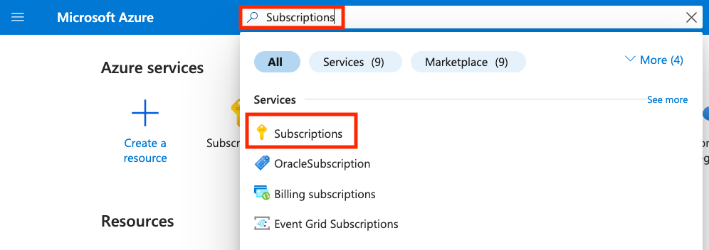

# 00 - Workshop Kickoff

Please check with the workshop moderator if this step has already been configured and completed for you.

## Create Azure Account for the workshop

To start the workshop, you need to have an Azure account with active subscription. If this is not provided by your company, please sign-up for a free Azure account which gives you $100 worth of free credit per month. Free account can be created by visiting [Microsoft Azure Pass](https://www.microsoftazurepass.com/)

As part of the workshop you will be provided a __Promo Code__ which gives $100 worth of free credits. Please make sure you enter the __Promo Code__ when you sign up for the new Azure account.

Once the account is created, please forward your `subscription id` to the workshop moderator. They will ensure the background processing is completed for you to go ahead and start using the subscription.

Subscription id can be accessed as below
 - Login to [Azure Portal](https://portal.azure.com)
 - In the search bar, type the keyword `Subscriptions`. This should pull up your subscription.
   
 - Click on the subscription link that shows up in the search results
 - On the result page you will find the `Subscription ID`, e.g. `00001111-aaaa-bbbb-cccc-ddddeeeeffff`

 ## Alternatively - Connect to an existing Azure Subscription

Check with the workshop moderator, an environment might have already been created for you. Please provide your Microsoft / Azure account so they can associate your account with an existing subscription.

## Next Guide

Next guide [01 - Azure Introduction](../01-azure-introduction/README.md)
