# 01 - Azure Introduction

In this section we will configure your Azure Subscription and Azure CLI.

## Login to Azure Portal

* Please go to [Azure Portal](https://portal.azure.com) and use your Microsoft / Azure account to login. You might need to authenticate with your phone number.

### Alternative 1: Using Azure Cloud Shell

* Select `Azure Cloud Shell` from the top navigation bar, e.g.


* If this is the first time you run Azure Cloud Shell, you will need to select `Bash`, e.g.

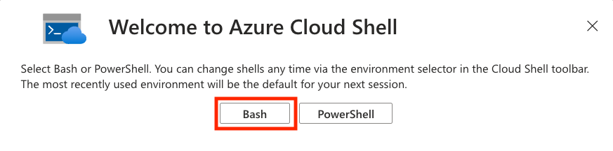

* Select to `Mount storage account`. Select storage account subscription from existing subscriptions, e.g.

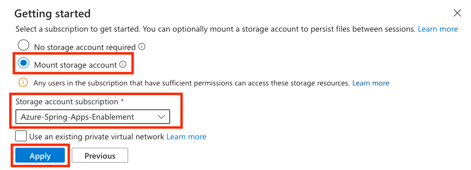

* Select `We will create a storage account for you` if you don't want to play with unique storage account names and naming rules, e.g.

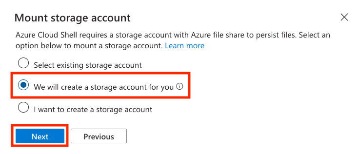

* Finally, wait for the Azure Cloud Shell to connect. Type in `az version` to find out the version of the Azure CLI, e.g.

```shell
az version
```

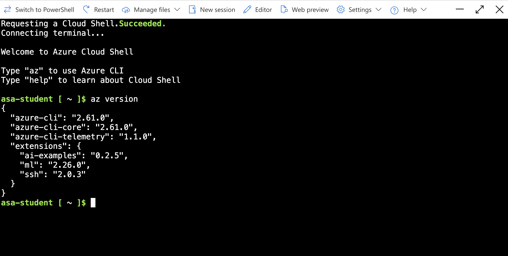

### Alternative 2: Using your desktop shell

* Please install [Azure CLI](https://learn.microsoft.com/cli/azure/install-azure-cli?view=azure-cli-latest) to your desktop. 

* Use `az version` to check the version of Azure CLI installed, e.g.

```shell
az version

{
  "azure-cli": "2.61.0",
  "azure-cli-core": "2.61.0",
  "azure-cli-telemetry": "1.1.0",
  "extensions": {
    "ai-examples": "0.2.5",
    "ml": "2.26.0",
    "ssh": "2.0.3"
  }
}
```

* Login using Azure CLI, e.g.

```shell
az login
```

* Follow the login instructions.

* Alternatively, you could use device code, e.g.

```shell
az login --use-device-code

To sign in, use a web browser to open the page https://microsoft.com/devicelogin and enter the code EJHGVJQHA to authenticate.
```

* Follow the directions in the browser, and paste the code from the shell above, e.g.

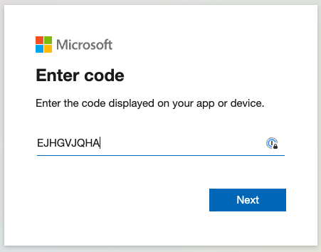

* Feel free to close the browser window, once you login, e.g.


## Azure CLI

Please refer to [Azure CLI documentation](https://learn.microsoft.com/en-us/cli/azure/cheat-sheet-onboarding) for more details.

### List all your subscriptions

* You can use Azure CLI to list all of your subscritions and account details, e.g.

```shell
az account list -o table
```

### Optional: Setting up default subscription

* You can set the default subscription in case you have multiple subscriptions, e.g.
```shell
az account set --subscription 00001111-aaaa-bbbb-cccc-ddddeeeeffff
```

## Register Microsoft.SaaS Provider

* From your shell environment, please register Microsoft.SaaS provider, e.g.

```shell
az provider register -n Microsoft.SaaS
```

```text
Registering is still on-going. You can monitor using 'az provider show -n Microsoft.SaaS'
```

* Similarly, please register `Microsoft.AppPlatform` provider, e.g. 

```shell
az provider register -n Microsoft.AppPlatform
```

```text
Registering is still on-going. You can monitor using 'az provider show -n Microsoft.AppPlatform'
```

## Add Spring extension

* From your shell environment install Azure Spring extension, e.g.

```shell
az extension add --upgrade --name spring
```

* Check installed extensions, e.g.

```
az extension list -o table

Experimental    ExtensionType    Name         Path                                                               Preview    Version
--------------  ---------------  -----------  -----------------------------------------------------------------  ---------  ---------
False           whl              ai-examples  /usr/lib/python3.9/site-packages/azure-cli-extensions/ai-examples  True       0.2.5
False           whl              ml           /usr/lib/python3.9/site-packages/azure-cli-extensions/ml           False      2.25.1
False           whl              spring       /home/asa-student/.azure/cliextensions/spring                            False      1.24.1
False           whl              ssh          /usr/lib/python3.9/site-packages/azure-cli-extensions/ssh          False      2.0.3
```

* Test the `spring` command, e.g.

```shell
az spring --help
```

## Create a Resource Group using Portal

* Click on `Resource groups` under your `Settings` in subscription, e.g.

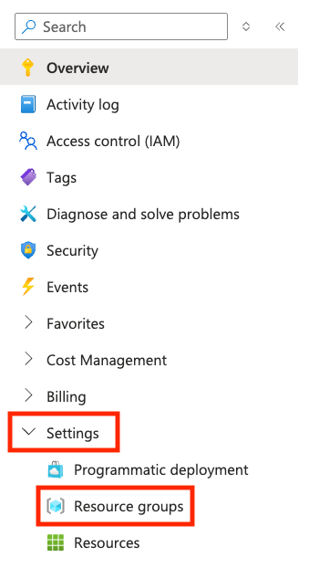

* Click on `Create` to create a new resource group, e.g.

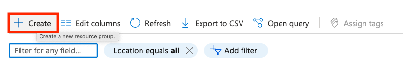

* Select a subscription. Type in a Resource group name, which should be unique within subscription context. Select the Region as instructed by the workshop moderator.

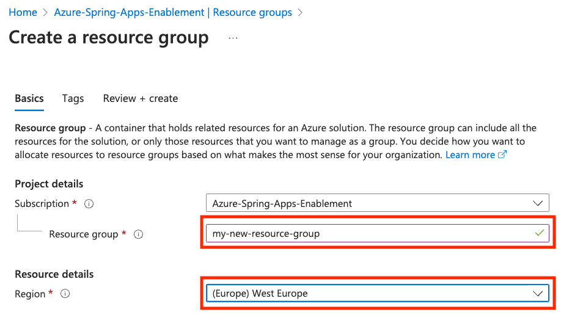

* Validate the configuration, e.g.

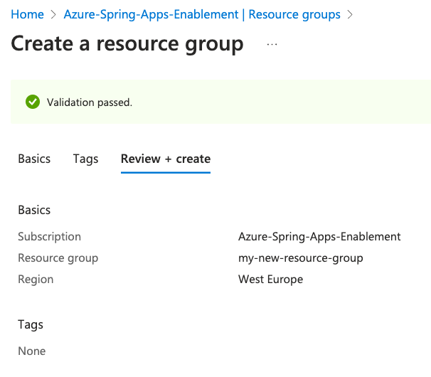

* Look at the `Resource groups` and search for a new resource group being created, e.g.

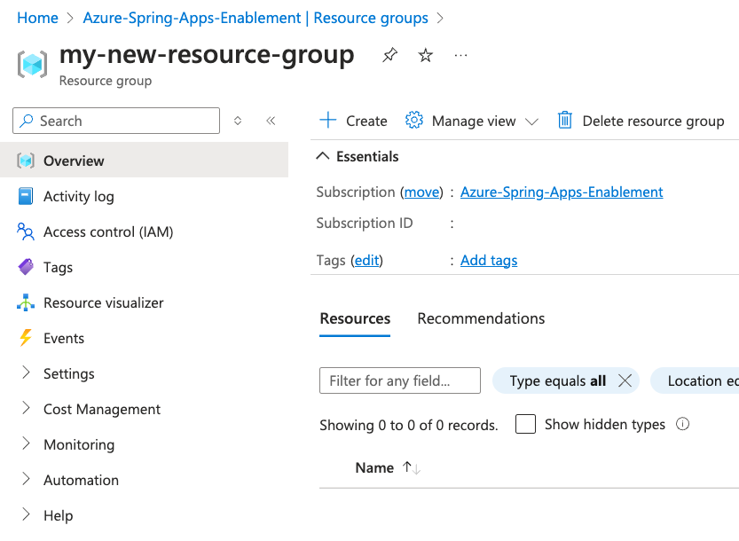

* Let's delete a resource group, e.g.

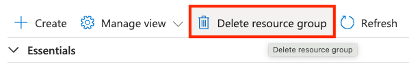

* Confirm the name of the resource group to be deleted, e.g.

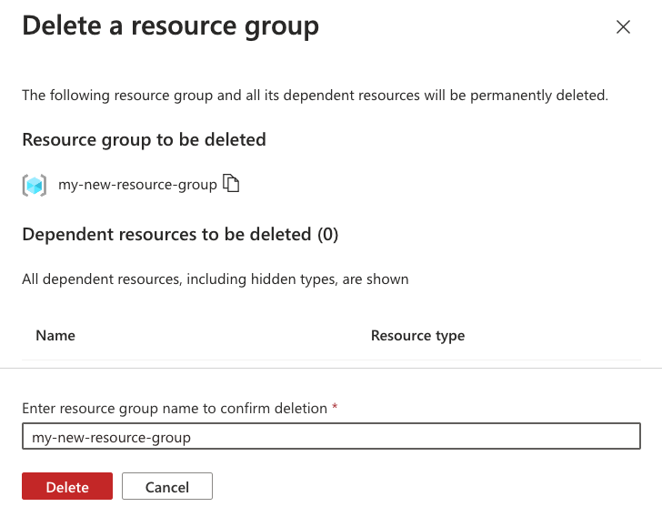


## Create a Resource Group using Azure CLI

* List all existing resource groups in the subscription, e.g.

```shell
az group list -o table
```

* Create a new resource group using Azure CLI, e.g.

```shell
az group create --name my-resource-group --location westeurope
```

* Congratulations! You have successfully created a Resource Group using both Azure Portal and Azure CLI.

## Next Guide

Next guide - [02 - Azure Spring Apps Enterprise Introduction](../02-azure-spring-apps-enterprise-introduction/README.md)
