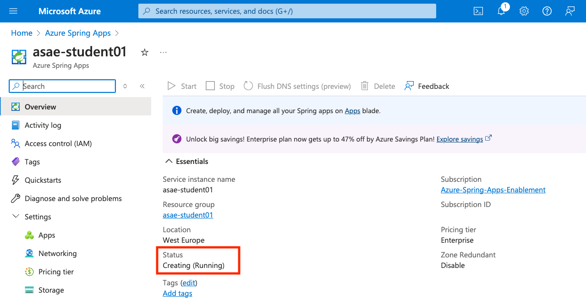

# 02 - Azure Spring Apps Enterprise Introduction

In this lab we will explore Azure Spring Apps Enterprise (ASA-E) and create an instance we will use throughout the day.

## Accept Azure Spring Apps plan

* You need to accept the Azure Spring Apps Enterprise plan, e.g.

```shell
az term accept --publisher vmware-inc --product azure-spring-cloud-vmware-tanzu-2 --plan asa-ent-hr-mtr
```

* Hopefully, there are no problems with your subscription signing the terms. You should see output like this, e.g.

```text
Command group 'term' is experimental and under development. Reference and support levels: https://aka.ms/CLI_refstatus
{
  "accepted": true,
  "id": "/subscriptions/00001111-aaaa-bbbb-cccc-ddddeeeeffff/providers/Microsoft.MarketplaceOrdering/offerTypes/Microsoft.MarketplaceOrdering/offertypes/publishers/vmware-inc/offers/azure-spring-cloud-vmware-tanzu-2/plans/asa-ent-hr-mtr/agreements/current",
  "licenseTextLink": "https://mpcprodsa.blob.core.windows.net/legalterms/3E5ED_legalterms_VMWARE%253a2DINC%253a24AZURE%253a2DSPRING%253a2DCLOUD%253a2DVMWARE%253a2DTANZU%253a2D2%253a24ASA%253a2DENT%253a2DHR%253a2DMTR%253a24TO3RAC3XZSHSDTP65CFZW6IPPAHH7AK67FSWSYMURETXWPUSCAVD4OLQYHA6YD5CWK4S4UAJE7VXIOTVYYJ7EJA67IXPJPVHUB2B7DY.txt",
  "marketplaceTermsLink": "https://mpcprodsa.blob.core.windows.net/marketplaceterms/3EDEF_marketplaceterms_SAAS%253a245XNIYDD23KXQBTPZZUVTDJNYHJZ5Y76OXRLYJ2DHP67BFUMFY42RHUG62CKSGJIAUTE2UN6MIODUJ4JBTOMEQBMWQM4VD2QGXBRTTUY.txt",
  "name": "asa-ent-hr-mtr",
  "plan": "asa-ent-hr-mtr",
  "privacyPolicyLink": "https://www.vmware.com/help/privacy.html",
  "product": "azure-spring-cloud-vmware-tanzu-2",
  "publisher": "vmware-inc",
  "retrieveDatetime": "2024-05-17T19:33:42.611828Z",
  "signature": "OT7T65UQENLCKBAT5465AVRDAO3IOB46AINSWT5PTBU3Z9RZ3ZBLKCFNWTRE7TLN22MOIFYR7DXOQ466D6DR4OC3NXZ56GQ4HZ4HPDY",
  "systemData": {
    "createdAt": "2024-05-17T19:33:46.875169+00:00",
    "createdBy": "00001111-aaaa-bbbb-cccc-ddddeeeeffff",
    "createdByType": "ManagedIdentity",
    "lastModifiedAt": "2024-05-17T19:33:46.875169+00:00",
    "lastModifiedBy": "00001111-aaaa-bbbb-cccc-ddddeeeeffff",
    "lastModifiedByType": "ManagedIdentity"
  },
  "type": "Microsoft.MarketplaceOrdering/offertypes"
}
```

## Create ASA-E Instance

* Let's configure environment variables for this workshop, please use corresponding workshop id, e.g. `asae-student01`

```shell
export REGION=westeurope
export SUBSCRIPTION=asae-student01
export RESOURCE_GROUP=asae-student01
export SPRING_APPS_SERVICE=asae-student01
```

* Let's create a resource group for this workshop first, e.g.

```shell
az group create \
  --name ${RESOURCE_GROUP} \
  --location ${REGION}
```

* Let's create an instance of Azure Spring Apps Enterprise, e.g.

```shell
az spring create \
  --name "${SPRING_APPS_SERVICE}" \
  --resource-group "${RESOURCE_GROUP}" \
  --location "${REGION}" \
  --sku enterprise \
  --enable-application-configuration-service \
  --application-configuration-service-generation Gen2 \
  --enable-gateway \
  --enable-service-registry \
  --enable-application-live-view \
  --enable-application-accelerator \
  --enable-api-portal \
  --build-pool-size S2 \
  --verbose
```

* The above `az spring create` command will take 10+ minutes to complete, as we are configuring lot of components for this Azure Spring Apps Enterprise instance. You can observe the output in the shell, e.g.

```text
 - Creating Service ..
Start configure Application Insights
Application Insights "asae-student01" was created for this Azure Spring Apps. You can visit https://portal.azure.com/#resource/subscriptions/00001111-aaaa-bbbb-cccc-ddddeeeeffff/resourceGroups/asae-student01/providers/microsoft.insights/components/asae-student01/overview to view your Application Insights component
 - Creating Application Configuration Service ..
Create with generation Gen2
- Creating Application Live View ..
- View Application Live View through Dev Tool portal. Create Dev Tool Portal by running "az spring dev-tool create --service asae-student01 --resource-group asae-student01 --assign-endpoint"
- Creating Dev Tool Portal ..
 - Creating Service Registry ..
 - Creating Spring Cloud Gateway ..
 - Creating API portal ..
 - Creating Application Accelerator ..
 {
  "id": "/subscriptions/00001111-aaaa-bbbb-cccc-ddddeeeeffff/resourceGroups/asae-student01/providers/Microsoft.AppPlatform/Spring/asae-student01",
  "location": "westeurope",
  "name": "asae-student01",
  "properties": {
    "fqdn": "asae-student01.azuremicroservices.io",
    "infraResourceGroup": null,
    "maintenanceScheduleConfiguration": null,
    "managedEnvironmentId": null,
    "marketplaceResource": {
      "plan": "asa-ent-hr-mtr",
      "product": "azure-spring-cloud-vmware-tanzu-2",
      "publisher": "vmware-inc"
    },
    "networkProfile": {
      "appNetworkResourceGroup": null,
      "appSubnetId": null,
      "ingressConfig": null,
      "outboundIPs": {
        "publicIPs": [
          "98.64.250.101",
          "98.64.250.102"
        ]
      },
      "outboundType": "loadBalancer",
      "requiredTraffics": null,
      "serviceCidr": null,
      "serviceRuntimeNetworkResourceGroup": null,
      "serviceRuntimeSubnetId": null
    },
    "powerState": "Running",
    "provisioningState": "Succeeded",
    "serviceId": "9b691e1378be429d8dd63ef79c441f08",
    "version": 3,
    "vnetAddons": null,
    "zoneRedundant": false
  },
  "resourceGroup": "asae-student01",
  "sku": {
    "capacity": null,
    "name": "E0",
    "tier": "Enterprise"
  },
  "systemData": {
    "createdAt": "2024-05-17T20:20:29.258713+00:00",
    "createdBy": "asastudent01@outlook.com",
    "createdByType": "User",
    "lastModifiedAt": "2024-05-17T20:20:29.258713+00:00",
    "lastModifiedBy": "asastudent01@outlook.com",
    "lastModifiedByType": "User"
  },
  "tags": null,
  "type": "Microsoft.AppPlatform/Spring"
}
Command ran in 631.394 seconds (init: 0.167, invoke: 631.227)
```

* Please explore in [Azure portal](https://portal.azure.com) the creation of the new Azure Spring Apps Enterprise instance, e.g.



* Once completed, you will see the status changed to `Succeeded`, e.g.


* Feel free to explore the [Azure portal](https://portal.azure.com) for the ASA-E instance you have just created.

## Next Guide

Next guide - [03 - Workshop Environment Setup](../03-setup-workshop-environment/README.md)