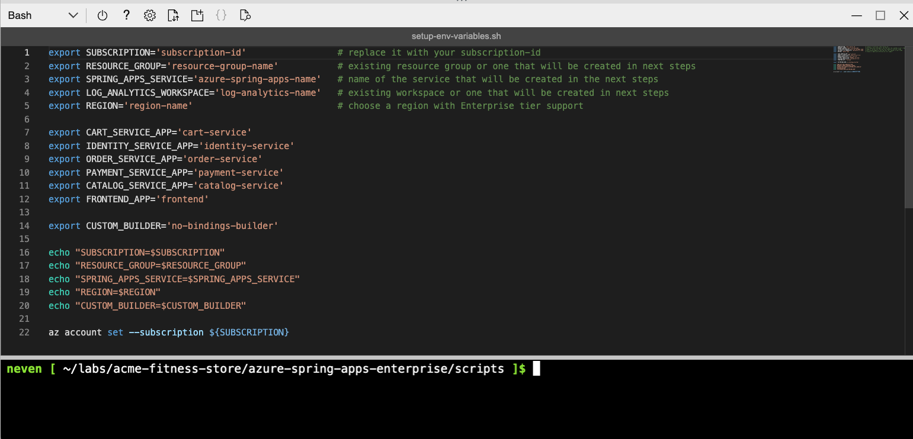
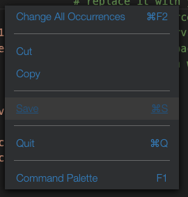

# 03 - Workshop Environment Setup

In this lab, we prepare the environment for an example polyglot microservice e-commerce application `acme-fitness-store` that we will use later in this workshop. We download the source code, and prepare environment variables for easier application deployment.

## Clone the repository

* Make sure you have the `git` client installed in your shell environment. Azure Cloud Shell environment already has `git` client installed.

* Create `labs` directory that we will use for this workshop, e.g.

```shell
mkdir labs
cd labs
```

* Clone the repository, e.g.

```shell
git clone https://github.com/Azure-Samples/acme-fitness-store
```

## Prepare the environment variables

* Make sure you are operating under `acme-fitness-store/azure-spring-apps-enterprise/scripts` folder, e.g.

```shell
cd acme-fitness-store/azure-spring-apps-enterprise/scripts
```

* You can see the current directory with `pwd`, e.g.

```shell
pwd
```

```text
/home/asa-student/labs/acme-fitness-store/azure-spring-apps-enterprise/scripts
```

* Create a bash script with environment variables by making a copy of the existing template, e.g. 

```shell
cp ./setup-env-variables-template.sh ./setup-env-variables.sh
```

* Edit the file, use your favourite editor, or just built-in `code` in Azure Cloud Shell, e.g.

```shell
code ./setup-env-variables.sh
```



* Enter the following information, that we already used in previous lab, e.g.

```text
export SUBSCRIPTION=asae-student01                  # replace it with your subscription-id or subscription name from previous steps
export RESOURCE_GROUP=asae-student01                # existing resource group or one that will be created in the next steps
export SPRING_APPS_SERVICE=asae-student01           # existing spring apps service name or one that will be created in the next steps
export LOG_ANALYTICS_WORKSPACE=asae-student01       # existing workspace or one that will be created in next steps
export REGION=westeurope                            # choose a region with Enterprise tier support
```

* Save the file, by right clicking in editor and saving. Quit the file, by right clicking in editor and quiting, e.g.



* Load the environment variables into existing shell, e.g.

```shell
source ./setup-env-variables.sh
```

## Configure default Azure Spring Apps instance

* For the purpose of this workshop, we will configure a default Azure Spring Apps instance, resource group and the region, e.g.

```shell
az configure --defaults \
  group=${RESOURCE_GROUP} \
  location=${REGION} \
  spring=${SPRING_APPS_SERVICE} 
```

## Configure Application Configuration Service

* Create a configuration repository for Application Configuration Service using the Azure CLI, e.g.

```shell
az spring application-configuration-service git repo add \
  --name acme-fitness-store-config \
  --label main \
  --patterns "catalog/default,catalog/key-vault,identity/default,identity/key-vault,payment/default" \
  --uri "https://github.com/Azure-Samples/acme-fitness-store-config"
```

## Configure Tanzu Build Service

* Make sure you are operating under the `scripts` folder, e.g.

```shell
pwd
```

* This should show something like, e.g.

```text
/home/asa-student/labs/acme-fitness-store/azure-spring-apps-enterprise/scripts
```

* Create a custom builder in Tanzu Build Service using the Azure CLI, e.g.

```shell
az spring build-service builder create \
    --name ${CUSTOM_BUILDER} \
    --builder-file ../resources/json/tbs/builder.json \
    --no-wait
```

## Next Guide

Next guide - [04 - Hello World Application](../04-hello-world-application/README.md)
