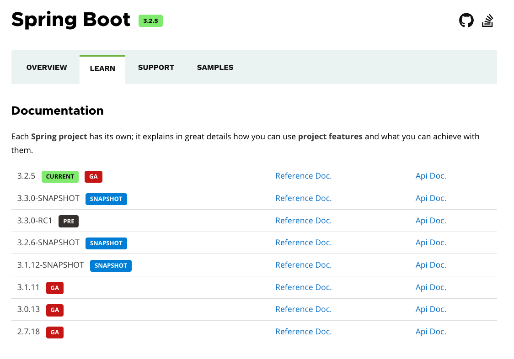
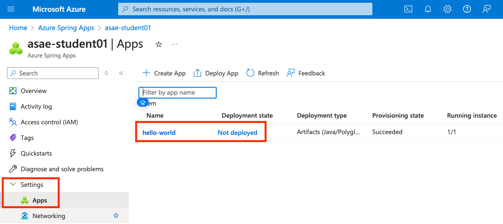
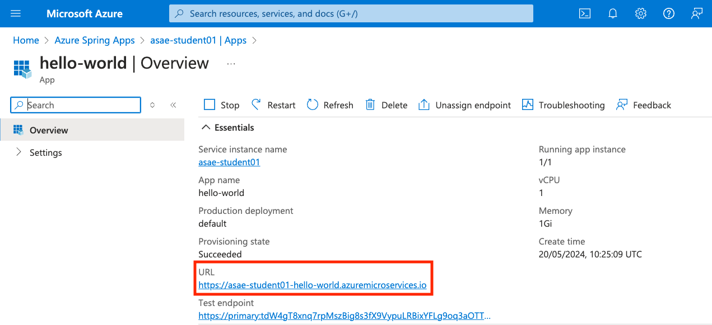
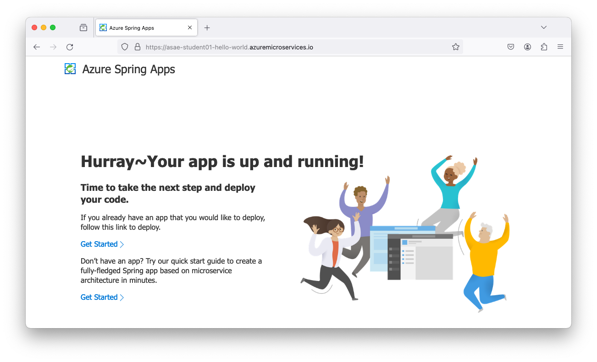
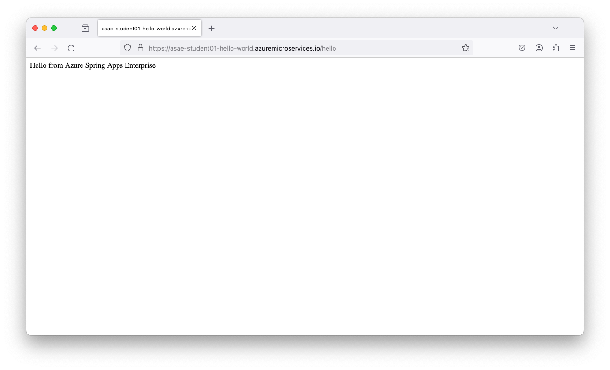

# 04 - Hello World Application

In this lab we create a simplest possible Hello World Spring Boot application and deploy it to the Azure Spring Apps Enterprise instance created in previous labs.

## Create Hello World Application

* Typical way to create new Spring Boot applications is to use Spring Initializr at https://start.spring.io. 
* Make sure you execute this from the `labs` folder, e.g.

```shell
cd labs
```

* You can see the current directory with `pwd`, e.g.

```shell
pwd
```

```text
/home/asa-student/labs
```

* For the purpose of this workshop and simplicity of this lab exercise, we will use `curl` to invoke the Spring Initalizr.

```shell
curl -k -s https://start.spring.io/starter.tgz -d dependencies=web -d baseDir=hello-world \ -d bootVersion=3.2.5 -d javaVersion=17 -d type=maven-project | tar -xzvf -
```

```text
hello-world/
hello-world/HELP.md
hello-world/.gitignore
hello-world/mvnw
hello-world/mvnw.cmd
hello-world/.mvn/
hello-world/.mvn/wrapper/
hello-world/.mvn/wrapper/maven-wrapper.properties
hello-world/.mvn/wrapper/maven-wrapper.jar
hello-world/src/
hello-world/src/test/
hello-world/src/test/java/
hello-world/src/test/java/com/
hello-world/src/test/java/com/example/
hello-world/src/test/java/com/example/demo/
hello-world/src/test/java/com/example/demo/DemoApplicationTests.java
hello-world/src/main/
hello-world/src/main/java/
hello-world/src/main/java/com/
hello-world/src/main/java/com/example/
hello-world/src/main/java/com/example/demo/
hello-world/src/main/java/com/example/demo/DemoApplication.java
hello-world/src/main/resources/
hello-world/src/main/resources/static/
hello-world/src/main/resources/application.properties
hello-world/src/main/resources/templates/
hello-world/pom.xml
```

* We are using the latest `3.2.5` Spring Boot version. We also used the default example package name, e.g. `com.example.demo`. Feel free to use whatever the latest Spring Boot version is instead. Check [Spring Boot Documentation](https://spring.io/projects/spring-boot#learn)



## Add a new Spring MVC Controller

* In the `hello-world/src/main/java/com/example/demo` directory, create a new file called `HelloController.java` next to `DemoApplication.java` file with the following content:

```java
package com.example.demo;

import org.springframework.web.bind.annotation.GetMapping;
import org.springframework.web.bind.annotation.RestController;

@RestController
public class HelloController {

    @GetMapping("/hello")
    public String hello() {
        return "Hello from Azure Spring Apps Enterprise\n";
    }
}
```

## Package the Application

* From the `hello-world` directory, package the application with `mvn clean package`, e.g.

```shell
cd hello-world
./mvnw clean package
```

* If you had no errors in your code, this command should create a JAR package file, e.g. `target/demo-0.0.1-SNAPSHOT.jar`

* See an example output, e.g.

```text
[INFO] Scanning for projects...
[INFO] 
[INFO] --------------------------< com.example:demo >--------------------------
[INFO] Building demo 0.0.1-SNAPSHOT
[INFO]   from pom.xml
[INFO] --------------------------------[ jar ]---------------------------------
[INFO] 
[INFO] --- clean:3.3.2:clean (default-clean) @ demo ---
[INFO] Deleting /home/asa-student/labs/hello-world/target
[INFO] 
[INFO] --- resources:3.3.1:resources (default-resources) @ demo ---
[INFO] Copying 1 resource from src/main/resources to target/classes
[INFO] Copying 0 resource from src/main/resources to target/classes
[INFO] 
[INFO] --- compiler:3.11.0:compile (default-compile) @ demo ---
[INFO] Changes detected - recompiling the module! :source
[INFO] Compiling 2 source files with javac [debug release 17] to target/classes
[INFO] 
[INFO] --- resources:3.3.1:testResources (default-testResources) @ demo ---
[INFO] skip non existing resourceDirectory /home/asa-student/labs/hello-world/src/test/resources
[INFO] 
[INFO] --- compiler:3.11.0:testCompile (default-testCompile) @ demo ---
[INFO] Changes detected - recompiling the module! :dependency
[INFO] Compiling 1 source file with javac [debug release 17] to target/test-classes
[INFO] 
[INFO] --- surefire:3.1.2:test (default-test) @ demo ---
[INFO] Using auto detected provider org.apache.maven.surefire.junitplatform.JUnitPlatformProvider
[INFO] 
[INFO] -------------------------------------------------------
[INFO]  T E S T S
[INFO] -------------------------------------------------------
[INFO] Running com.example.demo.DemoApplicationTests
17:58:10.704 [main] INFO org.springframework.test.context.support.AnnotationConfigContextLoaderUtils -- Could not detect default configuration classes for test class [com.example.demo.DemoApplicationTests]: DemoApplicationTests does not declare any static, non-private, non-final, nested classes annotated with @Configuration.
17:58:11.029 [main] INFO org.springframework.boot.test.context.SpringBootTestContextBootstrapper -- Found @SpringBootConfiguration com.example.demo.DemoApplication for test class com.example.demo.DemoApplicationTests

  .   ____          _            __ _ _
 /\\ / ___'_ __ _ _(_)_ __  __ _ \ \ \ \
( ( )\___ | '_ | '_| | '_ \/ _` | \ \ \ \
 \\/  ___)| |_)| | | | | || (_| |  ) ) ) )
  '  |____| .__|_| |_|_| |_\__, | / / / /
 =========|_|==============|___/=/_/_/_/
 :: Spring Boot ::                (v3.2.5)

2024-05-19T17:58:12.285Z  INFO 2891 --- [demo] [           main] com.example.demo.DemoApplicationTests    : Starting DemoApplicationTests using Java 17.0.11 with PID 2891 (started by asa-student in /home/asa-student/labs/hello-world)
2024-05-19T17:58:12.287Z  INFO 2891 --- [demo] [           main] com.example.demo.DemoApplicationTests    : No active profile set, falling back to 1 default profile: "default"
2024-05-19T17:58:14.551Z  INFO 2891 --- [demo] [           main] com.example.demo.DemoApplicationTests    : Started DemoApplicationTests in 3.132 seconds (process running for 5.997)
OpenJDK 64-Bit Server VM warning: Sharing is only supported for boot loader classes because bootstrap classpath has been appended
[INFO] Tests run: 1, Failures: 0, Errors: 0, Skipped: 0, Time elapsed: 5.735 s -- in com.example.demo.DemoApplicationTests
[INFO] 
[INFO] Results:
[INFO] 
[INFO] Tests run: 1, Failures: 0, Errors: 0, Skipped: 0
[INFO] 
[INFO] 
[INFO] --- jar:3.3.0:jar (default-jar) @ demo ---
[INFO] Building jar: /home/asa-student/labs/hello-world/target/demo-0.0.1-SNAPSHOT.jar
[INFO] 
[INFO] --- spring-boot:3.2.5:repackage (repackage) @ demo ---
[INFO] Replacing main artifact /home/asa-student/labs/hello-world/target/demo-0.0.1-SNAPSHOT.jar with repackaged archive, adding nested dependencies in BOOT-INF/.
[INFO] The original artifact has been renamed to /home/asa-student/labs/hello-world/target/demo-0.0.1-SNAPSHOT.jar.original
[INFO] ------------------------------------------------------------------------
[INFO] BUILD SUCCESS
[INFO] ------------------------------------------------------------------------
[INFO] Total time:  16.303 s
[INFO] Finished at: 2024-05-19T17:58:17Z
[INFO] ------------------------------------------------------------------------
```

## Test the project locally

* If you run this in Azure Cloud Shell, the process might already have something running on port `8080`, so we need to use a different port number, e.g. `9090`

* Execute JAR application from command line, e.g.

```shell
java -jar target/demo-0.0.1-SNAPSHOT.jar --server.port=9090 &
```

* You can request the `/hello` endpoint that should return the "Hello from Azure Spring Apps" message, e.g.

```shell
curl http://localhost:9090/hello
```

* Finally, kill running app:

```bash
kill %1
```

* Alternatively, you could execute the application from `mvn` with alternate port number as well, e.g.

```
./mvnw spring-boot:run -Dspring-boot.run.jvmArguments='-Dserver.port=9090' &
curl http://localhost:9090/hello
kill %1
```

* The above steps ensure that the `hello-world` application is up and running locally without any issues.


## Create Application Placecholder

* First, we need to create an application placeholder for the `hello-world` application, e.g.

```shell
az spring app create --name hello-world --assign-endpoint --cpu 1 --memory 1Gi
```

* You can observe the example [output](output-azure-spring-app-create.txt).

* You can also explore the Azure portal, and notice the application URL, e.g. 





* You can also get an application url by querying the ASAE instance, e.g.

```shell
az spring app show --name hello-world --query properties.url -o tsv
```

* The ASAE has deployed a placeholder app to the URL, until we deploy the real application, e.g.



## Deploy a hello-world application

* Make sure you are in the `labs/hello-world` folder, e.g.

```shell
pwd
```

```text
/home/asa-student/labs/hello-world
```

* Deploy an application using source, e.g. 

```shell
az spring app deploy \
  --name hello-world \
  --source-path . \
  --build-env BP_JVM_VERSION=17 \
  --verbose
```

* Alternatively, you can deploy an application using JAR file, e.g.

```shell
az spring app deploy \
    --name hello-world \
    --artifact-path target/demo-0.0.1-SNAPSHOT.jar \
    --build-env BP_JVM_VERSION=17 \
    --verbose
```
> Note: You could skip the `--build-env BP_JVM_VERSION=17` as that is now the default Java version for Microsoft Java Buildpack. You could use `--build-env BP_JVM_VERSION=21` for Java 21 applications.

* Observe the [example output](output-azure-spring-app-deploy.txt) (it's quite long).


* Test the application URL, e.g.

```shell
curl https://asae-student01-hello-world.azuremicroservices.io/hello

Hello from Azure Spring Apps Enterprise
```

* You can test in the browser, too:



* Congratulations! You have successfully deployed your first Spring Boot application to Azure Spring Apps.

## Next Guide

Next guide - [05 - Deploy Frontend Application](../05-deploy-frontend-application/README.md)
