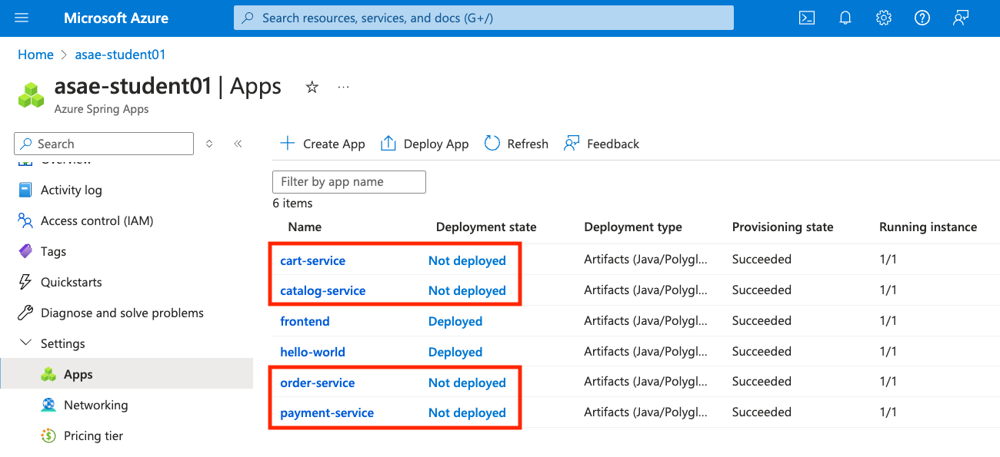
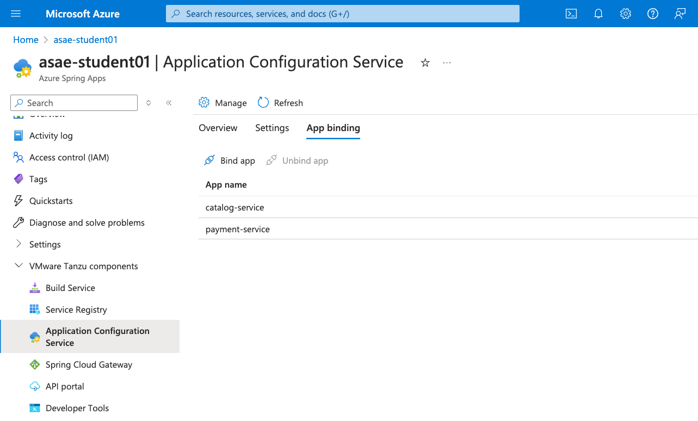
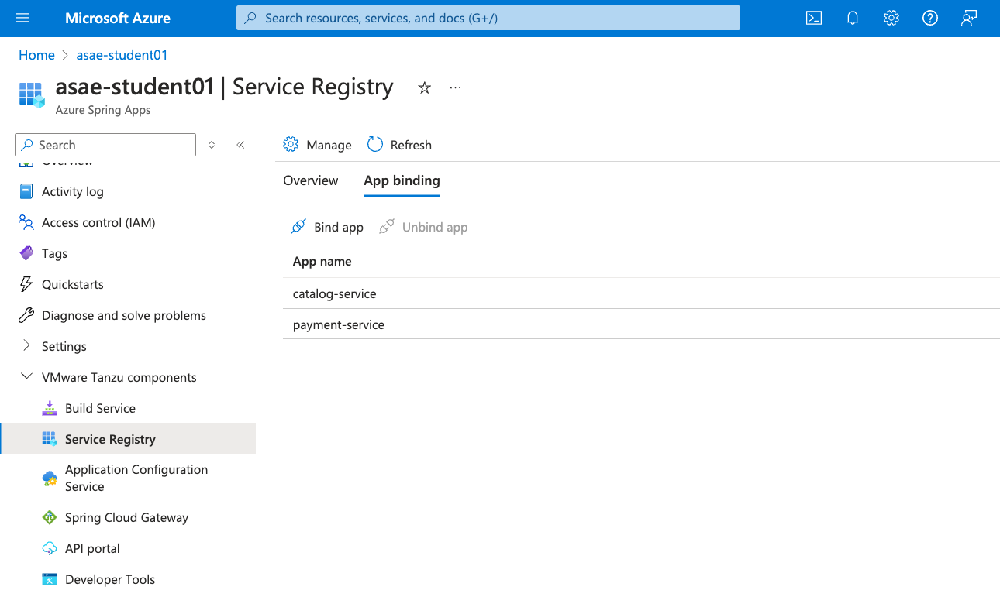
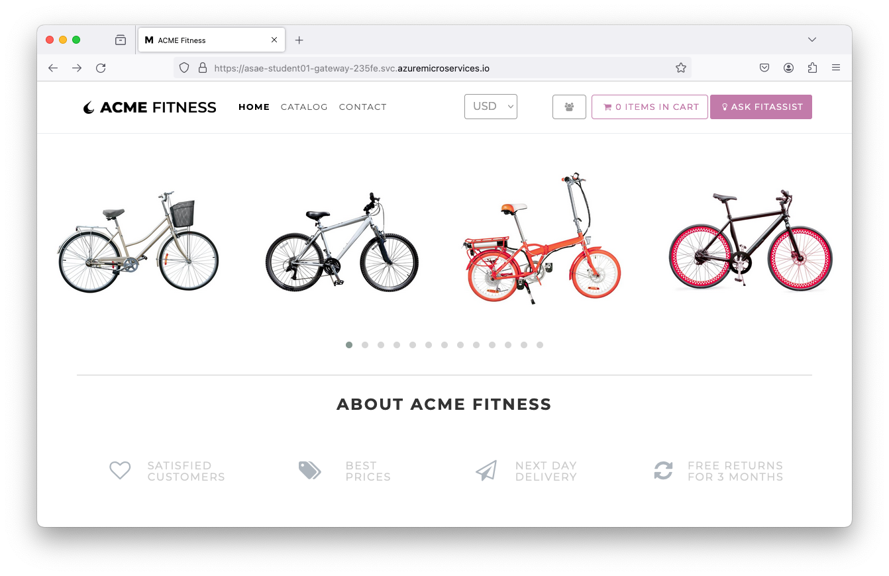
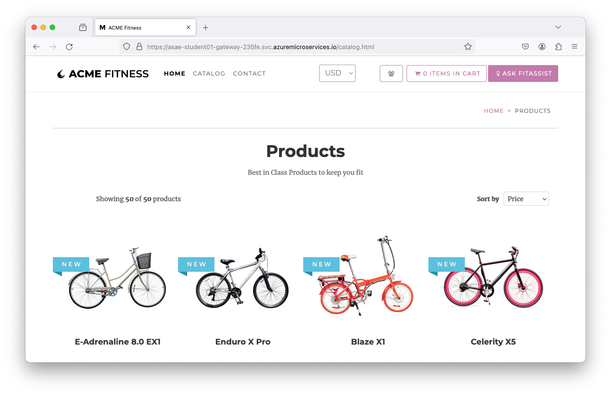
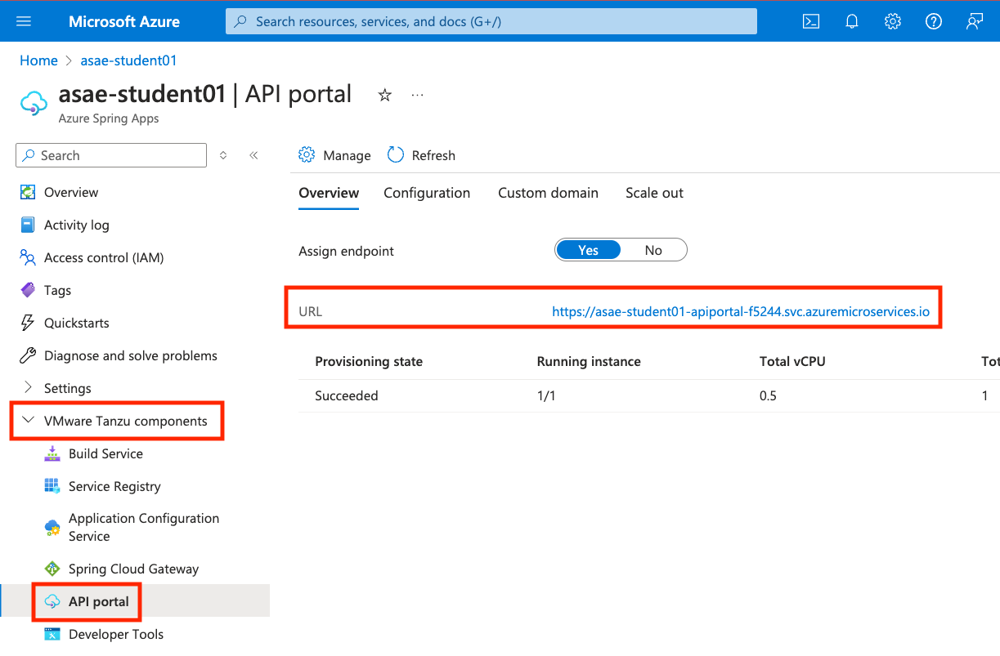
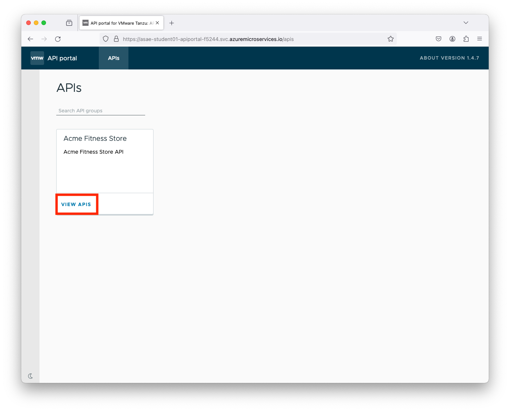
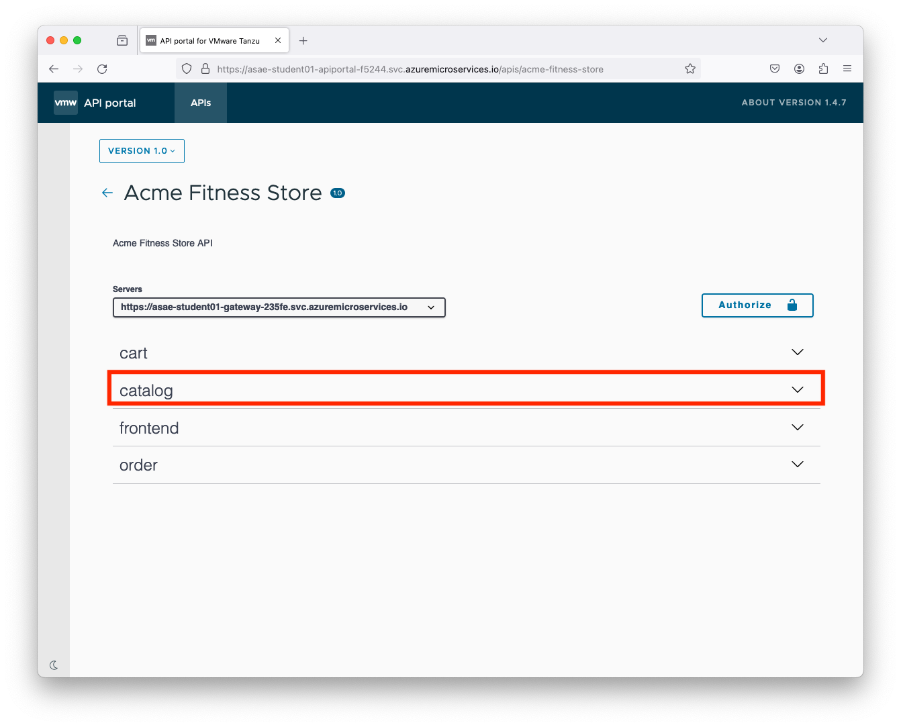
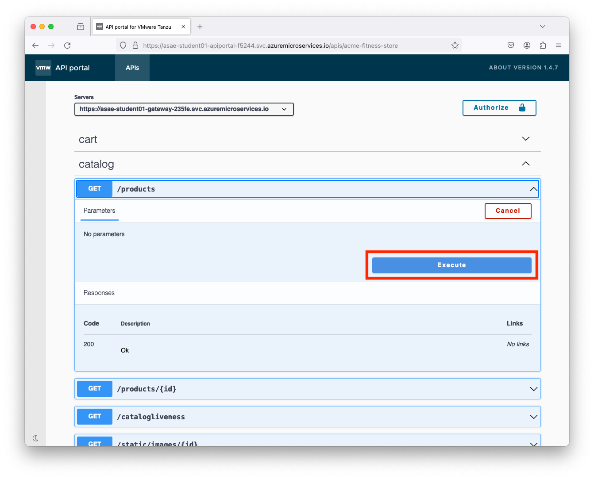
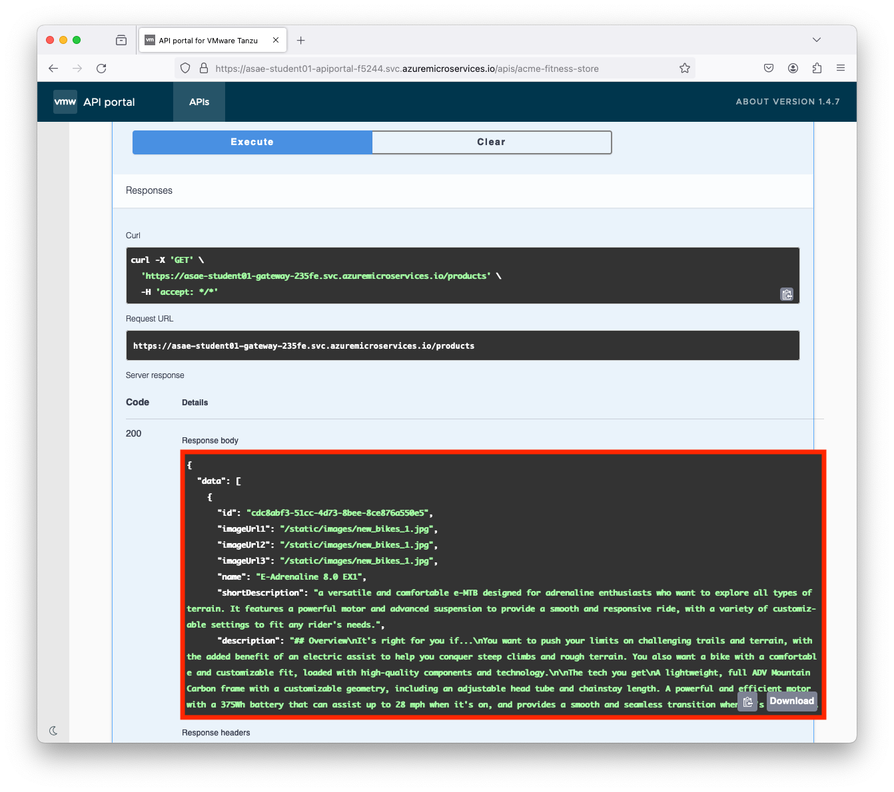

# 06 - Deploy Backend Applications

In the previous lab we have configured the frontend component and Spring Cloud Gateway.
In this lab we will configure the backend components, such as `Catalog`, `Cart`, `Payment` and `Order` services.
These microservices are written in different languages, such as `Catalog` and `Payment` in Spring Boot,
`Order` in .NET and `Cart` in Python.

Some of the applications have externalized their configuration to outside configuration service, e.g. Application Configuration Service.
We configured this in the [earlier lab](../03-setup-workshop-environment/README.md).

## Create backend applications

* Let's create placeholders for the backend microservice components, e.g.

```shell
az spring app create --name ${CART_SERVICE_APP} --instance-count 1 --memory 1Gi &
az spring app create --name ${ORDER_SERVICE_APP} --instance-count 1 --memory 1Gi &
az spring app create --name ${PAYMENT_SERVICE_APP} --instance-count 1 --memory 1Gi &
az spring app create --name ${CATALOG_SERVICE_APP} --instance-count 1 --memory 1Gi &
wait
```

* If the above step is successfully completed, you should see all the backend applications listed in your ASAE instance, e.g.

```shell
az spring app list -o table
```

```text
Name             Location    ResourceGroup    Production Deployment    Provisioning State    CPU    Memory    Running Instance  
---------------  ----------  ---------------  -----------------------  --------------------  -----  --------  ------------------
cart-service     westeurope  asae-student01   default                  Succeeded             1      1Gi       1/1
catalog-service  westeurope  asae-student01   default                  Succeeded             1      1Gi       1/1
frontend         westeurope  asae-student01   default                  Succeeded             1      1Gi       1/1
hello-world      westeurope  asae-student01   default                  Succeeded             1      1Gi       1/1
order-service    westeurope  asae-student01   default                  Succeeded             1      1Gi       1/1
payment-service  westeurope  asae-student01   default                  Succeeded             1      1Gi       1/1
```

* Also, you can check the status of the apps in the Azure portal, e.g.



## Configure the applications to use Application Configuration Service

* We need to bind the applications that use externalized configuration in Application Configuration Service, i.e. two Spring Boot applications `Catalog` and `Payment`

```shell
az spring application-configuration-service bind --app ${PAYMENT_SERVICE_APP} &
az spring application-configuration-service bind --app ${CATALOG_SERVICE_APP} &
wait
```

* Also, you can check the bindings in the Azure portal, e.g. 




## Configure the applications to use Service Registry

* Similarly, the applications (microservice components) need to communicate with each other. ASAE internally uses Tanzu Service Registry for dynamic service discovery.
For details, reference [Use Tanzu Service Registry](https://learn.microsoft.com/azure/spring-apps/how-to-enterprise-service-registry).
To achieve this, we need to bind the applications to Service Registry, e.g.

```shell
az spring service-registry bind --app ${PAYMENT_SERVICE_APP}
az spring service-registry bind --app ${CATALOG_SERVICE_APP}
```

* Also, you can check the bindings in the Azure portal, e.g. 



## Configure Spring Cloud Gateway routing rules

* Next, we need to configure routing rules for the backend applications, i.e. `Cart`, `Order` and `Catalog` services

```shell
az spring gateway route-config create \
    --name ${CART_SERVICE_APP} \
    --app-name ${CART_SERVICE_APP} \
    --routes-file azure-spring-apps-enterprise/resources/json/routes/cart-service.json

az spring gateway route-config create \
    --name ${ORDER_SERVICE_APP} \
    --app-name ${ORDER_SERVICE_APP} \
    --routes-file azure-spring-apps-enterprise/resources/json/routes/order-service.json

az spring gateway route-config create \
    --name ${CATALOG_SERVICE_APP} \
    --app-name ${CATALOG_SERVICE_APP} \
    --routes-file azure-spring-apps-enterprise/resources/json/routes/catalog-service.json
```

* You can list all the route configurations, e.g.

```shell
az spring gateway route-config list -o table
```

```text
Name             ResourceGroup
---------------  ---------------
cart-service     asae-student01
catalog-service  asae-student01
frontend         asae-student01
order-service    asae-student01
```

## Deploy the backend applications

* Now that all the backing services have been configured, we can deploy the 4 backend services, i.e. `Payment`, `Catalog`, `Order` and `Cart`

```shell
# Deploy Payment Service (Spring Boot)
az spring app deploy --name ${PAYMENT_SERVICE_APP} \
    --config-file-pattern payment/default \
    --source-path apps/acme-payment \
    --build-env BP_JVM_VERSION=17

# Deploy Catalog Service (Spring Boot)
az spring app deploy --name ${CATALOG_SERVICE_APP} \
    --config-file-pattern catalog/default \
    --source-path apps/acme-catalog \
    --build-env BP_JVM_VERSION=17

# Deploy Order Service (.NET)
az spring app deploy --name ${ORDER_SERVICE_APP} \
    --source-path apps/acme-order 

# Deploy Cart Service (Python)
az spring app deploy --name ${CART_SERVICE_APP} \
    --env "CART_PORT=8080" \
    --source-path apps/acme-cart 
```

## Test the application

* Now all the required microservices are deployed. You should be able to open the home page and browse through the application.
You should be able to browse through the catalog and view different products.
You will not be able to add products to shopping cart or checkout.

* If you closed your shell terminal, you will need to configure GATEWAY_URL variable again, e.g.

```shell
export GATEWAY_URL=$(az spring gateway show --query properties.url --output tsv)
```

* You can browse the application through the GATEWAY_URL, e.g. `https://asae-student01-gateway-235fe.svc.azuremicroservices.io`






## Explore the API using API Portal

* Update API portal and assign an endpoint to API Portal and open it in a browser, e.g.

```shell
az spring api-portal update --assign-endpoint true
export PORTAL_URL=$(az spring api-portal show --query properties.url --output tsv)
```

* You can also observe the changes in the Azure portal, e.g.



* Feel free to explore the API Portal, e.g.









## Next Guide

Next guide - [07 - Configure Single Sign-On](../07-configure-single-signon/README.md) - OPTIONAL

Next guide - [09 - Configure Azure OpenAI Services](../09-configure-azure-openai-services/README.md)

