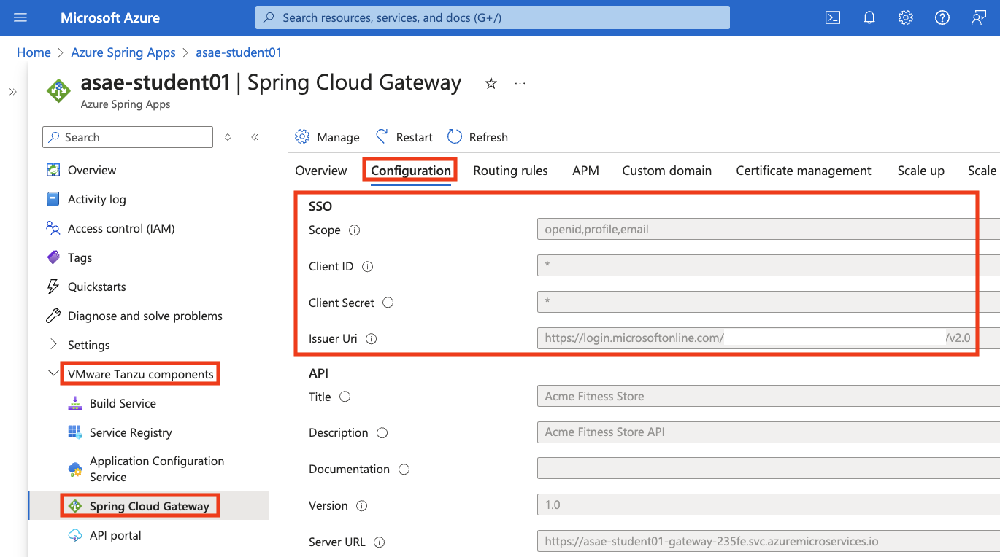
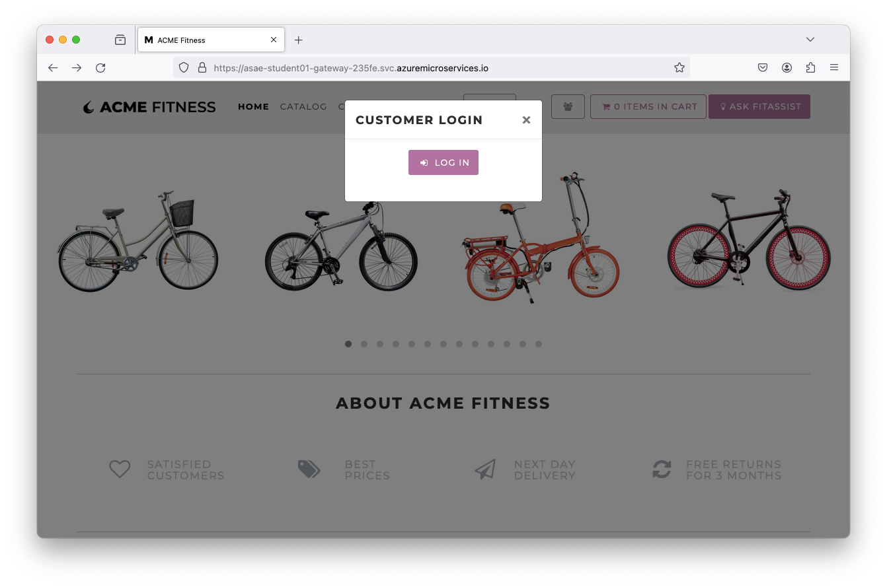
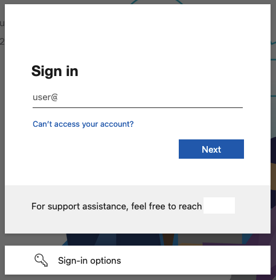
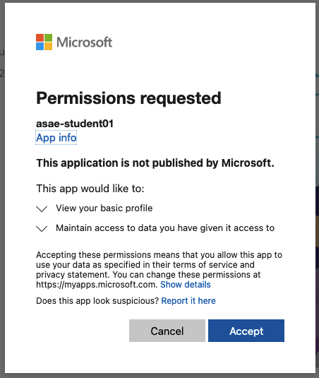
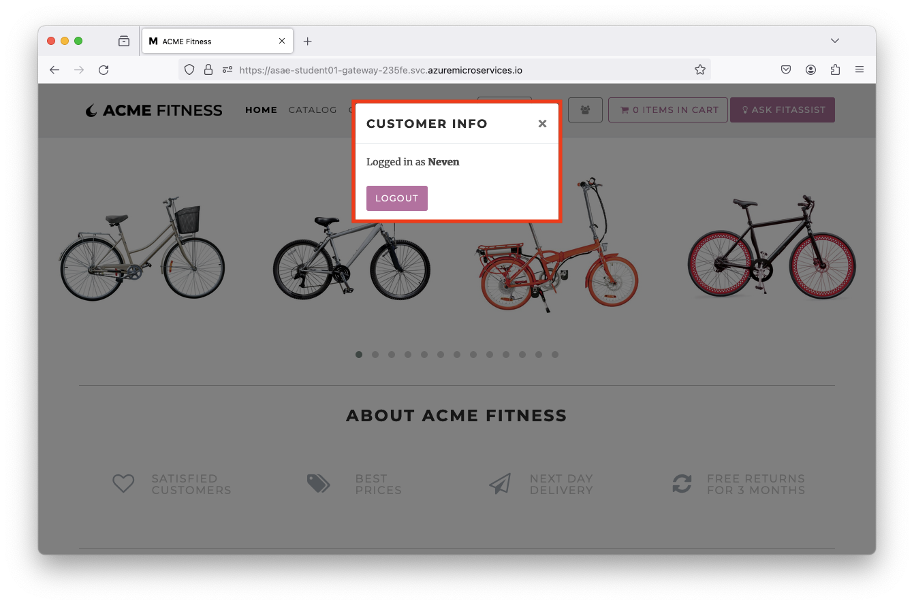
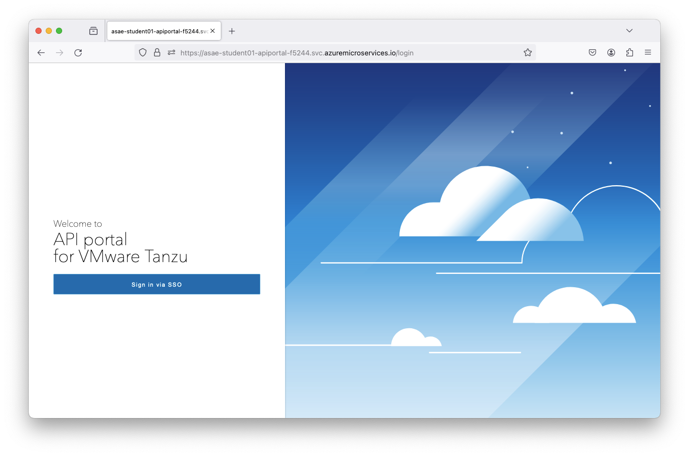
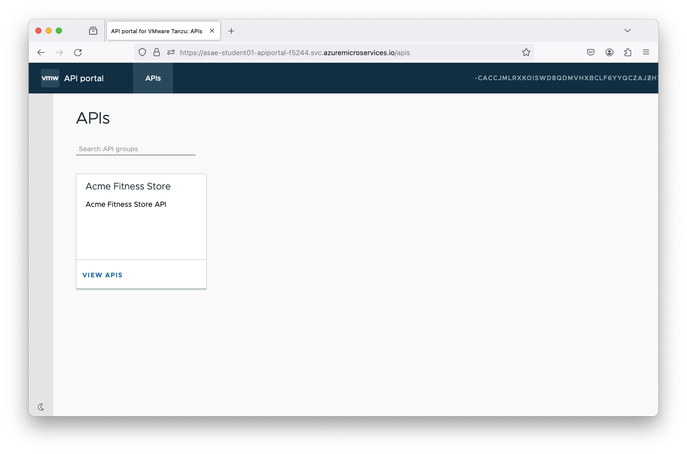

# 07 - Configure Single Sign-On - OPTIONAL

In this lab we will configure Single Sign-On for Spring Cloud Gateway using Microsoft Entra ID (formerly Azure Active Directory) or an existing Identity Provider.

It is important that you have a right to manage Azure Active Directory Application Registrations or Credentials for Single Sign-On Identity Provider.

> Note: This lab is optional. The application will continue to function without completing this lab.
> Certain features will remain unavailable including: login, adding items to the cart, or completing the order.

* Continue to [08 - Configure Databases](../08-configure-databases/README.md) which is optional.
* Continue to [09 - Configure Azure OpenAI Services](../09-configure-azure-openai-services/README.md) which is also optional.

## Register Application with Microsoft Entra ID

* This section steps through creating a Single Sign-On Provider using Microsoft Entra ID. To use an existing provider, skip to the next step [Using an Existing Identity Provider](#using-an-existing-identity-provider).

* Choose a unique display name for your Application Registration, e.g.

```shell
export AD_DISPLAY_NAME=asae-student01    # unique application display name
```

### Create an Application Registration with Microsoft Entra ID

* Create an application registration with Microsoft Entra ID, and save the output, e.g.

```shell
az ad app create --display-name ${AD_DISPLAY_NAME} > resources/json/ad.json
```

### Retrieve the Application ID and collect secret

* Retrieve the APPLICATION_ID, e.g.

```shell
export APPLICATION_ID=$(cat resources/json/ad.json | jq -r '.appId')
```

* Reset the password, e.g.

```shell
az ad app credential reset --id ${APPLICATION_ID} --append > resources/json/sso.json
```

### Assign a Service Principal to the Application Registration

* Assign a service principal to the application registration, e.g.

```shell
az ad sp create --id ${APPLICATION_ID}
```

More detailed instructions on Application Registrations can be found [here](https://learn.microsoft.com/en-us/entra/identity-platform/quickstart-register-app).

### Prepare your environment for SSO Deployments

* Set the environment using the provided script and verify the environment variables are set, e.g.

```shell
source ./setup-sso-variables-ad.sh
```

* This will also configure `setup-sso-variables.sh` script for setting these variables again if needed, e.g.

```shell
source ./setup-sso-variables.sh
```

* You can also echo all the variables, e.g.

```shell
echo "SCOPE=${SCOPE}"
echo "APPLICATION_ID=${APPLICATION_ID}"
echo "CLIENT_ID=${CLIENT_ID}"
echo "CLIENT_SECRET=${CLIENT_SECRET}"
echo "TENANT_ID=${TENANT_ID}"
echo "ISSUER_URI=${ISSUER_URI}"
echo "JWK_SET_URI=${JWK_SET_URI}"
echo "GATEWAY_URL=${GATEWAY_URL}"
echo "PORTAL_URL=${PORTAL_URL}"
```

* Finally, update the web redirects for the Application Registration in Microsoft Entra ID, e.g.

```shell
az ad app update \
    --id ${APPLICATION_ID} \
    --web-redirect-uris \
     "https://${GATEWAY_URL}/login/oauth2/code/sso" \
     "https://${PORTAL_URL}/oauth2-redirect.html" \
     "https://${PORTAL_URL}/login/oauth2/code/sso" \
     --verbose
```

* You can observe the Application Registration, e.g.

```shell
az ad app show --id ${APPLICATION_ID}
```

```text
{
  "@odata.context": "https://graph.microsoft.com/v1.0/$metadata#applications/$entity",
  "addIns": [],
  "api": {
    "acceptMappedClaims": null,
    "knownClientApplications": [],
    "oauth2PermissionScopes": [],
    "preAuthorizedApplications": [],
    "requestedAccessTokenVersion": null
  },
  "appId": "12345678-aaaa-bbbb-cccc-ddddeeeeffff",
  "appRoles": [],
  "applicationTemplateId": null,
  "certification": null,
  "createdDateTime": "2024-05-21T08:51:47Z",
  "defaultRedirectUri": null,
  "deletedDateTime": null,
  "description": null,
  "disabledByMicrosoftStatus": null,
  "displayName": "asae-student01",
  "groupMembershipClaims": null,
  "id": "aaaabbbb-cccc-dddd-eeee-0123456789ab",
  "identifierUris": [],
  "info": {
    "logoUrl": null,
    "marketingUrl": null,
    "privacyStatementUrl": null,
    "supportUrl": null,
    "termsOfServiceUrl": null
  },
  "isDeviceOnlyAuthSupported": null,
  "isFallbackPublicClient": null,
  "keyCredentials": [],
  "nativeAuthenticationApisEnabled": null,
  "notes": null,
  "optionalClaims": null,
  "parentalControlSettings": {
    "countriesBlockedForMinors": [],
    "legalAgeGroupRule": "Allow"
  },
  "passwordCredentials": [
    {
      "customKeyIdentifier": null,
      "displayName": null,
      "endDateTime": "2025-05-21T08:56:08Z",
      "hint": "2nK",
      "keyId": "bbbbcccc-dddd-eeee-ffff-0123456789ab",
      "secretText": null,
      "startDateTime": "2024-05-21T08:56:08Z"
    }
  ],
  "publicClient": {
    "redirectUris": []
  },
  "publisherDomain": "acme.onmicrosoft.com",
  "requestSignatureVerification": null,
  "requiredResourceAccess": [],
  "samlMetadataUrl": null,
  "serviceManagementReference": null,
  "servicePrincipalLockConfiguration": null,
  "signInAudience": "AzureADMyOrg",
  "spa": {
    "redirectUris": []
  },
  "tags": [],
  "tokenEncryptionKeyId": null,
  "uniqueName": null,
  "verifiedPublisher": {
    "addedDateTime": null,
    "displayName": null,
    "verifiedPublisherId": null
  },
  "web": {
    "homePageUrl": null,
    "implicitGrantSettings": {
      "enableAccessTokenIssuance": false,
      "enableIdTokenIssuance": false
    },
    "logoutUrl": null,
    "redirectUriSettings": [
      {
        "index": null,
        "uri": "https://asae-student01-apiportal-f5244.svc.azuremicroservices.io/login/oauth2/code/sso"
      },
      {
        "index": null,
        "uri": "https://asae-student01-apiportal-f5244.svc.azuremicroservices.io/oauth2-redirect.html"
      },
      {
        "index": null,
        "uri": "https://asae-student01-gateway-235fe.svc.azuremicroservices.io/login/oauth2/code/sso"
      }
    ],
    "redirectUris": [
      "https://asae-student01-apiportal-f5244.svc.azuremicroservices.io/login/oauth2/code/sso",
      "https://asae-student01-apiportal-f5244.svc.azuremicroservices.io/oauth2-redirect.html",
      "https://asae-student01-gateway-235fe.svc.azuremicroservices.io/login/oauth2/code/sso"
    ]
}
```


## Using an Existing Identity Provider

* We won't be using a different Identity Provider in this workshop. However, it is possible to configure it if you already have an existing Identity Provider.

* You need to edit the SSO env variables to `setup-sso-variables.sh`, e.g.

```text
export CLIENT_ID=change-me        # Your SSO Provider Client ID
export CLIENT_SECRET=change-me    # Your SSO Provider Client Secret
export ISSUER_URI=change-me       # Your SSO Provider Issuer URI
export JWK_SET_URI=change-me      # Your SSO Provider Json Web Token URI
export SCOPE=openid,profile,email
```

* The following URLs need to be added to your SSO provider's list of approved redirect URIs:

```text
echo "https://${GATEWAY_URL}/login/oauth2/code/sso"
echo "https://${PORTAL_URL}/oauth2-redirect.html" 
echo "https://${PORTAL_URL}/login/oauth2/code/sso"
```

## Configure Spring Cloud Gateway with SSO

* Configure Spring Cloud Gateway with SSO enabled, e.g.

```shell
az spring gateway update \
    --client-id ${CLIENT_ID} \
    --client-secret ${CLIENT_SECRET} \
    --scope ${SCOPE} \
    --issuer-uri ${ISSUER_URI} \
    --no-wait \
    --verbose
```

* You can observe the changes in Azure portal as well, e.g.



## Deploy the Identity Service Application

* We need to create the `Identity` application placeholder first, e.g.

```shell
az spring app create --name ${IDENTITY_SERVICE_APP} --instance-count 1 --memory 1Gi
```

* We need to bind the `Identity` application to Application Configuration Service, e.g.

```shell
az spring application-configuration-service bind --app ${IDENTITY_SERVICE_APP}
```

* We need to bind the `Identity` application to Service Registry, e.g.

```shell
az spring service-registry bind --app ${IDENTITY_SERVICE_APP}
```

* We need to create routing rules for the `Identity` application, e.g.

```shell
az spring gateway route-config create \
    --name ${IDENTITY_SERVICE_APP} \
    --app-name ${IDENTITY_SERVICE_APP} \
    --routes-file ../resources/json/routes/identity-service.json \
    --verbose
```

* Finally, we need to deploy the `Identity` application, e.g.

```shell
az spring app deploy \
    --name ${IDENTITY_SERVICE_APP} \
    --env "JWK_URI=${JWK_SET_URI}" \
    --config-file-pattern identity/default \
    --source-path ../../apps/acme-identity \
    --build-env BP_JVM_VERSION=17 \
    --verbose
```

> Note: The application will take 4-5 minutes to deploy.

## Update Existing Applications

* We need to update existing applications `Cart` and `Order` to use authorization information from Spring Cloud Gateway, e.g.

```shell
az spring app update \
    --name ${CART_SERVICE_APP} \
    --env "AUTH_URL=https://${GATEWAY_URL}" "CART_PORT=8080" \
    --verbose
```

```shell
az spring app update \
    --name ${ORDER_SERVICE_APP} \
    --env "AcmeServiceSettings_AuthUrl=https://${GATEWAY_URL}" \
    --verbose
```

> Note: Each application update should take less than a minute to complete.

## Test the application again

* Feel free to login to the Acme Fitness Application and use SSO, e.g.









## Configure SSO on API Portal

* Make sure you have the `PORTAL_URL` configured, e.g.

```shell
export PORTAL_URL=$(az spring api-portal show --query properties.url -o tsv)
```

* Configure SSO on API Portal, e.g.

```shell
az spring api-portal update \
  --client-id ${CLIENT_ID} \
  --client-secret ${CLIENT_SECRET} \
  --scope "openid,profile,email" \
  --issuer-uri ${ISSUER_URI} \
  --verbose
```

> Note: This API Portal update should take only a minute to complete.

## Test the API Portal again

* Feel free to login to API Portal and use SSO, e.g. 





## Next Guide

Next guide - [08 - Configure Databases](../08-configure-databases/README.md) - OPTIONAL
 
Next guide - [09 - Configure Azure OpenAI Services](../09-configure-azure-openai-services/README.md)

