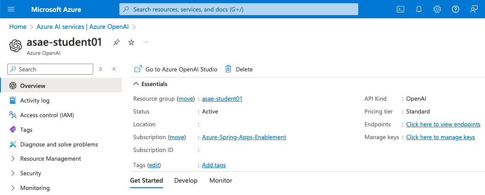
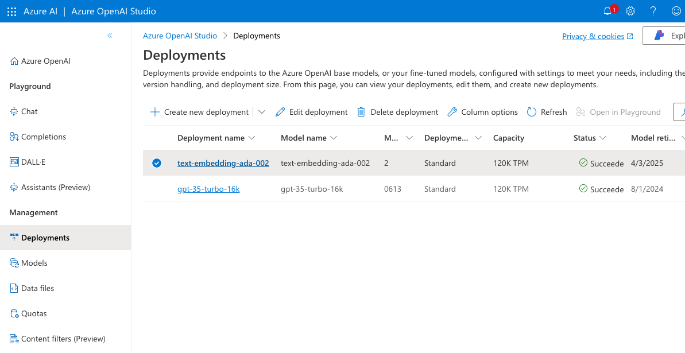
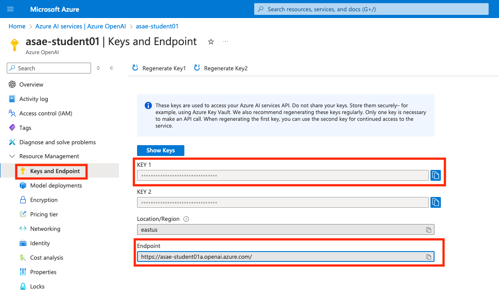
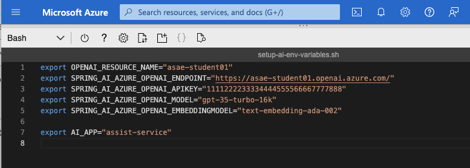

# 09 - Configure Azure OpenAI Services

In this lab we will prepare Azure OpenAI service so we can use that with AI assistant application in the next lab.

Please consult with your workshop instructor if this section has been already configured for you. Workshop instructor might share and instance of Azure OpenAI for everyone in the workshop, or maybe each one of you get your own instance of Azure OpenAI. 

It is important that your Azure subscription has been granted access to Azure OpenAI. If you don't have access, please [request access to Azure OpenAI](https://aka.ms/oai/access).

## Prepare Environment Variables

* Make sure you operate in the `labs/acme-fitness-store/azure-spring-apps-enterprise/scripts` folder, e.g.

```shell
pwd
```

```text
/home/asa-student/labs/acme-fitness-store/azure-spring-apps-enterprise/scripts
```

* If your shell has been closed, you need to source all the environment scripts, e.g.

```shell
source setup-env-variables.sh
source setup-db-env-variables.sh
source setup-sso-env-variables.sh
```

* Copy the template script, e.g.

```shell
cp setup-ai-env-variables-template.sh setup-ai-env-variables.sh 
```

* We will update this file once we create an Azure OpenAI instance.

## Create Azure OpenAI instance

* Choose a `OPENAI_RESOURCE_NAME` which should be globally unique.

* Run the following command to create an Azure OpenAI resource, e.g.

```shell
export OPENAI_RESOURCE_NAME=asae-student01
az cognitiveservices account create \
    --name ${OPENAI_RESOURCE_NAME} \
    --resource-group ${RESOURCE_GROUP} \
    --location eastus \
    --kind OpenAI \
    --sku s0 \
    --custom-domain ${OPENAI_RESOURCE_NAME} \
    --verbose
```

* You can check the [output](output-az-cognitiveservices-account-create.txt) or see the created instance in the Azure portal, e.g.



## Create Model Deployments

* We will create two model deployments for `text-embedding-ada-002` and `gpt-35-turbo-16k` in your Azure OpenAI service, e.g.

```shell
az cognitiveservices account deployment create \
    --resource-group ${RESOURCE_GROUP} \
    --name ${OPENAI_RESOURCE_NAME} \
    --deployment-name text-embedding-ada-002 \
    --model-name text-embedding-ada-002 \
    --model-version "2"  \
    --model-format OpenAI \
    --sku Standard \
    --capacity 120 \
    --verbose
```

```shell
az cognitiveservices account deployment create \
    --resource-group ${RESOURCE_GROUP} \
    --name ${OPENAI_RESOURCE_NAME} \
    --deployment-name gpt-35-turbo-16k \
    --model-name gpt-35-turbo-16k \
    --model-version "0613"  \
    --model-format OpenAI \
    --sku Standard \
    --capacity 120 \
    --verbose
```

> Note: The latest API version of `gpt-35-turbo-16k` deployment model might not be available in all regions (e.g. westeurope).

* Alternatively, you could do this step in `Azure AI Studio`. You can click on the link `Go to Azure OpenAI Studio` in the overview of your Azure OpenAI instance, or just directly click to [Azure OpenAI Portal](https://oai.azure.com/portal).



## Update the values in AI environment file

* Let's update the values in the AI environment file, e.g. `setup-ai-environment-variables.sh`

  * For Endpoint and API key - check under Azure Portal OpenAI instance in `Keys and Endpoint` section, e.g.



  * for `SPRING_AI_AZURE_OPENAI_MODEL` use previously defined model, e.g. `gpt-35-turbo-16k`

  * for `SPRING_AI_AZURE_OPENAI_EMBEDDINGMODEL` use previously defined model, e.g. `text-embedding-ada-002`

  * for `AI_APP` use default name, e.g. `assist-service`

* Alternatively, you can get these values using Azure CLI as well, e.g.

```shell
az cognitiveservices account show \
  --name ${OPENAI_RESOURCE_NAME} \
  --resource-group ${RESOURCE_GROUP} \
  --query 'properties.endpoint' \
  --output tsv

az cognitiveservices account keys list \
  --name ${OPENAI_RESOURCE_NAME} \
  --resource-group ${RESOURCE_GROUP} \
  --query 'key1' \
  --output tsv \
```

* Enter the values into the AI configuration file, e.g.

```shell
code setup-ai-env-variables.sh
```



* Finally, source the configured file, e.g. 

```shell
source setup-ai-env-variables.sh
```

* __Congratulations!__ You have everything ready to start consuming AI services from your Spring applications.

## Next Guide

Next guide - [10 - Deploy AI Assistant Application](../10-deploy-ai-assistant-application/README.md)
