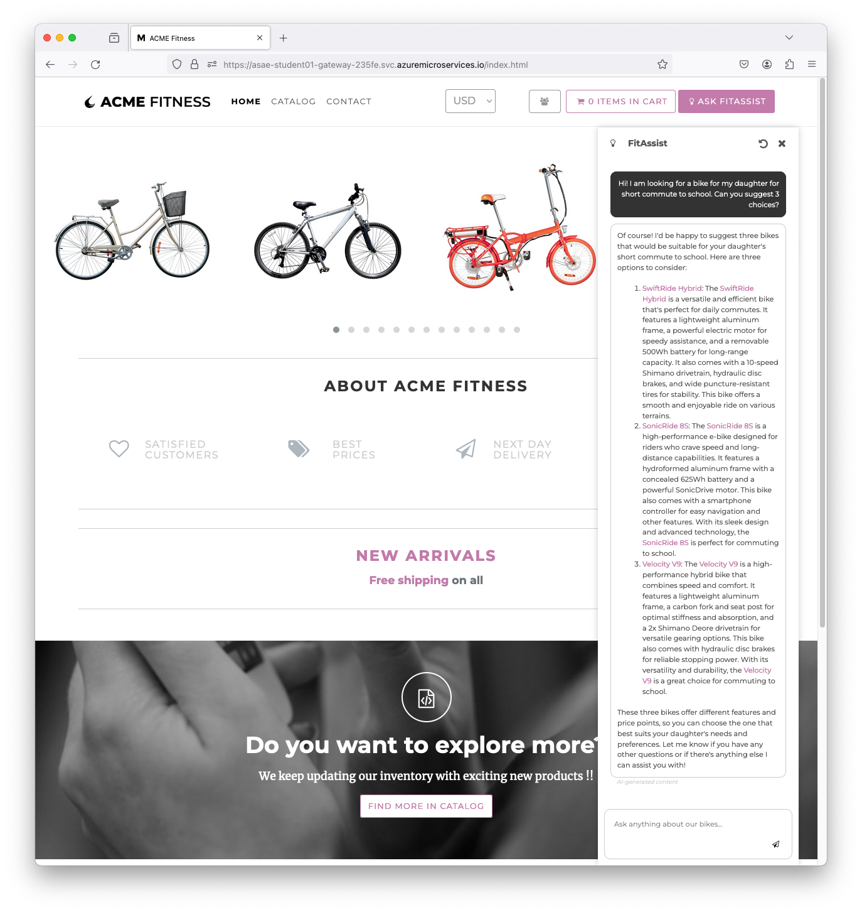

# 10 - Deploy AI Assistant Application

In this lab we will deploy `Assist` application that is built using [Spring AI](https://spring.io/projects/spring-ai). The `Assist` application connects to Azure OpenAI instance where we deployed AI models in the previous lab.

## Create Assist Application Placeholder

* Make sure you are in the `labs/acme-fitness-store/azure-spring-apps-enterprise/scripts` folder, e.g.

```shell
pwd
...

```text
/home/asa-student/labs/acme-fitness-store/azure-spring-apps-enterprise/scripts
```

* If your shell has been closed, you need to source all the environment scripts again, e.g.

```shell
source setup-env-variables.sh
source setup-db-env-variables.sh
source setup-sso-env-variables.sh
source setup-ai-env-variables.sh
```

* Create `Assist` application placeholder, e.g.

```shell
az spring app create --name ${AI_APP} --instance-count 1 --memory 1Gi
```

## Configure Spring Cloud Gateway

* Configure Spring Cloud Gateway with `assist-service` routes, e.g.

```shell
az spring gateway route-config create \
    --name ${AI_APP} \
    --app-name ${AI_APP} \
    --routes-file ../resources/json/routes/assist-service.json \
    --verbose
```

## Deploy Assist Application

* Deploy `Assist` application, e.g.

```shell
az spring app deploy \
    --name ${AI_APP} \
    --source-path ../../apps/acme-assist \
    --build-env BP_JVM_VERSION=17 \
    --env \
      SPRING_AI_AZURE_OPENAI_ENDPOINT=${SPRING_AI_AZURE_OPENAI_ENDPOINT} \
      SPRING_AI_AZURE_OPENAI_API_KEY=${SPRING_AI_AZURE_OPENAI_API_KEY} \
    --verbose 
```

## Test the application again

* Test the application again. Click `ASK FITASSIST` button to open a `FitAssist` chatbot. Try conversing with the chatbot, e.g. 

```text
Hi! I am looking for a bike for my daughter for short commute to school. Can you suggest 3 choices?
```



* __Congratulations!__ You have successfully deployed an AI-enabled application that converses with Azure OpenAI models.

## Next Guide

Next guide - [11 - Summary](../11-summary/README.md)
