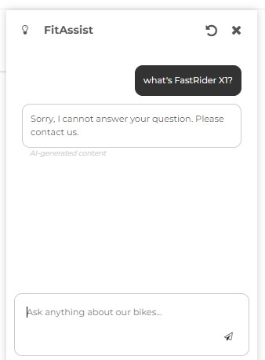
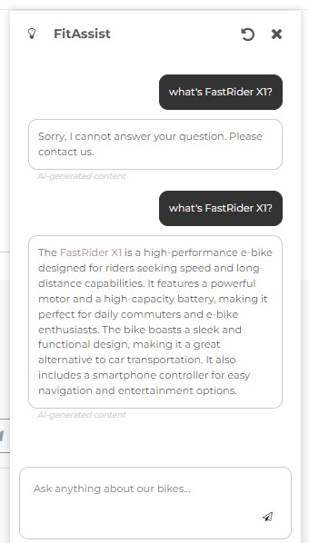

# Add Job into ACME Fitness Store

In this workshop, we will deploy a job workload in an existing ACME Fitness Store. The job is co-working with catalog service and AI assist service to fetch new product and generate embedding for AI assist service to consume.

## Prerequisite
Azure Spring Apps job feature requires the version of spring extension equals or greater than 1.24.0. You can use `az extension show --name spring --query version -o tsv` to query the version. Following script upgrades spring extension to the latest.
```bash
az extension update --name spring
```

## Steps
1. Visit ACME Fitness Store website and check FitAssist's response about non-existing product `FastRider X1`
    

1. Create Job resource and bind to service registry
    ```bash
    az spring job create --name index-product-job
    ```
1. Deploy a job. The implementation of job shares the source code with `acme-assist` project but uses different maven profile called `job` for packaging. 
    ```bash
    az spring job deploy --name index-product-job \
        --source-path ../apps/acme-assist \
        --build-env BP_JVM_VERSION=17 \
        --build-env BP_MAVEN_ACTIVE_PROFILES=job \
        --env \
            SPRING_AI_AZURE_OPENAI_ENDPOINT=${SPRING_AI_AZURE_OPENAI_ENDPOINT} \
            SPRING_AI_AZURE_OPENAI_API_KEY=${SPRING_AI_AZURE_OPENAI_API_KEY}
    ```
1. Add a new product to catalog service.
    ```bash
    # Fetch ULR of Spring Cloud Gateway
    export GATEWAY_URL=$(az spring gateway show --query properties.url --output tsv)
    # Add new product via POST method
    curl -X POST -d @./resources/json/data/newproduct.json \
         --header 'Content-Type: application/json' "https://${GATEWAY_URL}/products"
    ```
1. Visit ACME Fitness Store website. You can see new bike `FastRider X1` is added. You will get the same response when you ask FitAssist about `FastRider X1`.
1. Start job to update embedding of new added product.
    ```bash
    az spring job start --name index-product-job
    ```
1. Ask FitAssist about `FastRider X1` again and you will get following answer.
    
