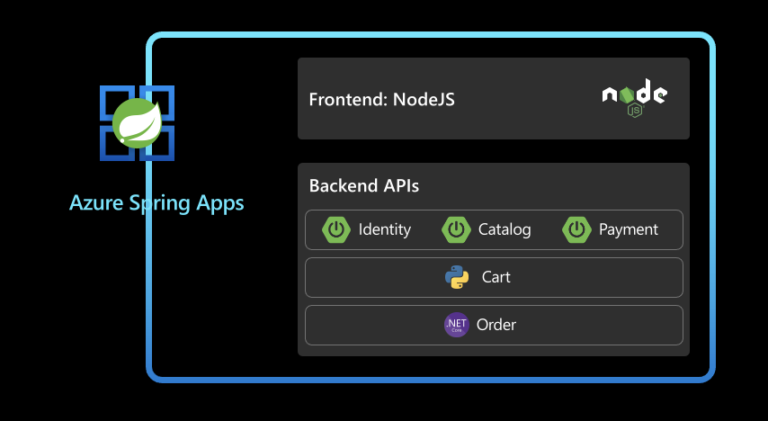

In the previous section we deployed a simple hello-world service to asa-e instance. In this section we are going to deploy the frontend of acme-fitness, configure that with Spring Cloud Gateway and validate that we are able to access the frontend. 

This diagram below shows the final result once this section is complete:


Below are the diffrent steps that we configure/create to successfully deploy the services/apps
- [1. Create and Deploy backend apps](#1-create-and-deploy-backend-apps)
- [2. Create Application Configuration Service](#2-create-application-configuration-service)
  - [2.1. Configure apps to Application Configuration Service](#21-configure-apps-to-application-configuration-service)
- [3. Bind apps to Service Registry](#3-bind-apps-to-service-registry)
- [4. Deploy backend apps](#4-deploy-backend-apps)
- [5. Create  routing rules for the backend apps:](#5-create--routing-rules-for-the-backend-apps)


## 1. Create and Deploy backend apps

First step is to create an application for each service:

```shell
az spring app create --name ${CART_SERVICE_APP} --instance-count 1 --memory 1Gi &
az spring app create --name ${ORDER_SERVICE_APP} --instance-count 1 --memory 1Gi &
az spring app create --name ${PAYMENT_SERVICE_APP} --instance-count 1 --memory 1Gi &
az spring app create --name ${CATALOG_SERVICE_APP} --instance-count 1 --memory 1Gi &
wait
```

Next step is to provide config information for Payment Service and Catalog Service. Remaining services do not need config data stored separately. 

## 2. Create Application Configuration Service

Before we can go ahead and point the services to config stored in an external location, we first need to create an application config instance pointing to that external repo. In this case we are going to create an application config instance that points to a github repo using azure cli.

```shell
az spring application-configuration-service git repo add --name acme-fitness-store-config \
    --label main \
    --patterns "catalog/default,catalog/key-vault,identity/default,identity/key-vault,payment/default" \
    --uri "https://github.com/Azure-Samples/acme-fitness-store-config"
```

### 2.1. Configure apps to Application Configuration Service

Now the next step is to bind the above created application configuration service instance to the azure apps that use this external config:


```shell
az spring application-configuration-service bind --app ${PAYMENT_SERVICE_APP} &
az spring application-configuration-service bind --app ${CATALOG_SERVICE_APP} &
wait
```

## 3. Bind apps to Service Registry

Applications need to communicate with each other. As we learnt in [previous section](../07-asa-e-components-overview/service-registry/README.md) ASA-E internally uses Tanzu Service Registry for dynamic service discovery. To achieve this, required services/apps need to be bound to the service registry using the commands below: 

```shell
az spring service-registry bind --app ${PAYMENT_SERVICE_APP}
az spring service-registry bind --app ${CATALOG_SERVICE_APP}
```

## 4. Deploy backend apps

Now that all the required services are configured, the next step is to go ahead and deploy the services/apps. For this we need access to the source code for the services. 

Now go ahead and create the apps.

```shell
# Deploy Payment Service
az spring app deploy --name ${PAYMENT_SERVICE_APP} \
    --config-file-pattern payment/default \
    --source-path ./apps/acme-payment 

# Deploy Catalog Service
az spring app deploy --name ${CATALOG_SERVICE_APP} \
    --config-file-pattern catalog/default \
    --source-path ./apps/acme-catalog 

# Deploy Order Service
az spring app deploy --name ${ORDER_SERVICE_APP} \
    --source-path ./apps/acme-order 

# Deploy Cart Service 
az spring app deploy --name ${CART_SERVICE_APP} \
    --env "CART_PORT=8080" \
    --source-path ./apps/acme-cart 
```

You will notice that we need to supply a custom builder for frontend, cart service and order service as these are not Java based apps. Also to note is config-file-pattern for payment and catalog services. As you might recall in previous step, we configured aplication config service for payment and catalog services. This argument is providing the file pattern. More details about this pattern can be found in the previous section [application configuration sevice](../07-asa-e-components-overview/application-config-service/README.md)

After completing the above steps all the required applications should be successfully deployed. You can check for the status of these apps using the command below:

So far in this section we were able to successfully create and deploy the apps into an existing azure spring apps instance. 

## 5. Create  routing rules for the backend apps:

Routing rules bind endpoints in the request to the backend applications. For example in the Cart route below, the routing rule indicates any requests to /cart/** endpoint gets routed to backend Cart App.

```shell
az spring gateway route-config create \
    --name ${CART_SERVICE_APP} \
    --app-name ${CART_SERVICE_APP} \
    --routes-file ./routes/cart-service.json
    
az spring gateway route-config create \
    --name ${ORDER_SERVICE_APP} \
    --app-name ${ORDER_SERVICE_APP} \
    --routes-file ./routes/order-service.json

az spring gateway route-config create \
    --name ${CATALOG_SERVICE_APP} \
    --app-name ${CATALOG_SERVICE_APP} \
    --routes-file ./routes/catalog-service.json

This conpletes successful deployments of all the backend apps, configuring required apps with Application Config Service, binding apps to Service Registry and adding routing rules in Spring Clould Gateway for these apps

⬅️ Previous guide: [07 - ASA-E components Overview](../07-asa-e-components-overview/README.md)

➡️ Next guide: [09 - Hands On Lab 3 - Spring Cloud Gateway Configuration](../09-hol-3-configure-spring-cloud-gateway/README.md)